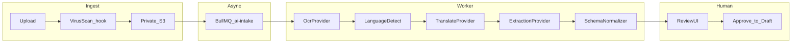

# AI / OCR Intake

Human-in-the-loop document intelligence for **Maher Al-Aghbar & Sons Furniture ERP**. Supports handwritten notes, WhatsApp screenshots, supplier invoices, and customer spec sheets in **Arabic, English, and Hebrew**.

**Core principle:** AI **never auto-confirms** orders, quotations, inventory movements, or payments. Output is always a **draft** requiring human review.

---

## Pipeline design



### Stages

| Stage | Input | Output |
|-------|-------|--------|
| 1. Ingest | Multipart upload | `Document` + `AIExtractionJob` (`QUEUED`) |
| 2. OCR | Image/PDF bytes | Plain text + bounding boxes (optional) |
| 3. Language detect | OCR text | `detectedLanguage`: `ar` \| `en` \| `he` |
| 4. Translate | Non-English/Arabic canonical | Normalized text for extraction (preserve original in job) |
| 5. Extract | Text + JSON schema prompt | `proposedPayloadJson` (RFQ or quotation shape) |
| 6. Review | Job + side-by-side doc | Human approve / edit / reject |
| 7. Apply | Approved payload | **Draft** `Rfq` or `Quotation` only |

Retries: exponential backoff, max 3 attempts; `FAILED` status with error code for ops.

---

## Provider abstraction

Interfaces in `packages/integrations` (planned):

```typescript
interface OcrProvider {
  extractText(input: Buffer, mimeType: string): Promise<OcrResult>;
}

interface TranslateProvider {
  translate(text: string, from: string, to: string): Promise<string>;
}

interface ExtractionProvider {
  extractStructured(input: ExtractionInput): Promise<unknown>;
}
```

| Environment | OCR | Translation | Extraction |
|-------------|-----|-------------|------------|
| Local / CI | `MockProvider` (fixture) or `OCR_PROVIDER=local` (pdf-parse + tesseract.js) | Passthrough | Mock structured output |
| Staging | `local` / Tesseract or cloud OCR | OpenAI-compatible | OpenAI-compatible |
| Production | OpenAI Vision / HTTP OCR (`OCR_API_*`) | OpenAI | OpenAI |

### Free / unpaid OCR

```bash
# .env
OCR_PROVIDER=local   # or tesseract | pdf | auto
```

- **PDF:** embedded text via `pdf-parse` (no API key). Cloud providers are wrapped to prefer PDF text first.
- **Images:** `tesseract.js` in-process (Arabic + English). First run downloads language data.
- Keep `OCR_PROVIDER=mock` for deterministic CI demos.

Factory selects provider via env (`OCR_PROVIDER` preferred; `AI_OCR_PROVIDER` still accepted):

```
OCR_PROVIDER=mock|local|tesseract|pdf|auto|openai|http
AI_LLM_PROVIDER=mock|openai
AI_LLM_MODEL=gpt-4o-mini
```

**No vendor lock-in at call sites** — only worker/API imports concrete providers.

---

## Extraction schema (RFQ draft)

`proposedPayloadJson` conforms to shared Zod schema in `packages/validation`:

- Customer hint (name, phone — fuzzy match suggested in UI)
- Line items: description, quantity, dimensions (L×W×H), material, fabric, color notes
- Delivery address hint
- Requested date / urgency
- Confidence scores per field (displayed in review UI)

Low-confidence fields highlighted for mandatory human verification.

---

## Review UI requirements

Admin **AI Intake** queue:

- Original document preview (signed URL)
- Detected language badge
- Editable form pre-filled from `proposedPayloadJson`
- Actions: **Approve** (create draft), **Save edits & approve**, **Reject** (reason required)
- Link to created draft entity after approval

Customer portal uploads enter same queue — customers see "Processing" until staff approves; they are **not** notified of extracted prices or internal notes.

---

## Safety rules

| Rule | Enforcement |
|------|-------------|
| No auto-confirm | Worker cannot call `/quotations/:id/send` or SO confirm |
| Draft only | Approve endpoint creates `status=Draft` entities |
| PII minimization | LLM prompts exclude unrelated customer financial data |
| Prompt injection | System prompt isolates user OCR text; schema-only output (JSON mode) |
| Cost control | Rate limits; page count cap (50 pages/job); image size cap (20 MB) |
| Audit | Every approve/reject → `AuditEvent` with job ID and reviewer |

---

## Supported document types (v1)

| Type | Expected extraction |
|------|---------------------|
| Handwritten order note | Line items, measurements |
| WhatsApp screenshot | Text + embedded specs |
| Supplier invoice | Supplier, lines, amounts (for PO draft hint — not auto-PO) |
| Photo of sketch | Dimensions annotation (best-effort) |

Unsupported types fail gracefully with `FAILED` + user message.

---

## Monitoring

- Job duration, failure rate, provider latency (metrics)
- Queue depth alert > 100 jobs
- Weekly sample audit: 5 random approved jobs checked for field accuracy

---

## Phase 9 deliverable

Live OCR/LLM providers wired in staging; production credentials documented in runbook (not in repo). Until then, **MockProvider** enables full E2E testing of review → draft → quotation workflow.
