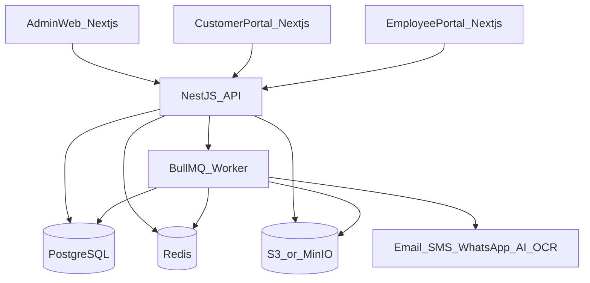

# Architecture

## System context



## Layering

1. **Presentation** — Next.js App Router apps (`admin-web`, `customer-portal`, `employee-portal`).
2. **API gateway** — NestJS REST, OpenAPI, rate limits, request IDs.
3. **Application services** — domain modules; transactions; permission checks.
4. **Persistence** — Prisma + PostgreSQL.
5. **Async** — BullMQ workers for PDF, AI/OCR, notifications, reports, thumbnails.
6. **Integrations** — provider interfaces with mock/console implementations for local.

## Authority

The **backend is the sole authority** for authz, workflow transitions, pricing/tax, inventory math, financial totals, PDF generation, audit, AI processing, and file access.

## Monorepo

```
apps/admin-web|customer-portal|employee-portal|api|worker
packages/ui|database|types|validation|permissions|i18n|config|logging|testing|eslint-config|tsconfig
infra/docker|nginx|database|deployment
docs/...
```

## Environments

`local` → `development` → `staging` → `production`

Secrets via environment variables only; never committed.
