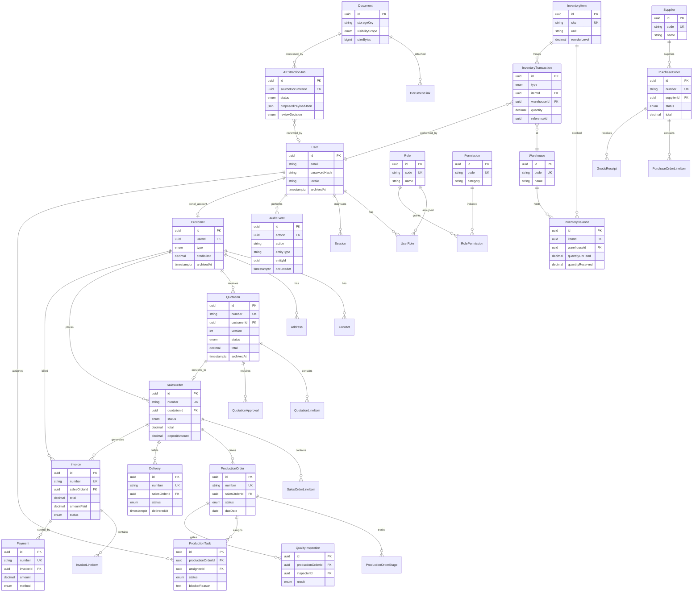

# Database Model

Phase 0 data design for **Maher Al-Aghbar & Sons Furniture ERP**. PostgreSQL via Prisma. All monetary amounts use `Decimal(18,3)` (JOD). Primary keys are UUID (v7 preferred, v4 fallback). Business entities use soft delete via `archivedAt` (null = active).

## Conventions

| Rule | Implementation |
|------|----------------|
| Money | `Decimal(18,3)` — never `float`/`double` |
| IDs | UUID on all entities; FK columns suffixed `Id` |
| Timestamps | `createdAt`, `updatedAt` (UTC stored, Asia/Amman displayed) |
| Soft delete | `archivedAt TIMESTAMPTZ NULL`; queries default `archivedAt IS NULL` |
| Document numbers | Server-generated, type-prefixed (e.g. `SO-2026-00102`) |
| Audit | Critical mutations emit `AuditEvent` rows (append-only) |
| Multi-tenancy | Single company at launch; `branchId` nullable on operational records for future expansion |

## Entity catalog

### Identity & access

| Entity | Key fields | Notes |
|--------|------------|-------|
| **User** | `id`, `email`, `phone`, `passwordHash`, `displayName`, `locale`, `status`, `lastLoginAt`, `archivedAt` | Staff and portal users; customers linked via `Customer.userId` |
| **Role** | `id`, `code`, `name`, `description`, `archivedAt` | Seed roles: `SALES_REPRESENTATIVE`, `WAREHOUSE_MANAGER`, etc. |
| **Permission** | `id`, `code`, `category`, `description` | Granular codes (e.g. `quotation.approve`) |
| **UserRole** | `userId`, `roleId`, `assignedAt` | M:N; users may hold multiple roles |
| **RolePermission** | `roleId`, `permissionId` | M:N grant matrix |
| **Session** | `id`, `userId`, `refreshTokenHash`, `expiresAt`, `revokedAt`, `userAgent`, `ipAddress` | Refresh rotation |
| **Invitation** | `id`, `email`, `roleIds`, `tokenHash`, `expiresAt`, `acceptedAt` | Staff onboarding |

### CRM

| Entity | Key fields | Notes |
|--------|------------|-------|
| **Customer** | `id`, `userId?`, `type`, `legalName`, `tradeName`, `taxNumber`, `creditLimit`, `paymentTermsDays`, `preferredLocale`, `archivedAt` | Individual or company |
| **Contact** | `id`, `customerId`, `name`, `email`, `phone`, `isPrimary`, `archivedAt` | |
| **Address** | `id`, `customerId`, `label`, `line1`, `city`, `governorate`, `country`, `isDefault`, `archivedAt` | Delivery/billing |
| **Activity** | `id`, `customerId`, `type`, `subject`, `body`, `createdById`, `occurredAt` | Communication log |

### Commercial

| Entity | Key fields | Notes |
|--------|------------|-------|
| **Rfq** | `id`, `number`, `customerId`, `source`, `status`, `preferredLocale`, `archivedAt` | Multi-source intake |
| **RfqLineItem** | `id`, `rfqId`, `description`, `quantity`, `dimensionsJson`, `materialNotes`, `fabricNotes` | Furniture specs |
| **Quotation** | `id`, `number`, `rfqId?`, `customerId`, `version`, `status`, `validUntil`, `subtotal`, `taxAmount`, `total`, `currency`, `archivedAt` | Versioned |
| **QuotationLineItem** | `id`, `quotationId`, `description`, `quantity`, `unitPrice`, `taxRate`, `lineTotal`, `specJson` | |
| **QuotationApproval** | `id`, `quotationId`, `approverId`, `decision`, `comment`, `decidedAt` | Internal gate |
| **SalesOrder** | `id`, `number`, `quotationId`, `customerId`, `status`, `subtotal`, `taxAmount`, `total`, `depositAmount`, `archivedAt` | Created from accepted quote |
| **SalesOrderLineItem** | `id`, `salesOrderId`, `description`, `quantity`, `unitPrice`, `lineTotal`, `specJson` | Snapshot of quote lines |
| **Contract** | `id`, `number`, `salesOrderId`, `customerId`, `signedAt`, `documentId`, `archivedAt` | Wholesale B2B |

### Production & tasks

| Entity | Key fields | Notes |
|--------|------------|-------|
| **ProductionStageTemplate** | `id`, `code`, `name`, `sortOrder`, `archivedAt` | Configurable pipeline |
| **ProductionOrder** | `id`, `number`, `salesOrderId`, `status`, `priority`, `dueDate`, `archivedAt` | One or more per SO |
| **ProductionOrderStage** | `id`, `productionOrderId`, `stageTemplateId`, `status`, `startedAt`, `completedAt` | Stage instances |
| **ProductionTask** | `id`, `productionOrderId`, `stageId`, `assigneeId?`, `status`, `startedAt`, `completedAt`, `blockerReason`, `archivedAt` | Floor work units |
| **TaskTimeEntry** | `id`, `taskId`, `userId`, `action`, `occurredAt` | start/pause/block/complete |
| **QualityInspection** | `id`, `productionOrderId`, `inspectorId`, `status`, `checklistJson`, `result`, `defectNotes`, `inspectedAt` | QC gate |
| **Delivery** | `id`, `number`, `salesOrderId`, `status`, `scheduledDate`, `driverId?`, `podDocumentId?`, `deliveredAt` | Proof of delivery |

### Inventory & warehouse

| Entity | Key fields | Notes |
|--------|------------|-------|
| **Warehouse** | `id`, `code`, `name`, `address`, `isDefault`, `archivedAt` | Multi-warehouse |
| **InventoryItem** | `id`, `sku`, `name`, `category`, `unit`, `barcode`, `reorderLevel`, `archivedAt` | Master data |
| **InventoryBalance** | `id`, `itemId`, `warehouseId`, `quantityOnHand`, `quantityReserved` | **Derived cache**; source of truth is transactions |
| **InventoryTransaction** | `id`, `number`, `type`, `itemId`, `warehouseId`, `quantity`, `unitCost?`, `referenceType`, `referenceId`, `performedById`, `occurredAt` | RECEIPT, ISSUE, TRANSFER, ADJUST, COUNT |
| **InventoryReservation** | `id`, `itemId`, `warehouseId`, `quantity`, `referenceType`, `referenceId`, `releasedAt?` | Ties to SO/production |

### Purchasing

| Entity | Key fields | Notes |
|--------|------------|-------|
| **Supplier** | `id`, `code`, `name`, `contactEmail`, `paymentTermsDays`, `archivedAt` | |
| **PurchaseRequest** | `id`, `number`, `requestedById`, `status`, `archivedAt` | Internal PR |
| **PurchaseOrder** | `id`, `number`, `supplierId`, `status`, `subtotal`, `taxAmount`, `total`, `expectedDate`, `archivedAt` | |
| **PurchaseOrderLineItem** | `id`, `purchaseOrderId`, `itemId?`, `description`, `quantity`, `unitPrice`, `lineTotal` | |
| **GoodsReceipt** | `id`, `number`, `purchaseOrderId`, `warehouseId`, `receivedAt`, `receivedById` | Creates inventory RECEIPT txns |

### Financial

| Entity | Key fields | Notes |
|--------|------------|-------|
| **Invoice** | `id`, `number`, `salesOrderId`, `customerId`, `status`, `issueDate`, `dueDate`, `subtotal`, `taxAmount`, `total`, `amountPaid`, `archivedAt` | |
| **InvoiceLineItem** | `id`, `invoiceId`, `description`, `quantity`, `unitPrice`, `lineTotal` | |
| **Payment** | `id`, `number`, `invoiceId`, `customerId`, `method`, `amount`, `receivedAt`, `reference`, `recordedById` | |
| **CreditNote** | `id`, `number`, `invoiceId`, `amount`, `reason`, `issuedAt` | Returns/adjustments |

### Documents & AI

| Entity | Key fields | Notes |
|--------|------------|-------|
| **Document** | `id`, `filename`, `mimeType`, `sizeBytes`, `storageKey`, `visibilityScope`, `uploadedById`, `archivedAt` | DMS; signed URL access |
| **DocumentLink** | `id`, `documentId`, `entityType`, `entityId`, `label` | Polymorphic attachment |
| **AIExtractionJob** | `id`, `status`, `sourceDocumentId`, `detectedLanguage`, `provider`, `rawOutputJson`, `proposedEntityType`, `proposedPayloadJson`, `reviewedById?`, `reviewDecision`, `archivedAt` | Human review required |
| **Notification** | `id`, `userId`, `channel`, `template`, `payloadJson`, `sentAt`, `readAt` | In-app + outbound |

### Audit & settings

| Entity | Key fields | Notes |
|--------|------------|-------|
| **AuditEvent** | `id`, `actorId`, `action`, `entityType`, `entityId`, `beforeJson`, `afterJson`, `ipAddress`, `occurredAt` | Immutable |
| **Setting** | `id`, `key`, `valueJson`, `updatedById` | VAT rate, quote expiry, etc. |

## Relationships summary

```
User ──< UserRole >── Role ──< RolePermission >── Permission
User ──< Session
Customer ──< Contact, Address, Activity, Rfq, Quotation, SalesOrder, Invoice
Rfq ──< RfqLineItem ──> Quotation (optional)
Quotation ──< QuotationLineItem, QuotationApproval
Quotation ──> SalesOrder ──< SalesOrderLineItem
SalesOrder ──> ProductionOrder ──< ProductionOrderStage, ProductionTask, QualityInspection, Delivery
SalesOrder ──> Invoice ──< Payment
Supplier ──< PurchaseOrder ──< PurchaseOrderLineItem ──> GoodsReceipt ──> InventoryTransaction
InventoryItem ──< InventoryBalance (per Warehouse)
InventoryItem ──< InventoryTransaction
Document ──< DocumentLink (polymorphic)
Document ──> AIExtractionJob
AuditEvent ──> User (actor)
```

Cardinality highlights:

- One **Quotation** version chain per RFQ; accepted version spawns exactly one **SalesOrder** (unless voided and re-issued).
- **ProductionOrder**(s) reference one **SalesOrder**; tasks belong to stages on a production order.
- **InventoryBalance** is updated atomically with each **InventoryTransaction** in the same DB transaction.
- **Invoice** totals must reconcile with **SalesOrder**; **Payment** sums cannot exceed invoice balance.

## Core ERD



## Indexing strategy (Phase 1+)

- Unique: `User.email`, `InventoryItem.sku`, document numbers per type/year.
- FK indexes on all `*Id` columns used in joins and filters.
- Composite: `(entityType, entityId)` on `DocumentLink`, `AuditEvent`.
- Partial: `archivedAt IS NULL` on high-volume list queries.
- Full-text (later phase): customer name, SKU, document numbers for global search.

## Migration principles

1. Forward-only migrations in `packages/database/prisma/migrations`.
2. Seed data: roles, permissions, stage templates, default warehouse, admin user.
3. Balance reconciliation job validates `InventoryBalance` vs sum of transactions (nightly).
