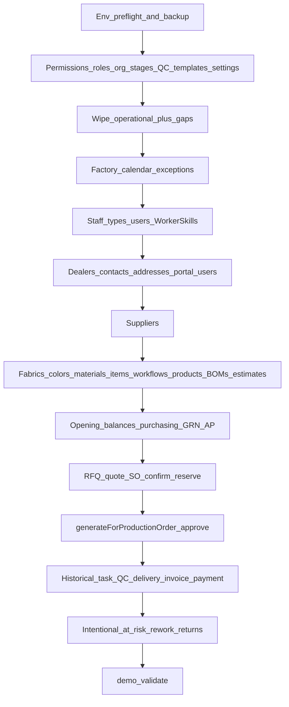

# Demo data system audit

**Checkpoint:** 1 of 3 (audit only — no wipe, no seed)  
**Date:** 2026-08-16  
**Schema:** [`packages/database/prisma/schema.prisma`](../packages/database/prisma/schema.prisma) — 92 models, 47 enums, PostgreSQL  
**Purpose:** Replace launch/UAT/mock business data with one coherent two-month factory dataset. This document is the system map. Implementation is Checkpoint 2. Execution against a confirmed DEV database is Checkpoint 3.

Checkpoints 2–3 completed 2026-08-16: builders in `packages/database/prisma/demo/`, then `pnpm demo:reset` on local `maher_erp`. See the docs below.

Related:

- [`demo-screen-data-coverage.md`](demo-screen-data-coverage.md) — Checkpoint 2
- [`father-demo-walkthrough.md`](father-demo-walkthrough.md) — Checkpoint 3
- [`demo-factory-data-closure-report.md`](demo-factory-data-closure-report.md) — Checkpoint 3

---

## 0. Connected environment (must re-verify before any wipe)

Workspace [`.env`](../.env) matches [`.env.example`](../.env.example) local defaults:

| Key | Value |
|-----|--------|
| `NODE_ENV` | `development` |
| `TZ` | `Asia/Amman` |
| Postgres | `127.0.0.1:5432`, database **`maher_erp`**, user `maher` |

Same names as [`infra/docker/docker-compose.yml`](../infra/docker/docker-compose.yml) (`POSTGRES_DB=maher_erp`). This is the **local Docker/dev database**, not production.

Today’s [`packages/database/prisma/seed.ts`](../packages/database/prisma/seed.ts) has **no production guard**. Checkpoint 3 must refuse wipe unless a preflight prints host + database name + `NODE_ENV` and all of these hold:

1. `NODE_ENV !== production`
2. Host is loopback (`127.0.0.1` / `localhost`)
3. Database name is `maher_erp`

**Backup before Checkpoint 3:** `pg_dump` of `maher_erp` to a gitignored path (for example `backups/maher_erp-pre-demo-YYYYMMDD.dump`) plus documented `pg_restore`. See [`docs/backups.md`](backups.md) (local = developer-owned).

**Canonical demo clock:** none exists. Current seed uses `Date.now()` via [`packages/database/prisma/seed/util.ts`](../packages/database/prisma/seed/util.ts) `daysAgo()`, so re-runs drift. Proposed freeze: `DEMO_AS_OF=2026-08-16` in `Asia/Amman`. Window: **2026-06-16 → 2026-08-16**.

Schema sync in CI/dev is **`prisma db push`**. The migrations folder is a placeholder. Do not delete schema, migrations, or permission catalog source.

---

## What the application actually is

Four UIs + API + worker (not three):

| Surface | Path | Port (local) |
|---------|------|----------------|
| Admin web | [`apps/admin-web`](../apps/admin-web) | 3000 |
| Dealer web | [`apps/customer-portal`](../apps/customer-portal) | 3001 |
| Worker web | [`apps/employee-portal`](../apps/employee-portal) | 3002 |
| Mobile (admin / dealer / worker) | [`apps/mobile`](../apps/mobile) | Metro 8081 |
| API | [`apps/api`](../apps/api) — 34 Nest modules | 4000 |
| Queue worker | [`apps/worker`](../apps/worker) | — |

Dealers are `Customer` rows plus portal `User`s (`User.customerId`). There is no separate dealers module.

Currency in settings/seed is **ILS**, VAT **16%**, factory timezone **Asia/Amman**, Friday closed by default (`workingWeekdays = [0,1,2,3,4,6]`), shift 08:00–16:00 with lunch 12:00–13:00.

---

## 1–6. Every persisted model

Legend:

- **Kind:** `business` (historical/ops — clear on demo reset) · `config` (preserve or recreate) · `auth` (clear users, recreate logins) · `log` (clear; modest reseed)

### IAM and organization

| Model | Table | Represents | Required FKs | Optional / useful for demo | Kind |
|-------|-------|------------|--------------|----------------------------|------|
| User | `users` | Staff, workers, dealer logins | — | `customerId`, `departmentId` | auth / business |
| Role | `roles` | Identity + staff types | — | `iconKey`, descriptions | config |
| Permission | `permissions` | Atomic codes from `@maher/permissions` | — | — | config |
| UserRole | `user_roles` | User ↔ role | `userId`, `roleId` | — | auth |
| RolePermission | `role_permissions` | Role ↔ permission | `roleId`, `permissionId` | — | config |
| Session | `sessions` | Refresh tokens | `userId` | — | auth (safe to clear) |
| Branch | `branches` | Site; seeded `AMMAN` | — | — | config |
| Department | `departments` | MGMT, SALES, PURCH, WH, PROD, CARP, PAINT, UPHOL, ASM, QC, PACK, DEL, ACCT | — | `branchId` | config |
| WorkerSkill | `worker_skills` | Worker × stage eligibility | `userId`, `stageDefinitionId` | `proficiency` | business — **not seeded today** |

Identity role codes: `CUSTOMER`, `PRODUCTION_WORKER`, `SYSTEM_ADMINISTRATOR`. Staff preset today: `WAREHOUSE_MANAGEMENT` only ([`packages/permissions/src/staff.ts`](../packages/permissions/src/staff.ts)). Demo needs additional staff types (production manager, scheduling, sales, purchasing, QC, finance, delivery).

### CRM / dealers

| Model | Table | Represents | Required FKs | Optional / useful | Kind |
|-------|-------|------------|--------------|-------------------|------|
| Customer | `customers` | Dealer account | — | account manager, creditLimit, paymentTermsDays, bilingual names, phone/email | business |
| CustomerContact | `customer_contacts` | Contact person | `customerId` | phone, email, `isPrimary` | business |
| CustomerAddress | `customer_addresses` | Billing / delivery | `customerId` | lat/lng, area, instructions | business |
| CommunicationLog | `communication_logs` | CRM notes | `customerId` | `employeeId` | business |

Statuses: `LEAD | PROSPECT | ACTIVE | INACTIVE | BLOCKED`. Types: `INDIVIDUAL | COMPANY | SHOWROOM`.

### Catalog, BOM, measurements

| Model | Table | Represents | Required FKs | Optional / useful | Kind |
|-------|-------|------------|--------------|-------------------|------|
| ProductCategory | `product_categories` | Taxonomy | — | `parentId` | config / business |
| Product | `products` | Sellable SKU | — | category, dimensions, `customMeasurements`, `bomDefaults`, images, cost, `adminNotes` | business |
| DealerPrice | `dealer_prices` | Per-dealer price | `customerId`, `productId` | — | business |
| Material | `materials` | Material master (often paired 1:1 with InventoryItem) | — | color, size, min/max | business |
| Fabric | `fabrics` | Fabric swatch | — | color, supplier | config / business |
| ColorReference | `color_references` | Finish / wood color | — | hex | config / business |
| ProductProductionProfile | `product_production_profiles` | Scheduling profile | `productId` | lead time, buffer | config |
| ProductStageEstimate | `product_stage_estimates` | Per-stage minutes | `productId`, `stageDefinitionId` | scaling mode, department override | config |
| StageEstimateStat | `stage_estimate_stats` | Historical estimate stats | `productId`, `stageDefinitionId` | — | business (computed) |
| ProductWorkflowConfiguration | `product_workflow_configurations` | Product → workflow | `productId`, `workflowId` | — | config |
| ProductWorkflowStageOverride | `product_workflow_stage_overrides` | REQUIRED / OPTIONAL / EXCLUDED | `configurationId`, `stageDefinitionId` | `workflowNodeId` | config |
| ProductStageInventoryOutput | `product_stage_inventory_outputs` | Stage produces WIP/FG | `productId` | warehouse, inventory item | config |
| ProductStageInventoryInput | `product_stage_inventory_inputs` | Stage consumes prior output | `productId`, `outputId` | — | config |

**BOM truth:** [`apps/api/src/common/helpers/inventory-reservation.util.ts`](../apps/api/src/common/helpers/inventory-reservation.util.ts) prefers `bomDefaults.materials[{ sku, qty }]`, else `fabricQty` / `woodQty` / `foamQty` / `accessoriesQty`. Current catalog seed writes `fabricMeters` / `woodUnits` / `foamBlocks` — **those keys are ignored by reservation**. Demo BOMs must use `materials[]` SKU lines (factory-UAT already does).

Request-item spec fields that must appear on realistic orders: width, height, depth, seatHeight, material, woodType, woodColor, fabricType, fabricCode, fabricColor, foamDensity, finish, accessories, notes, `customMeasurements`.

### Purchasing

| Model | Table | Represents | Required FKs | Optional / useful | Kind |
|-------|-------|------------|--------------|-------------------|------|
| Supplier | `suppliers` | Vendor | — | contacts, leadTimeDays, paymentTermsDays | business |
| SupplierContact | `supplier_contacts` | Vendor contact | `supplierId` | — | business |
| PurchaseRequest | `purchase_requests` | Internal PR | — | warehouse, preferred supplier, PO | business |
| PurchaseRequestLine | `purchase_request_lines` | PR line | `purchaseRequestId` | `inventoryItemId` | business |
| SupplierQuoteOffer | `supplier_quote_offers` | Quote comparison | `purchaseRequestId`, `supplierId` | — | business |
| PurchaseOrder | `purchase_orders` | PO | `supplierId` | warehouse | business |
| PurchaseOrderLine | `purchase_order_lines` | PO line | `purchaseOrderId` | `inventoryItemId` | business |
| GoodsReceipt | `goods_receipts` | GRN | `purchaseOrderId`, `warehouseId` | — | business |
| GoodsReceiptLine | `goods_receipt_lines` | Received qty | `goodsReceiptId`, `inventoryItemId` | rejectedQty | business |
| SupplierInvoice | `supplier_invoices` | AP invoice | `supplierId`, `purchaseOrderId` | goodsReceipt | business |
| SupplierInvoiceLine | `supplier_invoice_lines` | AP line | `supplierInvoiceId` | — | business |
| SupplierPayment | `supplier_payments` | AP payment | `supplierId` | supplierInvoice | business |

PO status: `DRAFT → APPROVED → SENT → PARTIALLY_RECEIVED → RECEIVED | CANCELLED | CLOSED`. GRN requires a PO. Receive cannot exceed ordered (partials allowed). GRN triggers `retryWaitingMaterialOrders()` so shortage stories need a real incoming PO, not a flag.

### Inventory and warehouses

| Model | Table | Represents | Required FKs | Optional / useful | Kind |
|-------|-------|------------|--------------|-------------------|------|
| Warehouse | `warehouses` | RAW / SEMI / FIN | — | `branchId` | config |
| WarehouseLocation | `warehouse_locations` | Bin | `warehouseId` | — | business (recreate) |
| InventoryItem | `inventory_items` | Stock SKU | — | material, product, preferredSupplier | business |
| InventoryBalance | `inventory_balances` | Qty snapshot | `inventoryItemId`, `warehouseId` | location | business |
| InventoryTransaction | `inventory_transactions` | Ledger (source of truth) | `inventoryItemId`, `warehouseId` | referenceType/Id | business |
| InventoryLot | `inventory_lots` | WIP / FG lot | `inventoryItemId`, `warehouseId` | PO, SO, stage | business |
| InventoryCount | `inventory_counts` | Physical count | — | — | business |
| InventoryCountLine | `inventory_count_lines` | Count line | `inventoryCountId`, `inventoryItemId` | — | business |
| WarehouseTransfer | `warehouse_transfers` | Inter-warehouse | from/to warehouse | — | business |
| WarehouseTransferLine | `warehouse_transfer_lines` | Transfer line | `transferId`, `inventoryItemId` | — | business |

Tx types include `OPENING_BALANCE`, `PURCHASE_RECEIPT`, `PRODUCTION_ISSUE`, `SEMI_FINISHED_RECEIPT` / `ISSUE`, `FINISHED_GOODS_RECEIPT`, `DELIVERY_ISSUE` / `RESTORE`, `CUSTOMER_RETURN`, `INVENTORY_ADJUSTMENT`, `DAMAGE`, `SCRAP`. **Never set balances independently of transactions.** Negative stock is not a supported happy path.

Factory-UAT may leave extra warehouses `RAW-2` / `SEMI-2` / `FIN-2` — wipe those on demo reset.

### Sales lifecycle

| Model | Table | Represents | Required FKs | Optional / useful | Kind |
|-------|-------|------------|--------------|-------------------|------|
| RequestForQuotation | `requests_for_quotation` | RFQ | `customerId` | assigned sales, delivery coords, external PO, notes | business |
| RequestItem | `request_items` | Line + furniture spec | `requestId` | `productId` (SetNull) | business |
| Quotation | `quotations` | Quote (versioned) | `customerId` | `requestId`, salesRep, parent revision | business |
| QuotationLine | `quotation_lines` | Quote line | `quotationId` | product, dimensions, fabric, color | business |
| QuotationApproval | `quotation_approvals` | Internal gate | `quotationId`, `approverId` | — | business |
| SalesOrder | `sales_orders` | Sale | `customerId` | `quotationId`, delivery date/address, cost breakdown | business |
| SalesOrderLine | `sales_order_lines` | SO line | `salesOrderId` | product, `specifications` | business |
| Contract | `contracts` | Optional legal wrapper | `customerId` | `salesOrderId` | business |

### Production and workflow

| Model | Table | Represents | Required FKs | Optional / useful | Kind |
|-------|-------|------------|--------------|-------------------|------|
| ProductionStageDefinition | `production_stage_definitions` | Stage library | — | inspection, photos, resource mode, slots | config |
| ProductionWorkflow | `production_workflows` | Template header | — | `activeVersionId` | config |
| ProductionWorkflowVersion | `production_workflow_versions` | Published graph | `workflowId` | — | config |
| ProductionWorkflowNode | `production_workflow_nodes` | Stage in graph | `workflowVersionId`, `stageDefinitionId` | warehouse, inventory flags | config |
| ProductionWorkflowEdge | `production_workflow_edges` | HARD DAG edge | version + from/to nodes | — | config |
| ProductionOrder | `production_orders` | Shop order | — | SO, line, product | business |
| ProductionStageInstance | `production_stage_instances` | Stage execution | `productionOrderId`, `stageDefinitionId` | planned/actual | business |
| ProductionTask | `production_tasks` | Floor task | `productionOrderId` | assignee, stage, rework | business |
| TaskTimeEntry | `task_time_entries` | Timer | `taskId`, `userId` | — | business |
| TaskBlocker | `task_blockers` | Impediment | `taskId` | reporter | business |
| ProductionOrderWorkflowSnapshot | `production_order_workflow_snapshots` | Frozen graph | `productionOrderId` | source workflow/version | business |
| Snapshot node / edge | `production_order_workflow_snapshot_*` | Denormalized DAG | `snapshotId` | stage instance | business |

Stage library today: `MATERIAL_PREP`, `CARPENTRY`, `PAINTING`, `FOAM`, `UPHOLSTERY`, `ASSEMBLY`, `INSPECTION` (`requiresInspection`), `PACKAGING`, `DELIVERY`. Seed currently attaches **one** template (`STANDARD_FURNITURE`) to all catalog products. UAT adds `UAT_PARALLEL`.

Workflow edges are `HARD` only. Optional stages use `StageApplicability` on product overrides (`INHERIT | REQUIRED | OPTIONAL | EXCLUDED`).

### Scheduling

| Model | Table | Represents | Required FKs | Optional / useful | Kind |
|-------|-------|------------|--------------|-------------------|------|
| FactoryCalendar | `factory_calendars` | Working week, TZ, breaks | — | overtimeConfig, delivery buffer | config — **not in current wipe** |
| FactoryCalendarException | `factory_calendar_exceptions` | HOLIDAY / SHUTDOWN / EXTRA_SHIFT | `calendarId` | shift override | config — **not in current wipe** |
| ProductionSchedule | `production_schedules` | Plan version | `productionOrderId` | approver, committed/suggested dates | business |
| ScheduleAllocation | `schedule_allocations` | Worker/resource slot | `scheduleId` | task, stage, employee, department, pin | business |
| SchedulingReplanRun | `scheduling_replan_runs` | Async replan job | — | payload/result JSON | log — **not in current wipe** |
| SchedulingEstimateProposal | `scheduling_estimate_proposals` | Estimate review | — | productionOrder | business |

Canonical at-risk: [`apps/api/src/modules/scheduling/domain/at-risk.ts`](../apps/api/src/modules/scheduling/domain/at-risk.ts). May-be-late = latest **active** schedule (`APPROVED | PROPOSED | NEEDS_REVIEW`) on **incomplete** POs with primary status `LATE | AT_RISK | BLOCKED`. Do not seed stale `requiresAdminEstimateReview` on products that lack estimates (that produced the old “everything may be late” UAT set — [`scheduling-at-risk-closure-report.md`](scheduling-at-risk-closure-report.md)).

Overtime is `EXTRA_SHIFT` calendar exceptions, not a fake load flag. Promise state, bottlenecks, and factory load are **computed** — never insert dashboard counts.

Scheduler requires `WorkerSkill`. There is no unlimited department fallback.

### Quality, delivery, finance, returns

| Model | Table | Represents | Required FKs | Optional / useful | Kind |
|-------|-------|------------|--------------|-------------------|------|
| QualityChecklistTemplate | `quality_checklist_templates` | Checklist def (`FINAL_QC`) | — | `stageCode` | config |
| QualityChecklistItem | `quality_checklist_items` | Checklist row | `templateId` | — | config |
| QualityInspection | `quality_inspections` | Inspection | `productionOrderId` | inspector | business |
| QualityInspectionItem | `quality_inspection_items` | Item result | `inspectionId` | — | business |
| QualityDefect | `quality_defects` | Defect | `inspectionId` | — | business |
| ReworkRequest | `rework_requests` | Rework loop | `productionOrderId` | inspection, return, reentry stage | business |
| Delivery | `deliveries` | Shipment | `customerId` | SO, driver, geo, signature | business |
| DeliveryItem | `delivery_items` | Shipment line | `deliveryId` | — | business |
| Invoice | `invoices` | AR invoice | `customerId` | SO, JoFotara fields | business |
| InvoiceLine | `invoice_lines` | Invoice line | `invoiceId` | — | business |
| Payment | `payments` | AR payment | `customerId` | invoice | business |
| StatementEntry | `statement_entries` | AR ledger | `customerId` | — | business |
| ReturnRequest | `return_requests` | Dealer return | `customerId` | SO, photos, resolution, fate | business |

Rework `status` and return `approvalStatus` are **strings**, not Prisma enums (`AWAITING_STAGE` / `IN_PROGRESS` / `COMPLETED`; `PENDING` / `APPROVED` / `REJECTED`).

### Notifications, documents, AI, system

| Model | Table | Represents | Kind |
|-------|-------|------------|------|
| Document | `documents` | Uploads / task photos | business |
| Notification | `notifications` | In-app inbox | log |
| DevicePushToken | `device_push_tokens` | Push (skip seeding) | log |
| NotificationTemplate | `notification_templates` | Message templates | config |
| AIExtractionJob / Field | `ai_extraction_*` | OCR intake | business |
| AiChatConversation / Message | `ai_chat_*` | Chat — **not in current wipe** | log |
| AuditEvent | `audit_events` | Audit | log |
| IdempotencyRecord | `idempotency_records` | API cache | log |
| SystemSetting | `system_settings` | VAT, currency, company, auto-confirm | config |
| SequenceCounter | `sequence_counters` | Doc numbers `[key, year]` | business (reset then advance) |

---

## 6. Important enums (full)

| Enum | Values |
|------|--------|
| Locale | `ar`, `en`, `he` |
| CustomerStatus | `LEAD`, `PROSPECT`, `ACTIVE`, `INACTIVE`, `BLOCKED` |
| CustomerType | `INDIVIDUAL`, `COMPANY`, `SHOWROOM` |
| RequestStatus | `DRAFT`, `SUBMITTED`, `UNDER_REVIEW`, `NEEDS_INFORMATION`, `READY_FOR_QUOTATION`, `QUOTED`, `CLOSED`, `CANCELLED` |
| RequestSource | `PORTAL`, `SALES`, `WHATSAPP`, `EMAIL`, `PDF`, `IMAGE`, `HANDWRITTEN`, `PHONE`, `SITE_VISIT` |
| QuotationStatus | `DRAFT`, `INTERNAL_REVIEW`, `APPROVED`, `SENT`, `VIEWED`, `ACCEPTED`, `REJECTED`, `REVISION_REQUESTED`, `EXPIRED`, `CANCELLED` |
| SalesOrderStatus | `DRAFT`, `CONFIRMED`, `WAITING_FOR_PAYMENT`, `WAITING_FOR_MATERIALS`, `READY_FOR_PRODUCTION`, `IN_PRODUCTION`, `READY_FOR_DELIVERY`, `DELIVERED`, `COMPLETED`, `CANCELLED`, `ON_HOLD` |
| ContractStatus | `DRAFT`, `UNDER_REVIEW`, `ACTIVE`, `COMPLETED`, `TERMINATED`, `EXPIRED` |
| PurchaseRequestStatus | `DRAFT`, `SUBMITTED`, `APPROVED`, `REJECTED`, `ORDERED`, `CLOSED` |
| PurchaseOrderStatus | `DRAFT`, `APPROVED`, `SENT`, `PARTIALLY_RECEIVED`, `RECEIVED`, `CANCELLED`, `CLOSED` |
| ProductionOrderStatus | `DRAFT`, `PLANNED`, `WAITING_FOR_MATERIALS`, `READY`, `IN_PROGRESS`, `ON_HOLD`, `QUALITY_CHECK`, `READY_FOR_PACKAGING`, `READY_FOR_DELIVERY`, `COMPLETED`, `CANCELLED` |
| StageInstanceStatus | `PENDING`, `READY`, `IN_PROGRESS`, `COMPLETED`, `SKIPPED`, `BLOCKED` |
| TaskStatus | `NOT_STARTED`, `READY`, `IN_PROGRESS`, `PAUSED`, `BLOCKED`, `READY_FOR_INSPECTION`, `COMPLETED`, `CANCELLED` |
| BlockerCategory | `MATERIAL_MISSING`, `MATERIAL_DEFECT`, `MACHINE_PROBLEM`, `MEASUREMENT_ISSUE`, `DESIGN_ISSUE`, `PREVIOUS_STAGE_DEFECT`, `STAFFING`, `SAFETY`, `OTHER` |
| QualityResult | `PASSED`, `PASSED_WITH_NOTES`, `FAILED_REWORK_REQUIRED`, `BLOCKED` |
| ChecklistItemResult | `PASS`, `FAIL`, `NOT_APPLICABLE` |
| DeliveryStatus | `PLANNED`, `READY`, `OUT_FOR_DELIVERY`, `DELIVERED`, `FAILED`, `RESCHEDULED`, `CANCELLED` |
| InvoiceStatus | `DRAFT`, `ISSUED`, `PARTIALLY_PAID`, `PAID`, `OVERDUE`, `VOID`, `CANCELLED` |
| PaymentMethod | `CASH`, `BANK_TRANSFER`, `CHEQUE`, `CARD`, `OTHER` |
| ReturnReason | `MANUFACTURING_DEFECT`, `INCORRECT_MEASUREMENT`, `INCORRECT_MATERIAL`, `INCORRECT_COLOR`, `DELIVERY_DAMAGE`, `CUSTOMER_REQUEST`, `OTHER` |
| ReturnResolution | `REPAIR`, `REPLACEMENT`, `CREDIT_NOTE`, `REFUND`, `REJECTED` |
| ReturnInventoryFate | `PENDING`, `RETURN_TO_STOCK`, `REWORK`, `DAMAGED`, `SCRAP` |
| InventoryTxType | see inventory section |
| WarehouseType | `RAW_MATERIALS`, `SEMI_FINISHED`, `FINISHED_GOODS` |
| InventoryItemClass | `RAW_MATERIAL`, `SEMI_FINISHED_GOOD`, `FINISHED_GOOD` |
| InventoryLotStatus | `AVAILABLE`, `RESERVED`, `QUARANTINED`, `DAMAGED`, `SCRAPPED`, `CONSUMED`, `DELIVERED`, `REQUIRES_REVIEW` |
| ScheduleStatus | `DRAFT`, `PROPOSED`, `APPROVED`, `SUPERSEDED`, `CANCELLED`, `NEEDS_REVIEW`, `PROVISIONAL` |
| SchedulePromiseState | `ESTIMATED`, `AWAITING_APPROVAL`, `CONFIRMED`, `AT_RISK`, `LATE`, `RESCHEDULED`, `COMPLETED` |
| FactoryCalendarExceptionType | `HOLIDAY`, `SHUTDOWN`, `EXTRA_SHIFT` |
| WorkflowDependencyType | `HARD` |
| StageApplicability | `INHERIT`, `REQUIRED`, `OPTIONAL`, `EXCLUDED` |
| QuantityScalingMode | `LINEAR`, `FIXED`, `SETUP_PLUS_LINEAR`, `BATCH`, `PARALLEL_CAPACITY` |
| SchedulingResourceMode | `WORKER_CONSTRAINED`, `RESOURCE_CONSTRAINED` |
| RoleKind | `CUSTOMER`, `PRODUCTION_WORKER`, `STAFF`, `ADMIN` |

**Vestigial SO statuses (do not seed as if live API wrote them):**

- `CONFIRMED` — `confirm()` never sets it (DRAFT → `READY_FOR_PRODUCTION` or `WAITING_FOR_MATERIALS`)
- `WAITING_FOR_PAYMENT` — listed for hold/cancel; no domain writer found
- `COMPLETED` — delivery sets `DELIVERED`; payments do not complete the SO

Use `DELIVERED` + paid/partial/outstanding invoices for finished commercial history.

---

## 7. Lifecycle rules (canonical, from services)

```
RFQ  DRAFT → SUBMITTED → UNDER_REVIEW | READY_FOR_QUOTATION | NEEDS_INFORMATION
     → quotation.create → QUOTED
     → quotation.accept → CLOSED

Quotation  DRAFT → INTERNAL_REVIEW → APPROVED → SENT → ACCEPTED
           (accept creates SalesOrder DRAFT; auto_confirm_so_on_accept may call confirm())

SalesOrder.confirm()  [DRAFT only]
  → ProductionOrder per production line (PLANNED or WAITING_FOR_MATERIALS)
  → workflow snapshot + stage instances + tasks
  → tryReserveForSalesOrder()
  → SO READY_FOR_PRODUCTION | WAITING_FOR_MATERIALS
  → SchedulingService.generateForProductionOrder()

Task start  → PO IN_PROGRESS
            → SO IN_PRODUCTION only if SO is CONFIRMED | READY_FOR_PRODUCTION | WAITING_FOR_PAYMENT
            (WAITING_FOR_MATERIALS must not have started tasks)

Task complete
  → prereqs HARD edges satisfied
  → photos if snapshot/stage requiresPhotos
  → pipeline rollup + production inventory WIP/FG
  → targeted schedule replan
  → if PO COMPLETED → invoices.ensureFromSalesOrder()

QC submit
  PASSED | PASSED_WITH_NOTES → complete inspection tasks, rollup, replan(qc-pass)
  FAILED_REWORK_REQUIRED | BLOCKED → ReworkRequest, PO ON_HOLD, reverse FG, replan(qc-fail)
  Failed QC cannot become delivered without rework + later pass

All sibling POs COMPLETED | READY_FOR_DELIVERY | READY_FOR_PACKAGING
  → SO READY_FOR_DELIVERY

Delivery create  requires SO READY_FOR_DELIVERY
  PLANNED → READY → OUT_FOR_DELIVERY → DELIVERED
  DELIVERED → SO DELIVERED + issueForDelivery + ensureFromSalesOrder

Payment  amount ≤ invoice outstanding (PAYMENT_EXCEEDS_OUTSTANDING)

Return  PENDING → APPROVED | REJECTED
  APPROVED may quarantine; fate RETURN_TO_STOCK | REWORK | DAMAGED | SCRAP
  Returns belong on delivered orders

Purchasing  PR SUBMITTED → APPROVED → ORDERED (+ PO)
  PO DRAFT → APPROVED → SENT → GRN → PARTIALLY_RECEIVED | RECEIVED
  GRN → applyMovement(PURCHASE_RECEIPT) → retryWaitingMaterialOrders()
```

Domain services to reuse (Checkpoint 2): `SalesOrdersService.confirm`, `WorkflowSnapshotService.createSnapshotForProductionOrder`, `InventoryService.applyMovement` / `tryReserveForSalesOrder`, planner `generateForProductionOrder` + `approve`, `TasksService.complete` (or equivalent inventory/rollup), QC submit, delivery status, `PaymentsService.record`, purchasing GRN.

Direct Prisma for historical rows is allowed **only** if the result matches those invariants. Document every exception.

---

## 8–11. Historical vs config; what to clear vs keep

### Must remain or recreate (never leave empty)

- Permissions + identity roles + staff presets (extend with demo staff types)
- Branch `AMMAN`
- Warehouses `RAW`, `SEMI`, `FIN` (drop UAT `RAW-2` / `SEMI-2` / `FIN-2`)
- Departments
- Stage library (recreate codes above)
- QC template `FINAL_QC`
- Notification templates
- System settings (VAT 0.16, ILS, company name, `auto_confirm_so_on_accept`, quotation threshold)
- Default factory calendar (`Asia/Amman`)
- Ability to log in: recreate `admin` in the same command (password pattern `123` already exists)

### Safe to clear (business / auth / logs)

Everything in [`packages/database/prisma/seed/wipe.ts`](../packages/database/prisma/seed/wipe.ts) **plus wipe gaps**:

| Missing from current wipe | Why it matters |
|---------------------------|----------------|
| `factory_calendars`, `factory_calendar_exceptions` | DRUAT calendar exceptions linger |
| `production_workflows` + versions/nodes/edges | `UAT_PARALLEL` lingers; demo needs new templates |
| `scheduling_replan_runs` | DRUAT evidence remains |
| `ai_chat_conversations`, `ai_chat_messages` | Independent of users wipe order |
| `worker_skills` | Cascades from users if users truncated; list explicitly |
| `inventory_lots`, stage inventory I/O, estimate stats | Mostly cascade from products/POs; list explicitly |

### Do not delete

- Prisma schema, migrations, permission TypeScript catalog
- Auth infrastructure design (JWT settings in `.env`)
- Upload files on disk unless unreferenced after reset (optional cleanup)

---

## 12. Correct deletion order

PostgreSQL `TRUNCATE … CASCADE` on a complete table list is the existing pattern. Extend the list; do not `DROP` schema.

Order conceptually (CASCADE handles FKs if the list is complete):

1. Logs: AI chat, replan runs, idempotency, audit, notifications, push tokens, documents
2. Returns, QC, rework, deliveries, invoices/payments/statements, AP
3. Schedules + allocations, tasks, stage instances, snapshots, production orders
4. Contracts, sales orders, quotations, RFQs
5. Inventory txs/balances/lots/counts/transfers, GRNs, POs, PRs, items, locations
6. Catalog: dealer prices, products, categories, materials, fabrics, colors, workflows
7. Suppliers, customers (+ contacts/addresses/comms)
8. Sessions, user_roles, worker_skills, users
9. Sequence counters
10. Then recreate calendars / extra warehouses after truncate (or include calendars in truncate and recreate)

---

## 13. Correct creation order



Numbered:

1. Env preflight + backup (**Checkpoint 3 only**)
2. Foundation upsert
3. Wipe operational + leftover config
4. Factory calendar + exceptions (one holiday/shutdown, a few overtime evenings, maybe one exceptional open day)
5. Staff types beyond warehouse
6. Users + **WorkerSkill** rows (uneven skills; some multi-skilled)
7. Dealers + contacts + addresses + dealer users
8. Suppliers
9. Fabrics/colors, materials, inventory items, locations
10. 5 workflow templates; attach per product family; SKU BOMs; estimates; stage inventory I/O
11. Opening balances as `OPENING_BALANCE` txs; purchasing history + GRNs + AP
12. Curated sales: RFQ → quote → SO DRAFT → confirm/reserve → schedule generate/approve
13. Historical: replay task complete + QC + delivery + invoice/payment with chronological timestamps
14. Intentional exceptions: 1–3 at-risk, 1–3 QC/rework, 2–4 returns
15. Modest notifications/audit
16. `demo:validate`

---

## 14. Existing fake / UAT / demo sources

Do **not** use these as the father presentation dataset.

### Seed pipeline

| File | What it does | Problem for presentation |
|------|----------------|--------------------------|
| [`prisma/seed.ts`](../packages/database/prisma/seed.ts) | Foundation + wipe + launch/demo | No production guard |
| [`seed-demo-world.ts`](../packages/database/prisma/seed-demo-world.ts) | Launch vs `SEED_FULL_DEMO` | Full demo is old 14-day world |
| [`seed/people.ts`](../packages/database/prisma/seed/people.ts) | admin, warehouse, 3 dealers, 15 workers | Last names `Warehouse` / `Portal`; **no WorkerSkill** |
| [`seed/catalog.ts`](../packages/database/prisma/seed/catalog.ts) | ~40 generic products | Wrong BOM keys; one workflow |
| [`seed/dealer-orders-recent.ts`](../packages/database/prisma/seed/dealer-orders-recent.ts) | 14-day RNG snapshots | Cheats final statuses from progress%; dates relative to `now` |
| [`seed/dealer-finance.ts`](../packages/database/prisma/seed/dealer-finance.ts) | Invoices/payments/returns | Invoices in-production orders; returns on `READY_FOR_DELIVERY` |
| [`seed/inventory.ts`](../packages/database/prisma/seed/inventory.ts) | 15 materials | Thin vs two-month ops |
| [`seed/purchasing.ts`](../packages/database/prisma/seed/purchasing.ts) | 6 suppliers | `PR-2025-*` in 2026 |
| [`seed/sales-timeline.ts`](../packages/database/prisma/seed/sales-timeline.ts) | Unused 8-month RNG | Not wired |
| [`seed-orders-volume.ts`](../packages/database/prisma/seed-orders-volume.ts) | Deprecated no-op | — |
| [`seed/factory-uat.ts`](../packages/database/prisma/seed/factory-uat.ts) | `UAT-SOFA-A/B/C`, `UAT_PARALLEL` | Forbidden presentation names |
| [`seed/platform-extras.ts`](../packages/database/prisma/seed/platform-extras.ts) | AI stub | `provider: seed-stub` |
| Password `123` | bcrypt in seed | **Keep** — already the repo’s explicit demo credential pattern |

Launch vs demo commands: `pnpm db:seed` (empty ops) · `pnpm db:seed:demo` · `pnpm db:seed:factory-uat`. **No `demo:reset` today.**

### Live UAT scripts (leave tagged rows in `maher_erp`)

| Script | Tag |
|--------|-----|
| [`scripts/dynamic-replan-live-uat.mjs`](../scripts/dynamic-replan-live-uat.mjs) | `DRUAT` (POs often not deleted) |
| [`scripts/material-wip-readiness-live-uat.mjs`](../scripts/material-wip-readiness-live-uat.mjs) | `DRUAT-MWIP` |
| [`scripts/qc-scheduling-replan-live-uat.mjs`](../scripts/qc-scheduling-replan-live-uat.mjs) | `DRUAT-QC` |
| [`scripts/factory-lifecycle-uat.mjs`](../scripts/factory-lifecycle-uat.mjs) | uses `UAT-SOFA-*` |
| [`scripts/smoke-factory-uat.mjs`](../scripts/smoke-factory-uat.mjs) | UAT fixtures |
| [`scripts/dealer-delivery-schedule-live-uat.mjs`](../scripts/dealer-delivery-schedule-live-uat.mjs) | live `nile` |

[`e2e/factory-production-setup.spec.ts`](../e2e/factory-production-setup.spec.ts) currently depends on **`UAT-SOFA-A`**. Presentation reset must retarget or isolate that spec.

### Client fixtures (not DB)

Mobile `/dev/*` galleries + Jest fixtures ([`docs/mobile-mock-data-audit.md`](mobile-mock-data-audit.md)). Production screens are live API. Demo reset fills the API; do not delete `/dev` fixtures.

i18n still has example copy such as “Jerash Furnishings” — UI strings, not DB.

### Known presentation bugs in current data

- Workers without skills → scheduler fail-closed / empty capacity
- 14-day history, not two months
- One workflow for every product
- BOM keys ignored by reservation
- UAT/DRUAT leftovers; calendar and replan-run wipe gaps
- Finance/returns not tied to delivery
- `daysAgo(now)` non-reproducible

---

## 15. Portal / screen consumption

Checkpoint 2 writes the screen-by-screen matrix. Summary:

| Dataset | Admin web | Mobile | Dealer portal | Worker portal |
|---------|-----------|--------|---------------|---------------|
| Dashboard metrics | `GET /reports/dashboard` | `GET /reports/admin-home` / `dealer-home` / `worker-home` | RFQ/SO/invoice/delivery queries | worker-home |
| RFQs / quotes / SO | `/orders`, `/requests`, `/quotations`, `/sales-orders` | orders, requests, quotations | `/orders`, `/quotations`, `/requests` | — |
| Production / tasks | `/production`, `/quality/[id]` | production, flow, worker tasks | order flow graph | `/tasks` |
| Scheduling / calendar | `/production/scheduling` | `/(admin)/scheduling` | dealer dates via own-deliveries | — |
| Dealer delivery calendar | — | `account/calendar` → `/scheduling/own-deliveries` | `/deliveries` | — |
| Inventory | `/inventory`, `/warehouses` | inventory tabs | — | — |
| Purchasing | `/purchasing`, `/suppliers` | purchasing | — | — |
| Invoices / statement | `/invoices`, `/payments` | invoices | `/invoices`, `/statement` | — |
| Returns | `/returns` | returns | `/returns` | — |
| Catalog / products | `/products`, fabrics, materials | products, dealer catalog | `/catalog` | — |
| Employees / skills | `/employees`, staff types | users | — | profile |
| Workflow templates | `/production/workflow` | workflow | — | — |
| QC | detail only (list redirects to production) | **no QC list** — inspection is a task | — | inspection tasks |
| Notifications | `/notifications` | inbox | `/notifications` | `/notifications` |

Admin nested nav also includes deliveries, AI intake, quality, reports, settings, audit, documents, contracts, departments.

---

## 16. Features that cannot be honestly seeded

| Feature | Why |
|---------|-----|
| Live WhatsApp / SMS / inbound email | External providers; local mocks |
| Real JoFotara clearance | Needs credentials; local mock is OK |
| Device push tokens, MFA secrets, live JWT sessions | Runtime |
| Redis queue contents | Ephemeral; replan runs can be empty |
| Statutory general ledger | Module does not exist |
| Barcode hardware | Out of scope |
| Thousands of notifications | Keep modest |
| Real private people data | Forbidden |
| Promise/at-risk/bottleneck/load **counts** | Must be derived |
| Time-limited download tokens | Need real `storageKey` files if photos are required |
| Estimate-stat recompute | `POST scheduling/estimate-stats/recompute` after completed tasks |

Stages currently seed `requiresPhotos: true`. Historical `TasksService.complete` needs `TASK_PHOTO` documents **or** snapshot `requiresPhotos=false` for demo replay. Document whichever exception is used.

AI intake: one realistic reviewed job is enough — not `seed-stub` copy.

---

## Lifecycle invariants (Checkpoint 2 validators)

Fail `demo:validate` if any of these hold:

1. SO `DELIVERED` without a `DELIVERED` delivery, or with active production tasks
2. Delivery whose SO is not `READY_FOR_DELIVERY` (at create) / not aligned after deliver
3. SO `IN_PRODUCTION` with zero started tasks
4. Started tasks on `WAITING_FOR_MATERIALS`
5. Downstream stage COMPLETED before HARD predecessors
6. Inspection-required path without passing QC (`PASSED` or `PASSED_WITH_NOTES`) before FG/delivery
7. Failed QC delivered without completed rework + later pass
8. Allocation whose worker lacks active `WorkerSkill` for that stage
9. Exclusive worker (or resource-slot) overlaps on current plans
10. Allocation on a closed weekday without `EXTRA_SHIFT` / valid pin
11. Inventory balance ≠ sum of transactions (per item/warehouse)
12. Consumption before stock existed (chronology)
13. GRN before its PO, or received qty > ordered
14. Payment > invoice outstanding
15. Invoice totals ≠ SO lines + tax (VAT 16%) for invoiced orders
16. Return qty > delivered qty, or return without dealer + original SO
17. At-risk chip membership ≠ canonical classifier on latest active schedule
18. Dealer-facing dates that are internal stage dates rather than committed/suggested delivery
19. `bomDefaults.materials[]` SKU missing as inventory item
20. Presentation strings matching `UAT`, `DRUAT`, `TEST`, `MOCK`, `SAMPLE`, `Lorem`
21. Orphan FKs / missing snapshots on confirmed POs
22. Dashboard counts that cannot be recomputed from source rows

---

## Proposed two-month factory story (Checkpoint 2 design — not executed here)

**Identity:** Maher Al-Aghbar & Sons Furniture, Amman (real company name already in settings). Dealers, suppliers, and staff are **fictional Levantine** identities. Keep known logins `admin`, `nile`, `oasis`, `balqis` (password `123`) and add more.

**Clock:** `DEMO_AS_OF=2026-08-16`, timezone `Asia/Amman`, window 2026-06-16 → 2026-08-16.

**Proposed counts:**

| Entity | Count | Notes |
|--------|------:|-------|
| Staff + workers | 32 | Owner, prod mgr, scheduling mgr, 2 sales, purchasing, 2 warehouse, QC lead, finance, 2 drivers, ~20 floor workers |
| Dealers | 10 | Keep Nile / Oasis / Balqis; add boutique, hotel/project, small showroom, custom-sofa specialist, etc. |
| Suppliers | 8 | Timber, foam, fabric, hardware, coatings, packaging, +2 |
| Products | 22 | Not 40 generics — sofa, sectional, armchair, dining, bed/headboard, ottoman, table, custom |
| Workflow templates | 5 | Standard upholstered; painted wood; armchair; custom sectional (parallel foam/sewing); simple ottoman |
| Materials / inventory SKUs | 55 | Distinct BOMs via `materials[]` |
| Purchase orders | 22 | Mix pending / partial / received |
| Sales orders | 65 | See mix below |
| At-risk (legitimate) | 3 | Late material PO; WIP gate; committed date vs capacity |
| QC / rework | 2 | 1 historical recovered, 1 current |
| Returns | 3 | On delivered orders only |
| Accidental conflicts | 0 | No demo conflict card unless later requested |

**Sales mix (~65):**

- ~20 delivered (full historical production + QC + delivery + invoice; mix paid / partial / outstanding)
- ~12 ready for delivery / packaging / QC
- ~20 in production at different stages
- ~8 ready for production, not started
- ~4 awaiting quote or `PROPOSED` schedule approval
- plus the at-risk / rework / return examples above (overlapping the buckets)

**Calendar:** Sun–Thu + Sat work, Fri closed; one shutdown/holiday; three overtime evenings (`EXTRA_SHIFT`); keep exceptions light.

**Scheduling:** seed workers/skills/calendar/BOMs/orders, then call **real** `generateForProductionOrder` + `approve`. Historical completions follow allocation chronology. At-risk only via `at-risk.ts`.

**E2E:** retarget or isolate Playwright `UAT-SOFA-A` dependency so demo reset does not break CI.

---

## Checkpoint 2 / 3 preview (not this document’s job)

Checkpoint 2 (after this audit): `packages/database/prisma/demo/` builders, `pnpm demo:reset`, `pnpm demo:validate`, [`demo-screen-data-coverage.md`](demo-screen-data-coverage.md). **Do not run destructive reset until that code is reviewed.**

Checkpoint 3 (after reset review): backup, execute against confirmed DEV `maher_erp`, validate, live API UAT, [`father-demo-walkthrough.md`](father-demo-walkthrough.md), [`demo-factory-data-closure-report.md`](demo-factory-data-closure-report.md).

---

## Source index

| Concern | Path |
|---------|------|
| Schema | [`packages/database/prisma/schema.prisma`](../packages/database/prisma/schema.prisma) |
| Current wipe | [`packages/database/prisma/seed/wipe.ts`](../packages/database/prisma/seed/wipe.ts) |
| Current seed entry | [`packages/database/prisma/seed.ts`](../packages/database/prisma/seed.ts) |
| SO confirm | [`apps/api/src/modules/sales-orders/sales-orders.service.ts`](../apps/api/src/modules/sales-orders/sales-orders.service.ts) |
| Stage rollup | [`apps/api/src/modules/production/stage-pipeline.service.ts`](../apps/api/src/modules/production/stage-pipeline.service.ts) |
| Tasks | [`apps/api/src/modules/tasks/tasks.service.ts`](../apps/api/src/modules/tasks/tasks.service.ts) |
| Scheduling | [`apps/api/src/modules/scheduling/scheduling.service.ts`](../apps/api/src/modules/scheduling/scheduling.service.ts) |
| At-risk | [`apps/api/src/modules/scheduling/domain/at-risk.ts`](../apps/api/src/modules/scheduling/domain/at-risk.ts) |
| Delivery | [`apps/api/src/modules/deliveries/deliveries.controller.ts`](../apps/api/src/modules/deliveries/deliveries.controller.ts) |
| QC | [`apps/api/src/modules/quality/quality.controller.ts`](../apps/api/src/modules/quality/quality.controller.ts) |
| BOM reservation | [`apps/api/src/common/helpers/inventory-reservation.util.ts`](../apps/api/src/common/helpers/inventory-reservation.util.ts) |
| Permissions | [`packages/permissions/src/catalog.ts`](../packages/permissions/src/catalog.ts) |
