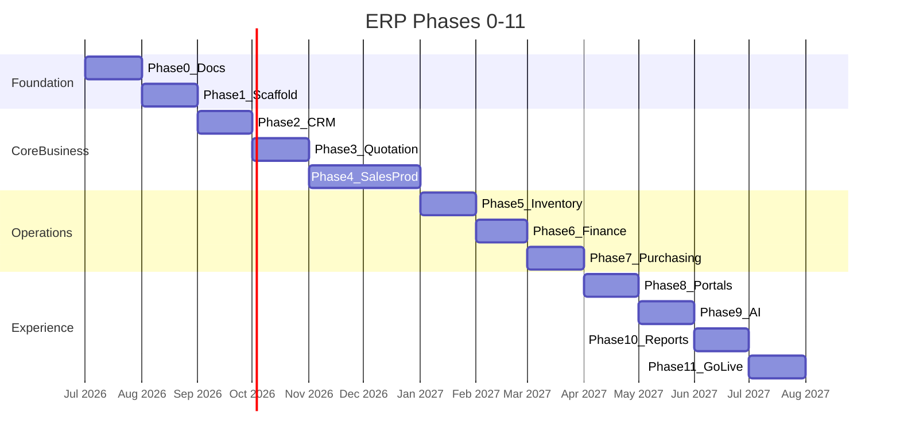
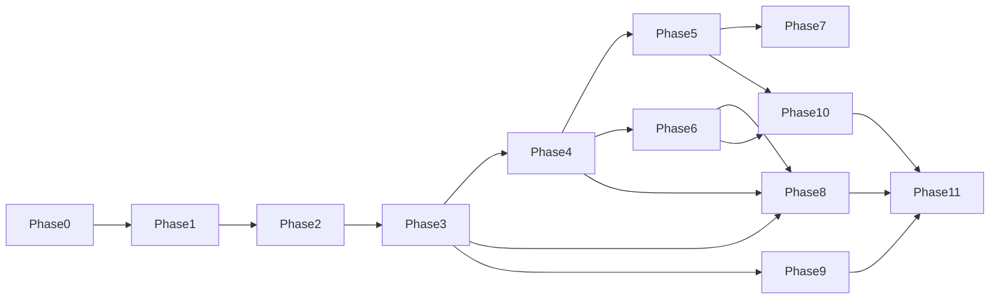

# Implementation Milestones

Phased delivery plan for **Maher Al-Aghbar & Sons Furniture ERP** (Technzone proposal `JO/LF/112/07072026`). Each phase ends with demoable deliverables and Definition of Done criteria.

Brand: coral-red (`#E03C31`) enterprise ERP for Jordan furniture factory.

---

## Overview

Timelines indicative — adjust per sprint velocity.

---

## Phase 0 — Discovery & documentation

**Goal:** Shared understanding before code.

| Deliverable | Location |
|-------------|----------|
| Product overview | `docs/product-overview.md` |
| Requirements summary | `docs/requirements.md` |
| Architecture | `docs/architecture.md` |
| Assumptions | `docs/assumptions.md` |
| Permissions | `docs/permissions.md` |
| Database model + ERD | `docs/database/database-model.md` |
| Workflows | `docs/workflows.md` |
| API outline | `docs/api.md` |
| Security model | `docs/security.md` |
| AI/OCR design | `docs/ai-ocr.md` |
| Deployment | `docs/deployment.md` |
| Localization | `docs/localization.md` |
| Testing strategy | `docs/testing.md` |
| Backups | `docs/backups.md` |
| Navigation maps | `docs/navigation.md` |
| Milestones (this doc) | `docs/milestones.md` |

**Exit criteria:** Stakeholder sign-off on assumptions; no blocking questions for Phase 1.

---

## Phase 1 — Monorepo scaffold & foundation

**Goal:** Runnable skeleton with auth and database.

- pnpm + Turborepo monorepo structure
- PostgreSQL + Prisma schema (User, Role, Permission, AuditEvent)
- NestJS API: auth (JWT cookies, Argon2), health, OpenAPI
- Next.js admin shell: login, layout, i18n AR/EN/HE RTL
- Docker Compose: postgres, redis, minio
- CI: lint, typecheck, unit tests
- Seed: roles, permissions, admin user

**Exit criteria:** Admin login/logout; permission guard demo endpoint; CI green.

---

## Phase 2 — CRM

**Goal:** Customer master data.

- Customer, Contact, Address, Activity entities + API
- Admin CRM screens (list, detail, create/edit)
- Customer portal account linking
- Soft delete, audit on mutations
- Integration tests for CRM module

**Exit criteria:** Create customer with contacts/addresses; activity log visible.

---

## Phase 3 — RFQ & quotations

**Goal:** Commercial quoting workflow.

- RFQ + line items with furniture specs
- Quotation versions, approval, send, accept/reject
- Quotation PDF worker (BullMQ)
- Email notification abstraction (console provider)
- State machine per `workflows.md`

**Exit criteria:** Full quotation lifecycle through customer accept (admin simulates portal).

---

## Phase 4 — Sales orders & production

**Goal:** Order-to-factory pipeline.

- SalesOrder from accepted quotation
- ProductionOrder, stage templates, ProductionTask
- Employee portal: task list, start/complete/block
- Production board (admin)
- QualityInspection entity (basic)
- Delivery entity (schedule only)

**Exit criteria:** SO → PO → task complete → QC pass; employee portal usable on tablet.

---

## Phase 5 — Inventory

**Goal:** Multi-warehouse stock control.

- InventoryItem, Warehouse, InventoryBalance, InventoryTransaction
- Receive, issue, transfer, adjust, count flows
- Barcode/QR generation
- Reservation against SO/production
- Negative stock blocked with audit override

**Exit criteria:** Material issue on production order updates balances; transaction ledger reconciles.

---

## Phase 6 — Finance

**Goal:** Invoicing and payments.

- Invoice from sales order, PDF generation
- Payment recording, partial payments
- Credit notes
- Statement of account PDF
- Customer portal billing section

**Exit criteria:** Invoice issued, payment recorded, SO closed; amounts Decimal-accurate.

---

## Phase 7 — Purchasing

**Goal:** Supplier and PO management.

- Supplier master
- Purchase request → purchase order → approval
- Goods receipt → inventory RECEIPT
- PO PDF

**Exit criteria:** PO receive increases stock; linked to supplier.

---

## Phase 8 — Customer & employee portals (complete)

**Goal:** Production-ready portal UX.

- Customer: RFQ submit, quote accept, order tracking, documents
- Employee: deliveries POD, QC checklists
- Notification inbox both apps
- Accessibility pass (keyboard, contrast)
- Mobile responsive customer flows

**Exit criteria:** Customer accepts quote without admin; delivery POD captured on employee app.

---

## Phase 9 — AI intake

**Goal:** OCR/translation/extraction with human review.

- AIExtractionJob pipeline + worker
- MockProvider local; staging providers wired
- Admin review queue UI
- Draft RFQ/quotation creation on approve
- **Never auto-confirm** enforced by tests

**Exit criteria:** Upload handwritten note → review → draft quotation; E2E alternate path in `testing.md`.

---

## Phase 10 — Reports, search & polish

**Goal:** Management visibility and performance.

- Dashboards: sales, production, inventory, financial
- Global search (permission-filtered)
- Report export jobs
- Audit log UI
- Document library with visibility scopes
- Performance indexes, pagination audit

**Exit criteria:** GM dashboard loads < 2s on seed data; audit searchable by entity.

---

## Phase 11 — Staging, UAT & go-live

**Goal:** Production deployment.

- Staging environment with TLS
- 16-step E2E scenario passed (manual + automated)
- Backup/restore drill
- Security checklist (`security.md`)
- User training materials (admin quick-start)
- Production deploy runbook
- Hypercare period (2 weeks on-call)

**Exit criteria:** Production live; factory staff using admin + employee apps daily; customer portal enabled for pilot customers.

---

## Cross-phase quality gates

Every phase includes:

1. Permission checks on new mutations
2. Audit events for critical actions
3. Arabic RTL strings for new UI
4. OpenAPI updated
5. Integration tests for new modules
6. No secrets in repository

---

## Dependency graph

---

## Out of scope until post-launch

- Multi-branch UI (schema ready)
- Live WhatsApp Business (blocked on Meta account)
- Online payment gateway
- Real-time chat
- Native mobile apps (PWA sufficient v1)

See `assumptions.md` for full list.
