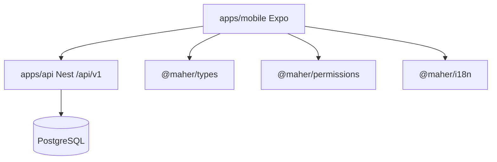

# Mobile architecture

**Date:** 2026-08-05  
**Status:** Scaffold present at `apps/mobile` (boot screen only; business screens not started)  
**Target:** One Expo application for Administrator, Dealer/Customer, and Worker against the existing NestJS API

**Reading path:** this doc → [mobile-screen-map.md](./mobile-screen-map.md) → [mobile-navigation-map.md](./mobile-navigation-map.md) → [mobile-data-flow.md](./mobile-data-flow.md) → [mobile-implementation-plan.md](./mobile-implementation-plan.md)

**Audit basis:** [mobile-audit.md](./mobile-audit.md), [mobile-api-inventory.md](./mobile-api-inventory.md), [mobile-api-gap-analysis.md](./mobile-api-gap-analysis.md), [mobile-risk-register.md](./mobile-risk-register.md)

---

## 1. Goals and non-goals

### Goals

- Single Expo Router app; persona resolved from permissions via `@maher/permissions` (`resolveAppSurface` / `resolveMobileHomeHref`)
- Reuse existing API, database, roles, permissions, orders, inventory, production, invoices, files, notifications, and AI intake — **no backend rebuild**
- Bearer auth with `client: 'mobile'`; SecureStore for tokens
- Feature-oriented folders; permission-aware navigation
- Brand-aligned RN theme (Army Camo); AR/EN/HE + RTL

### Non-goals (v1)

- Full port of admin-web (admin mobile = permission-gated module hub)
- Custom offline sync protocol or delta endpoints
- Push **delivery** (register tokens only until API sender exists)
- Durable forgot-password UX against production (API reset store is in-memory)
- Importing `@maher/ui` DOM components into React Native

---

## 2. Place in the monorepo



| Dependency | Use |
|------------|-----|
| `@maher/types` | `AuthUser`, locales, API error shapes |
| `@maher/permissions` | Permission codes, `hasPermission`, surface/home href |
| `@maher/i18n` | Message catalogs including `mobile` namespace |
| Nest API | Sole backend (`EXPO_PUBLIC_API_BASE_URL`) |

Workspace already includes `apps/*` — adding `apps/mobile` needs no `pnpm-workspace.yaml` change.

---

## 3. Folder structure

```text
apps/mobile/
  app/                          # Expo Router routes only
  src/
    api/                        # HTTP client, query keys, endpoint modules
    auth/                       # session, bootstrap, login MFA helpers
    components/                 # shared presentational UI
    features/                   # domain features (tasks, requests, …)
    hooks/                      # cross-cutting hooks
    i18n/                       # RN wiring around @maher/i18n
    permissions/                # gates, tab visibility helpers
    providers/                  # Query, auth, theme, i18n providers
    storage/                    # SecureStore + AsyncStorage wrappers
    theme/                      # tokens, ThemeProvider
    types/                      # mobile-only view models
    utils/                      # formatters, network, compress
    validation/                 # zod forms aligned to API DTOs
  assets/
  app.json | app.config.ts
  package.json
  tsconfig.json
```

### Feature folders

Each feature owns screens (imported by routes), hooks, and API helpers:

```text
src/features/
  tasks/
  requests/
  quotations/
  sales-orders/
  deliveries/
  quality/
  inventory/
  purchasing/
  invoices/
  notifications/
  ai-intake/
  catalog/
  profile/
```

Routes under `app/` stay thin: layout + screen re-export from `src/features/*`.

### Shared components

```text
src/components/
  BrandMark.tsx
  Screen.tsx
  ListState.tsx          # loading / empty / error
  PermissionGate.tsx
  StatusChip.tsx
  PhotoAttachField.tsx   # ImagePicker + upload orchestration
  MoneyText.tsx
  LocalizedName.tsx
```

---

## 4. Expo Router route groups

Matches `resolveMobileHomeHref` in `packages/permissions/src/routing.ts`:

```text
app/
  _layout.tsx                      # Root providers
  index.tsx                        # Bootstrap redirect
  (auth)/
    _layout.tsx
    login.tsx
    mfa.tsx
  (app)/
    _layout.tsx                    # Requires session
    (admin)/
      _layout.tsx                  # Surface guard: admin
      (tabs)/
        _layout.tsx
        index.tsx                  # Home
        orders.tsx
        inventory.tsx
        production.tsx
        more.tsx
      quotations/[id].tsx
      purchase-orders/[id].tsx
      production/[id].tsx
      ai-intake/[id].tsx
      inventory/...
    (customer)/
      _layout.tsx                  # Surface guard: customer
      (tabs)/
        _layout.tsx
        index.tsx
        catalog.tsx
        new-order.tsx
        orders.tsx
        account.tsx
      requests/new.tsx
      requests/[id].tsx
      quotations/[id].tsx
      orders/[id].tsx
      statements/[customerId].tsx
    (employee)/
      _layout.tsx                  # Surface guard: employee
      (tabs)/
        _layout.tsx
        index.tsx                  # Home
        tasks.tsx
        completed.tsx
        notifications.tsx
        profile.tsx
      tasks/[id].tsx
      inspections/[id].tsx
      deliveries/[id].tsx
    notifications/
      index.tsx
    modals/
      document-viewer.tsx
      language.tsx
```

Scheme: `maher` ([`apps/mobile/app.json`](../apps/mobile/app.json)); deep links in [mobile-navigation-map.md](./mobile-navigation-map.md).

---

## 5. Authentication bootstrap

Full contract: [mobile-authentication.md](./mobile-authentication.md) (preferred `/auth/mobile/*`).

```mermaid
flowchart TD
  Start[App launch]
  Load[Read SecureStore tokens]
  Refresh{Has refresh?}
  Me[GET /auth/me]
  Home[redirect resolveMobileHomeHref]
  Login[redirect /(auth)/login]
  Start --> Load
  Load --> Refresh
  Refresh -->|yes| Me
  Refresh -->|no| Login
  Me -->|ok| Home
  Me -->|401 after refresh fail| Login
```

1. On cold start, read `access_token` + `refresh_token` from SecureStore.
2. If refresh present, ensure access (refresh if missing/near-expiry) with `POST /auth/mobile/refresh` `{ refreshToken }`; **persist rotated refresh**.
3. `GET /auth/me` → `AuthUser` (permissions included).
4. Redirect to `resolveMobileHomeHref(user)`.
5. Login: `POST /auth/mobile/login` `{ username, password, mfaCode? }` → store body tokens (no cookies). Legacy: `POST /auth/login` + `client: 'mobile'`.
6. MFA: if API returns `MFA_REQUIRED`, navigate to `(auth)/mfa` then retry login with code.
7. Logout: `POST /auth/mobile/logout` `{ refreshToken }`; clear SecureStore; unregister local Expo push token (API delete endpoint still missing).

---

## 6. API client architecture

Implementation: [mobile-api-client.md](./mobile-api-client.md).

```text
src/api/
  client.ts           # fetch wrapper
  refresh.ts          # single-flight refresh
  errors.ts           # map ApiError + translateApiError
  query-keys.ts       # factory
  modules/
    auth.ts
    tasks.ts
    requests.ts
    ...
```

| Rule | Detail |
|------|--------|
| Base URL | `EXPO_PUBLIC_API_BASE_URL` + `/api/v1` |
| Auth header | `Authorization: Bearer <access>` |
| Credentials | **Do not** use cookie credentials |
| 401 handling | One refresh attempt → retry original; else clear session |
| Refresh | Body `refreshToken` + `client: 'mobile'`; overwrite SecureStore |
| Uploads | `multipart/form-data` field `file`; no JSON content-type |
| Accept-Language | From active locale (`ar` \| `en` \| `he`) |
| Throttle | API 120/min — backoff on 429 |

Do **not** copy portal `api-client.ts` (`credentials: 'include'`).

---

## 7. TanStack Query strategy

| Concern | Policy |
|---------|--------|
| Client | Single `QueryClient` in `src/providers/QueryProvider.tsx` |
| Keys | `queryKeys.tasks.list(filters)`, `queryKeys.tasks.detail(id)`, … |
| Stale time | Lists 30–60s; detail 15–30s; `auth.me` 5m or until logout |
| GC | Default; persist selected queries (see offline) |
| Mutations | Invalidate owning list + detail; avoid blanket `invalidateQueries()` |
| Optimistic | Safe for mark-notification-read, task progress %; not for money/approvals |
| Focus | `refetchOnReconnect: true`; `refetchOnWindowFocus` N/A on native — use AppState |
| Errors | Toast + `ListState`; auth errors escalate to session clear |

Invalidation map (examples):

| Mutation | Invalidate |
|----------|------------|
| Task start/complete | `tasks.list`, `tasks.detail`, employee today |
| Request submit | `requests.*` |
| Quote accept | `quotations.*`, `sales-orders.*` |
| Upload on task | `tasks.detail`, documents if listed |
| Notification read | `notifications.list` |

---

## 8. SecureStore strategy

| Key | Contents | Notes |
|-----|----------|-------|
| `maher.access_token` | JWT access | Short-lived (15m server-side) |
| `maher.refresh_token` | Opaque refresh | Rotated; never log |
| `maher.locale` | `ar` \| `en` \| `he` | Also AsyncStorage OK |
| `maher.theme` | `light` \| `dark` \| `system` | Preferences |
| `maher.push_token` | Last registered Expo token | For local cleanup |

Rules:

- Tokens **only** in SecureStore (not AsyncStorage, not Query cache).
- User profile may live in memory + Query cache (`auth.me`), not SecureStore.
- On biometric-optional later: wrap unlock, do not change API contract.
- Clear all auth keys on logout / refresh reuse failure.

Query persistence (lists): use **AsyncStorage** via `@tanstack/query-async-storage-persister` — never persist mutations or tokens there.

---

## 9. Theme structure

See [mobile-design-system.md](./mobile-design-system.md). Runtime: `ThemeProvider` + `useTheme` under `apps/mobile/src/theme/` with light/dark/system mode (SecureStore `maher.theme`).

Mirror brand tokens from [docs/brand.md](./brand.md) / `packages/ui` CSS — as RN semantic objects, not CSS imports. Max three font weights (400/500/600). No hardcoded hex in feature UI.

---

## 10. Localization and RTL

| Item | Decision |
|------|----------|
| Source | `@maher/i18n` message JSON (`mobile` + shared namespaces) |
| Default locale | `ar` |
| Locales | `ar`, `en`, `he` |
| RTL | `I18nManager.allowRTL` / `forceRTL` for `ar` and `he`; restart guidance if native flip requires reload |
| Wire-up | `src/i18n/` thin adapter (i18next or expo-localization + custom `t`) calling into catalogs |
| Entity names | `localizedName` from `@maher/i18n` |
| API errors | `translateApiError` |
| Dates / money | Locale-aware formatters in `src/utils/` (JOD) |

Locale switch updates SecureStore/AsyncStorage, Query `Accept-Language`, and layout direction.

---

## 11. Offline strategy

API has **no** sync/delta endpoints. V1 policy:

| Mode | Behavior |
|------|----------|
| Online | Normal Query fetch/mutate |
| Cached read | Persist task/order/request lists + details for last session |
| Offline mutate | **Fail fast** with toast (“Connect to continue”) |
| Photo drafts | Optional local URI queue in AsyncStorage; upload when online (feature-local, not global sync) |
| Conflict | Server wins; refetch detail after reconnect |

Do not build a custom outbox for financial or approval mutations in v1.

---

## 12. Upload strategy

| Step | Detail |
|------|--------|
| Capture | `expo-image-picker` / Camera; DocumentPicker for PDF |
| Compress | Resize/compress JPEG before send; keep under **15MB** |
| MIME | jpeg, png, webp, heic, pdf, xlsx, docx |
| API | `POST /uploads?category=&taskId=&requestId=` multipart field `file` |
| Permission | `document.manage` |
| Result | Store `document.id` + `downloadPath` (signed; default TTL 900s) |
| Display | Prefer re-fetch link via `GET /uploads/documents/:id/link` if TTL expired |
| Failures | Surface `INVALID_FILE_TYPE` / size errors via i18n |

No presigned PUT; do not invent chunked upload without API support.

---

## 13. Notification strategy

| Layer | V1 behavior |
|-------|-------------|
| Inbox | `GET /notifications` (cap 50); poll every 60s while app active + on foreground |
| Read | `POST /notifications/:id/read`, `POST /notifications/read-all` |
| Push register | After login: Expo Notifications → `POST /notifications/device-token` `{ token, platform }` |
| Push receive | Register anyway; **delivery not implemented server-side** — do not market as reliable push |
| Deep link | Map `linkUrl` → Expo href (see navigation map) |
| Badge | Unread count from list client-side |

Permission required: `notification.read` (granted to CUSTOMER and PRODUCTION_WORKER seeds).

---

## 14. Permission-aware navigation

1. Resolve **surface** with `resolveAppSurface(user)` → mount only that route group.
2. Resolve **persona** with `resolveHomePersona(user)` → admin Home widgets / quick actions.
3. Hide tabs/modules without required permissions (`PermissionGate` / tab `href` filter).
4. Missing permission → empty state (`noModules`), never crash.
5. Cycle count / warehouse tools require `inventory.count` (not on default `PRODUCTION_WORKER`) — gate explicitly.

Details: [mobile-navigation-map.md](./mobile-navigation-map.md), [mobile-screen-map.md](./mobile-screen-map.md).

---

## 15. Testing strategy

| Layer | Tool | Scope |
|-------|------|-------|
| Unit | Jest | `api/refresh` single-flight, SecureStore mocks, permission tab filters, query-key factories |
| Component | React Native Testing Library | `PermissionGate`, `ListState`, login form validation |
| Contract | Jest + mocked fetch | Login `client: 'mobile'` body shape; upload FormData |
| E2E (later) | Maestro or Detox | Login → employee task start; customer request list |
| CI | Turbo `typecheck` (+ `test`) for `@maher/mobile` when scaffolded | Re-add mobile job removed in `c25ea5d` |

Do not block on Playwright (web-only today).

---

## 16. Security notes (client)

- Never log tokens or signed download URLs at info level.
- Clear session on refresh reuse anomalies.
- Use HTTPS `EXPO_PUBLIC_API_BASE_URL` in production builds.
- Treat LAN HTTP as dev-only.
- MFA path must be first-class for admin accounts.

See [mobile-risk-register.md](./mobile-risk-register.md).

---

## 17. Related docs

| Doc | Contents |
|-----|----------|
| [mobile-screen-map.md](./mobile-screen-map.md) | Screens × permissions × endpoints |
| [mobile-navigation-map.md](./mobile-navigation-map.md) | Tabs, guards, deep links |
| [mobile-data-flow.md](./mobile-data-flow.md) | Sequences for auth, query, upload, notify, offline |
| [mobile-implementation-plan.md](./mobile-implementation-plan.md) | Phases + dependency-ordered checklist |
