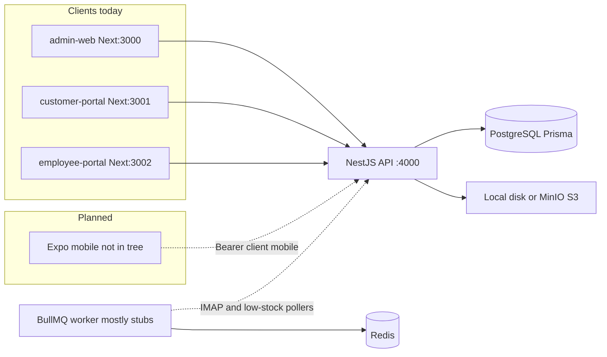
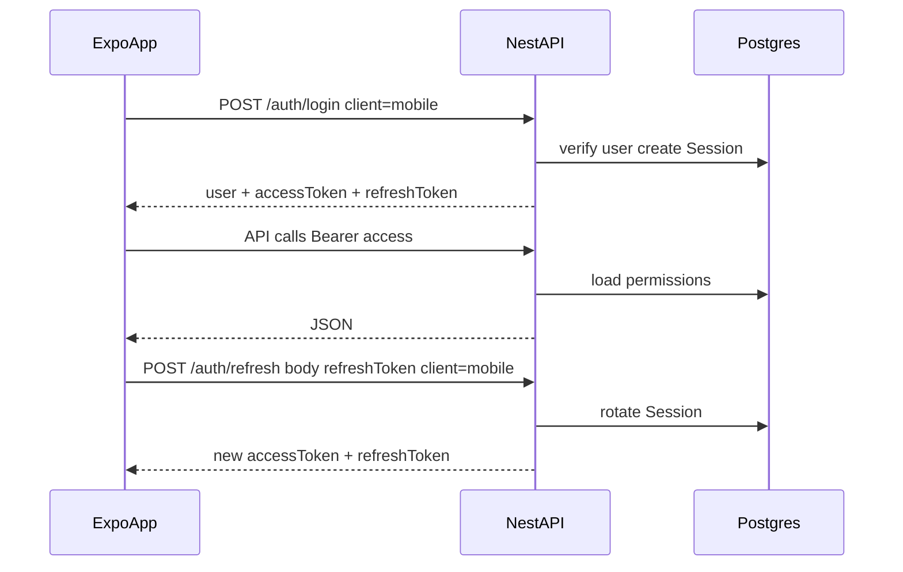

# Mobile application audit

**Date:** 2026-08-05  
**Repository:** `maher-aghbar-furniture-app`  
**Goal:** Assess readiness for a planned Expo/React Native client against the existing NestJS API.  
**Constraints of this pass:** documentation only — no production code changes, no `apps/mobile` created.

**Companions:**

- [mobile-api-inventory.md](./mobile-api-inventory.md) — 264 endpoints
- [mobile-api-gap-analysis.md](./mobile-api-gap-analysis.md) — missing/weak surfaces
- [mobile-risk-register.md](./mobile-risk-register.md) — security / performance / ops risks

---

## 1. Current architecture



| Layer | Tech | Role |
|-------|------|------|
| Presentation | Next.js 14 × 3 portals | Admin, dealer, floor web UIs |
| API | NestJS REST `/api/v1` | Sole authority for authz, pricing, inventory, PDFs, AI |
| Data | PostgreSQL + Prisma (`packages/database`) | Schema + seed; **no `migrations/` directory** |
| Async | `apps/worker` + Redis | Queue scaffolding; real notifications often inline in API |
| Infra | `infra/docker` | Postgres, Redis, MinIO; optional full-stack compose |
| Shared | `packages/*` | Types, permissions, i18n, validation, UI (web), integrations |

**Monorepo:** pnpm `9.15.9` + Turborepo; workspace `apps/*`, `packages/*`.

**Mobile status:** `apps/mobile` was removed in commit `c25ea5d` (“webiste done no mobile app”). Leftovers remain in API auth (`client: 'mobile'`), `@maher/permissions` (`resolveMobileHomeHref`), `@maher/i18n` `mobile` namespace, admin `?embedded=1` WebView hooks, and Prisma `DevicePushToken`.

---

## 2. Workspace map

### Apps

| Path | Package | Purpose |
|------|---------|---------|
| `apps/api` | `@maher/api` | NestJS API `:4000`, binds `0.0.0.0` |
| `apps/admin-web` | `@maher/admin-web` | Admin UI `:3000` |
| `apps/customer-portal` | `@maher/customer-portal` | Dealer portal `:3001` |
| `apps/employee-portal` | `@maher/employee-portal` | Floor UI `:3002` |
| `apps/worker` | `@maher/worker` | BullMQ consumers + IMAP / low-stock pollers |

### Packages (mobile reuse)

| Package | Reuse for Expo |
|---------|----------------|
| `@maher/types` | **Yes** — pure TS (`AuthUser`, locales, errors) |
| `@maher/permissions` | **Yes** — catalog, checks, `resolveMobileHomeHref` |
| `@maher/i18n` | **Yes** — message JSON + helpers; wire with RN i18n |
| `@maher/validation` | **Partial** — login schema lags API (username vs email/phone) |
| `@maher/ui` | **No** as components — DOM/CSS; brand assets/tokens only |
| `@maher/database`, `@maher/config`, `@maher/integrations` | **Server-only** |
| `@maher/logging`, `@maher/testing` | Optional / stubby |

There is **no** shared `@maher/api-client`. Portals each ship a cookie `api-client.ts` with `credentials: 'include'`.

### Tooling / CI / Docker

| Path | Role |
|------|------|
| `pnpm-workspace.yaml` | `apps/*`, `packages/*` |
| `turbo.json` | `build`, `dev`, `lint`, `typecheck`, `test` |
| `.github/workflows/ci.yml` | install → Prisma generate/push → package builds → typecheck → test → API build |
| `infra/docker/docker-compose.yml` | Postgres 16, Redis 7, MinIO |
| `infra/docker/docker-compose.launch.yml` | Full stack web + API (no mobile) |

---

## 3. Authentication flow

### Web (today)

1. `POST /api/v1/auth/login` with `{ username, password, mfaCode? }` (no `client` or `client: 'web'`)
2. Sets HTTP-only cookies `access_token` (15m) and `refresh_token` (30d): `sameSite: 'lax'`, `secure` if `COOKIE_SECURE=true`
3. Body returns `{ user }` only
4. Browsers call API with `credentials: 'include'`; CORS origins from `CORS_ORIGINS`

### Mobile (supported by API today)

1. `POST /api/v1/auth/login` with `{ username, password, mfaCode?, client: 'mobile' }`
2. Cookies still set (ignore on native)
3. Body also returns `{ user, accessToken, refreshToken }`
4. Send `Authorization: Bearer <accessToken>`
5. Refresh: `POST /auth/refresh` with `{ refreshToken, client: 'mobile' }` → new token pair (rotation)
6. Store both tokens in **SecureStore**; persist rotated refresh every time



### Guards

- Global `JwtAuthGuard` → `PermissionsGuard` → `ThrottlerGuard` (120 / 60s)
- Permissions only enforced when `@RequirePermissions` / `@RequireAnyPermissions` present
- Customer row scope via `customerId` on `AuthUser`

### Browser-cookie assumptions (do not carry to native)

| Assumption | Web | Native |
|------------|-----|--------|
| Cookie jar + SameSite | Required | Useless / ignore |
| CORS credentials | Required | N/A for RN fetch |
| Host-only cookies | OK same-site ports | N/A |
| Bearer header | Optional | **Required** |

---

## 4. API surface (summary)

- **264** handlers, prefix `/api/v1`, Swagger `/api/docs`
- Domains: auth, users/roles/org, customers, requests/quotations/orders, production/tasks/quality, inventory/warehouses, purchasing/suppliers, finance, catalog, documents/PDFs, AI intake, notifications, geo, audit, settings, webhooks
- Full tables: [mobile-api-inventory.md](./mobile-api-inventory.md)

---

## 5. Notifications, uploads, AI

| Area | State |
|------|-------|
| In-app inbox | `GET /notifications` (50), mark read / read-all |
| Device tokens | `POST /notifications/device-token` `{ token, platform: ios\|android\|web }` |
| Push send | **Not implemented** |
| Channel send | EMAIL / SMS / WhatsApp via `@maher/integrations` (often console) + IN_APP rows |
| Uploads | Multipart ≤15MB; HEIC allowed; signed public download |
| AI/OCR | Jobs + from-upload; providers default **mock** without keys |

---

## 6. Incomplete / mock features

| Item | Notes |
|------|-------|
| Password reset | In-memory Map; console token; `devToken` outside production |
| User invite | Console temp password |
| OCR / AI extract | Mock unless configured |
| Worker queues | Mostly log stubs; IMAP + low-stock pollers call API webhooks |
| Push | Register only |
| Portal `test` / several `lint` scripts | Echo stubs |
| Docs drift | Argon2/email, presign uploads, notification preferences |

---

## 7. Existing tests

| Location | Coverage |
|----------|----------|
| `packages/permissions` | `hasPermission` + mobile home href routing |
| `apps/api` | money util + user guard helpers (8 tests) |
| Portals / worker / testing package | Stub echo scripts |
| `e2e/lifecycle.spec.ts` | Playwright smoke (partially stale login body) |

Root: `pnpm test` → turbo. CI does not run Playwright.

---

## 8. Verification run (2026-08-05)

Environment: Node `v26.5.0`, pnpm `9.15.9`, macOS darwin. Commands from repo root.

| Command | Exit | Result |
|---------|------|--------|
| `pnpm install` | **0** | Lockfile up to date; 18 workspace projects |
| `pnpm typecheck` | **0** | 25/25 Turbo tasks successful (~17s) |
| `pnpm lint` | **1** | **Pre-existing failure** — see below |
| `pnpm test` | **0** | 17/17 tasks; real Jest: permissions + API (9 tests); others stubs |
| `pnpm build` | **0** | 15/15 tasks (~42s); Next apps + API + packages |

### Pre-existing lint failure

```text
@maher/api lint
apps/api/src/modules/purchasing/low-stock-pr.webhook.controller.ts
  1:10  warning  'Body' is defined but never used
ESLint found too many warnings (maximum: 0).
Failed: @maher/api#lint
```

Not fixed in this audit (documentation-only pass). Other packages’ lint scripts that ran were stubs or Next lint (API failure aborted the Turbo graph after partial progress).

### CI note

`.github/workflows/ci.yml` runs typecheck + test + `@maher/api` build after Prisma generate/`db push`. It does **not** run root `pnpm lint` or `pnpm build` for all Next apps. Mobile CI steps were removed with `apps/mobile`.

---

## 9. Recommendation — how mobile should connect

**Treat the Nest API as the only backend.** Do not scrape the Next portals.

1. **Auth:** `POST /api/v1/auth/login` with `client: 'mobile'`; store `accessToken` + `refreshToken` in SecureStore; attach `Authorization: Bearer`; refresh with body token + `client: 'mobile'`; handle rotation and MFA.
2. **HTTP client:** New mobile-specific fetch wrapper (not the portal cookie clients). Single-flight refresh; clear store on logout / logout-all.
3. **Reuse:** `@maher/types`, `@maher/permissions` (`resolveMobileHomeHref`), `@maher/i18n` (`mobile` + shared namespaces). Do not import `@maher/ui` React DOM components.
4. **Notifications:** Poll `GET /notifications`; register Expo push tokens via `POST /notifications/device-token`; do not promise push until a sender exists.
5. **Uploads:** Multipart `POST /uploads` with compressed images; use returned signed `downloadPath` for display.
6. **Config:** `EXPO_PUBLIC_API_BASE_URL` pointing at `http://<lan-ip>:4000` in dev (API already listens on `0.0.0.0`); HTTPS in production.
7. **Permissions:** Drive navigation from `user.permissions`; do not assume `PRODUCTION_WORKER` can cycle-count without `inventory.count`.
8. **Scaffold:** Restore or recreate `apps/mobile` in a later change; workspace already accepts `apps/*`.

Until push send, durable password-reset, and Prisma migrations are production-ready, keep the first Expo slice **internal** (see [mobile-risk-register.md](./mobile-risk-register.md)).
