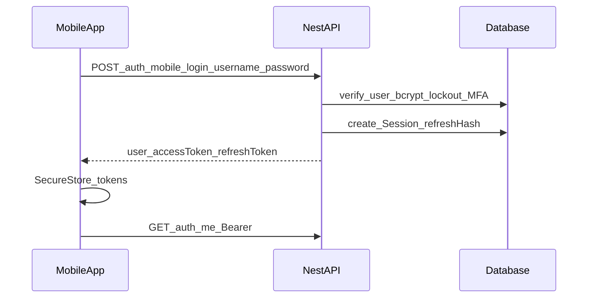

# Mobile authentication

**Date:** 2026-08-05  
**API:** Nest `apps/api`  
**Client guidance:** [mobile-api-client.md](./mobile-api-client.md)

Secure Bearer auth for React Native. **Website cookie login is unchanged.**

---

## App routes (Expo)

| Route | Role |
|-------|------|
| `/` | Splash / session bootstrap |
| `/(auth)/login` | Username + password |
| `/(auth)/mfa` | MFA code when required |
| `/(auth)/unlock` | Optional biometric gate |
| `/(auth)/disabled` | Suspended account |
| `/(auth)/session-expired` | Refresh failed |
| `/(auth)/offline` | No network with stored tokens |
| `/(app)` | Redirects to `resolveMobileHomeHref` (admin / customer / employee tabs) |

Tokens stay in **SecureStore** only. Optional biometric unlock preference: `maher.biometric_unlock` (not a token).

**Local demo logins** (seeded; password for all): username `admin` / `nile` / `carpenter` / … with password **`123`** — see root README. Unit tests may use other passwords.

---

## Preferred endpoints

| Method | Path | Notes |
|--------|------|-------|
| `POST` | `/api/v1/auth/mobile/login` | Username + password (+ optional `mfaCode`). **No cookies.** |
| `POST` | `/api/v1/auth/mobile/refresh` | Body `refreshToken` required. Rotates refresh. **No cookies.** |
| `POST` | `/api/v1/auth/mobile/logout` | Body `refreshToken` required. Revokes session. |
| `GET` | `/api/v1/auth/me` | Existing route; send `Authorization: Bearer <accessToken>`. |

Compatible (legacy): `POST /auth/login` and `POST /auth/refresh` with `client: "mobile"` still return tokens in the body **and** set cookies. Prefer `/auth/mobile/*` for native apps.

---

## Token model

| Token | Lifetime | Storage |
|-------|----------|---------|
| Access JWT (`typ: access`) | **15 minutes** | Client SecureStore only |
| Opaque refresh (48-byte hex) | **30 days** | Client SecureStore; server stores **SHA-256 hash** in `Session` |

- Every refresh **revokes** the old session and issues a new refresh (rotation).
- Logout sets `Session.revokedAt`.
- Access tokens are not stored server-side; they expire naturally.
- **Never log** access or refresh token values (audit events store userId / action / IP / UA only).

---

## Login flow



### Request

```json
{
  "username": "admin",
  "password": "********",
  "mfaCode": "123456"
}
```

- Identifier is **username** (lowercased). Email is not required and not used for login.
- Password must be non-empty (no minimum length).
- MFA: if enabled, omit `mfaCode` → `401 MFA_REQUIRED`; bad code → `MFA_INVALID`.

### Success response

```json
{
  "user": { "id": "...", "username": "...", "roles": [], "permissions": [], "...": "..." },
  "accessToken": "<jwt>",
  "refreshToken": "<opaque>"
}
```

### Error codes (401 unless noted)

| Code | When |
|------|------|
| `INVALID_CREDENTIALS` | Bad username/password |
| `ACCOUNT_LOCKED` | ≥5 failures → 15 minute lock |
| `ACCOUNT_SUSPENDED` | `isActive === false` |
| `MFA_REQUIRED` / `MFA_INVALID` | MFA gates |
| `VALIDATION_ERROR` | 400 — empty/invalid DTO |

---

## Refresh flow

1. Client sends `{ "refreshToken": "<current>" }`.
2. Server looks up non-revoked, unexpired session by hash.
3. If user is inactive/archived → revoke presented session → `401 ACCOUNT_SUSPENDED` (**no new tokens**).
4. Else revoke old session, create new session + access JWT.
5. Client **must** replace stored refresh with the new value.

Rate limit (mobile): login **10**/min, refresh/logout **30**/min (plus global API throttle).

---

## Logout

`POST /auth/mobile/logout` with `{ "refreshToken": "..." }` revokes that session. Clear local SecureStore afterward.

---

## Authenticated API calls

```http
Authorization: Bearer <accessToken>
Accept-Language: ar|en|he
x-request-id: <client-generated>
```

Do **not** rely on cookies for mobile.

---

## Web vs mobile

| | Web | Mobile |
|--|-----|--------|
| Login | `POST /auth/login` | `POST /auth/mobile/login` |
| Credentials | httpOnly cookies | JSON tokens + SecureStore |
| Refresh | Cookie or body | Body only (required) |
| Logout | Cookie clear + revoke | Revoke by body refresh |
| `/auth/me` | Cookie or Bearer | Bearer |

Cookie flags, CSRF posture, and web response shapes for `/auth/login` (without `client: mobile`) are preserved.

---

## OpenAPI

Swagger tag **`auth-mobile`** documents login / refresh / logout. Tag **`auth`** covers web routes and `GET /auth/me` (`@ApiBearerAuth`).

---

## Future hardening (not in this change)

- Refresh-token reuse detection (revoke all sessions for user)
- Argon2id password hashing migration
