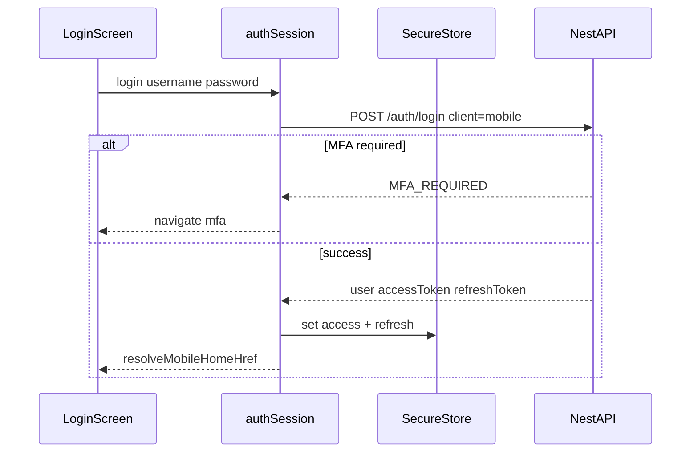
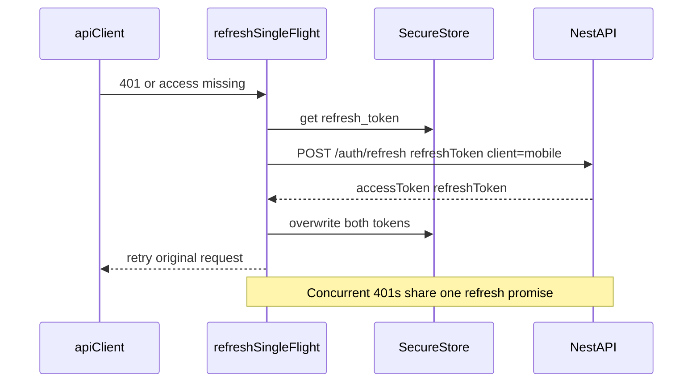
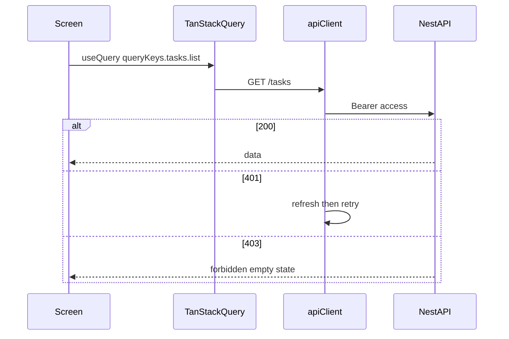
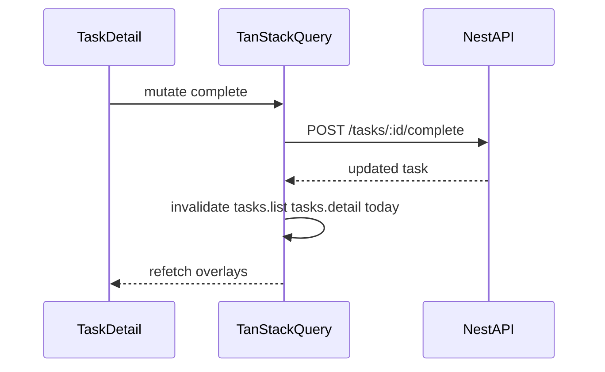
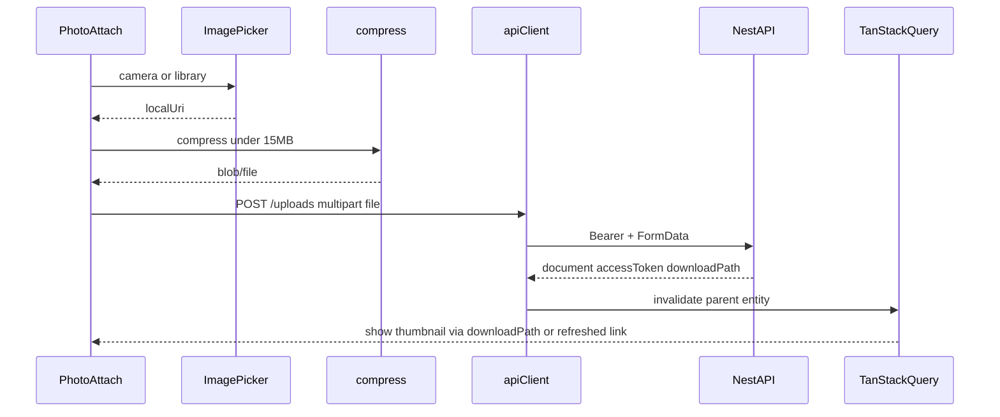
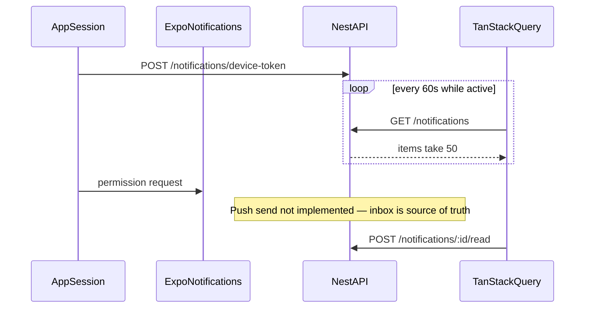
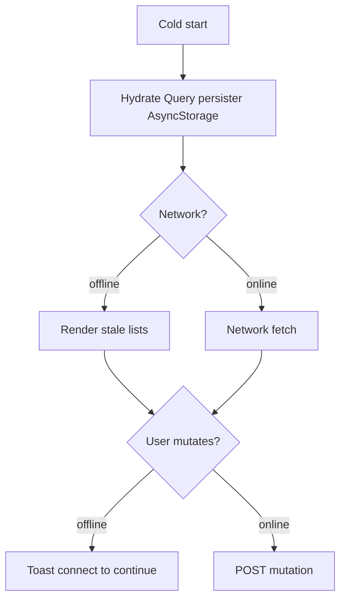
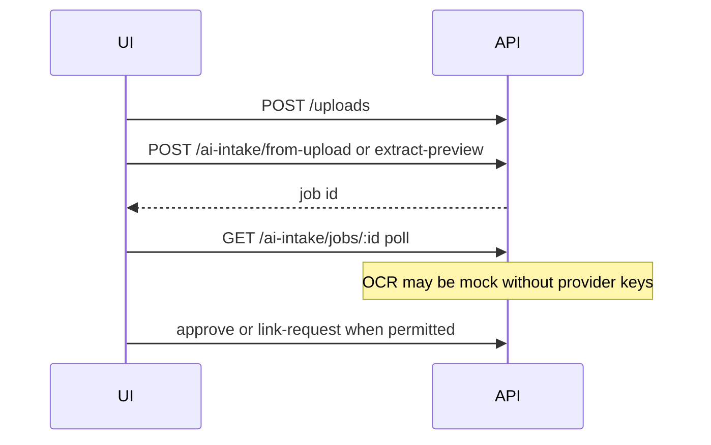

# Mobile data flow

**Date:** 2026-08-05  
**Companion:** [mobile-architecture.md](./mobile-architecture.md), [mobile-api-gap-analysis.md](./mobile-api-gap-analysis.md)

All traffic goes to Nest `EXPO_PUBLIC_API_BASE_URL` + `/api/v1`. No Next.js BFF.

---

## 1. Login and token storage

- Ignore Set-Cookie; use JSON tokens only.
- On MFA success, same login endpoint with `mfaCode`.

---

## 2. Refresh rotation

Failure path: clear SecureStore + Query `auth` cache → `/(auth)/login`.

Logout:

1. Ensure access (refresh if needed).
2. `POST /auth/logout` with Bearer + body `{ refreshToken }`.
3. Clear store; cancel polls; clear QueryClient.

---

## 3. Authenticated query path

- `Accept-Language` from locale.
- List screens: `ListState` for pending / error / empty.
- AppState `active` → `queryClient.invalidateQueries` for hot keys (tasks, notifications) sparingly.

---

## 4. Mutation + invalidation

Example: complete task

Approvals (quote/PO): no optimistic update; wait for server; then invalidate.

---

## 5. Upload flow

Query params: `taskId`, `requestId`, `category` as needed.  
If download TTL expired: `GET /uploads/documents/:id/link`.

Offline: keep `localUri` in a feature draft list; upload on reconnect (tasks/requests only).

---

## 6. Notification flow

- Foreground: poll + optional local notification if payload ever arrives.
- Tap notification / deep link: `resolveDeepLink(linkUrl, user)`.
- Unread badge: `items.filter(i => !i.readAt).length`.

---

## 7. Offline / cache

Persisted queries (whitelist):

- `tasks.list`, `tasks.detail`
- `requests.list`, `sales-orders.list`
- `notifications.list`
- `auth.me` **without** embedding tokens

Never persist: mutations, SecureStore secrets, full admin reports.

---

## 8. AI intake (customer / admin)

Feature-flag UI when settings/providers are mock (detect via failed extract or env).

---

## 9. Error mapping

| API signal | Client behavior |
|------------|-----------------|
| `MFA_REQUIRED` | MFA screen |
| `VALIDATION_ERROR` / field errors | Form inline via `translateApiError` |
| `INVALID_FILE_TYPE` / size | Toast on attach |
| 401 after refresh fail | Logout |
| 403 | Empty forbidden |
| 429 | Backoff retry once |
| Network fail | Offline banner + cached read |

---

## 10. Security data rules

- Tokens only in SecureStore.
- Signed `downloadPath` query tokens: treat as secrets; prefer https; short TTL.
- Do not put Bearer tokens in deep link URLs.
- Customer scope: never send another `customerId` from the client for statements; use `user.customerId`.
