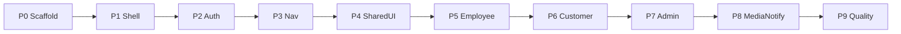

# Mobile implementation plan

**Date:** 2026-08-05  
**Status:** Plan only — do not scaffold `apps/mobile` in the documentation pass  
**Architecture:** [mobile-architecture.md](./mobile-architecture.md)  
**Screens / nav / data:** [mobile-screen-map.md](./mobile-screen-map.md), [mobile-navigation-map.md](./mobile-navigation-map.md), [mobile-data-flow.md](./mobile-data-flow.md)

This plan builds one Expo app on the **existing** API. Backend rebuild is out of scope. Backend gaps that block GA are listed at the end; mobile can still ship an internal pilot without them.

---

## Phases overview

---

## Phase 0 — Workspace scaffold

- Create `apps/mobile` with Expo Router (SDK aligned to current Expo RN).
- `package.json` name `@maher/mobile`; scripts: `start`, `ios`, `android`, `typecheck`, `lint`, `test`.
- Depend on `@maher/types`, `@maher/permissions`, `@maher/i18n` (workspace).
- Root optional scripts: `dev:mobile`, filter in Turbo.
- `EXPO_PUBLIC_API_BASE_URL` in `.env.example` / EAS profiles.
- Brand assets under `apps/mobile/assets/brand/`.

**Exit:** `pnpm --filter @maher/mobile typecheck` passes with empty routes.

---

## Phase 1 — Theme, i18n, RTL shell

- `src/theme/tokens.ts` + `ThemeProvider` (Army Camo / Apple White / Liquorice).
- `src/i18n` adapter loading `@maher/i18n` catalogs; default `ar`.
- RTL via `I18nManager` for `ar`/`he`.
- Root `_layout` providers: theme + i18n only.

**Exit:** Placeholder screen shows localized branded chrome LTR/RTL.

---

## Phase 2 — Storage, API client, Query

- `src/storage/secure.ts` keys for access/refresh/locale/theme.
- `src/api/client.ts` Bearer + single-flight refresh + `client: 'mobile'`.
- `src/api/query-keys.ts` + `QueryProvider` + AsyncStorage persister whitelist.
- Unit tests: refresh single-flight, 401 retry, logout clears store.

**Exit:** Manual login against local API returns `/auth/me` in a debug screen.

---

## Phase 3 — Auth screens + bootstrap

- `(auth)/login`, `(auth)/mfa`.
- `app/index.tsx` bootstrap → `resolveMobileHomeHref`.
- `(app)/_layout` session gate.
- Logout on More.

**Exit:** Login as seeded admin/customer/worker lands on correct surface home href.

---

## Phase 4 — Permission navigation shell

- Three surface groups + tab layouts per [mobile-navigation-map.md](./mobile-navigation-map.md).
- Tab visibility filters; surface guards.
- Shared `/(app)/notifications` stub list.
- `PermissionGate` + `noModules` empty states.

**Exit:** Each seeded persona sees the correct tabs; cross-surface URL redirects home.

---

## Phase 5 — Shared components

- `Screen`, `ListState`, `StatusChip`, `MoneyText`, `LocalizedName`, `PhotoAttachField` (upload wired in Phase 8).
- Error toast helper.

**Exit:** Story-less but used by at least one list stub per surface.

---

## Phase 6 — Employee tasks (first vertical)

Highest floor value; validates auth, lists, mutations, photos later.

- Tabs: Today, Tasks; stack `tasks/[id]`.
- Actions: start/pause/resume/progress/block/unblock/complete/notes.
- Query invalidation per data-flow doc.

**Exit:** Worker completes a seeded task on device against API.

---

## Phase 7 — Customer commercial path

- Requests list/create/submit; quotation accept/reject; orders list/detail; billing list; statement.
- Customer scoping respected.

**Exit:** Dealer account submits RFQ and views order status.

---

## Phase 8 — Admin hub

- Home widgets by `resolveHomePersona`.
- Work: quotation approve/send, PO approve, request queue, AI job list/detail.
- Ops: production orders, inventory low-stock, counts **if** `inventory.count`.

**Exit:** Admin approves a quotation and opens AI job on phone.

---

## Phase 9 — Uploads + notifications

- Multipart upload + compress; task/RFQ attachments.
- Notifications poll + mark read; device-token register after login.
- Deep link resolver for `linkUrl`.

**Exit:** Photo on task appears via signed URL; inbox updates while app foregrounded.

---

## Phase 10 — Employee QC + deliveries

- Inspections list/detail/submit.
- Deliveries list/detail; status + debounced location; POD upload.

**Exit:** Delivery status update and inspection submit on device.

---

## Phase 11 — Hardening

- Jest unit + RNTL for gates/login.
- CI: restore `@maher/mobile` typecheck (and test) job.
- Maestro smoke: login → task list (optional).
- Performance: list pagination params if API supports; image cache.

**Exit:** CI green for mobile typecheck; known risks documented.

---

## Backend-dependent follow-ups (not mobile-only)

Track in API workstreams; do not block internal pilot:

| Item | Why |
|------|-----|
| Push send via `DevicePushToken` | Reliable alerts |
| `DELETE` device token | Clean logout |
| Durable password-reset + email | Customer self-service |
| Notification preferences | Opt-out |
| Prisma migrations (vs `db push`) | Production ops |
| Fix API lint unused `Body` import | Root `pnpm lint` |

---

## Implementation checklist (dependency order)

Use this as the build order. Do not start a step before its dependencies are done.

1. [ ] Add `apps/mobile` Expo Router package + Turbo/pnpm scripts + `EXPO_PUBLIC_API_BASE_URL`
2. [ ] Wire workspace deps: `@maher/types`, `@maher/permissions`, `@maher/i18n`
3. [ ] Theme tokens + `ThemeProvider` + brand assets
4. [ ] i18n adapter + default `ar` + RTL for `ar`/`he`
5. [ ] SecureStore wrapper (access, refresh, locale, theme)
6. [ ] API client (Bearer, `client: 'mobile'`, single-flight refresh, error mapping)
7. [ ] TanStack Query provider + query-key factory + persister whitelist
8. [ ] Unit tests for refresh/401/logout storage
9. [ ] Login + MFA screens
10. [ ] Bootstrap `index` + `(app)` auth gate + logout
11. [ ] Surface layouts (admin/customer/employee) using `resolveAppSurface`
12. [ ] Tab navigators + permission-based tab visibility
13. [ ] Shared `PermissionGate`, `ListState`, `Screen`
14. [ ] Employee: tasks list + detail + lifecycle mutations
15. [ ] Employee: Today summary queries
16. [ ] Customer: requests list/create/submit
17. [ ] Customer: quotations detail actions
18. [ ] Customer: orders + billing (+ statement)
19. [ ] Admin: Home persona widgets
20. [ ] Admin: Work queues (quotes/PO/requests/AI)
21. [ ] Admin: Ops slices (production/inventory; gate counts)
22. [ ] `PhotoAttachField` + `POST /uploads` + compress
23. [ ] Attach photos to tasks and RFQs; document viewer modal
24. [ ] Notifications inbox poll + read/read-all
25. [ ] Register Expo push token via `POST /notifications/device-token`
26. [ ] Deep-link / `linkUrl` resolver
27. [ ] Employee: quality inspections
28. [ ] Employee: deliveries status + location + POD
29. [ ] Language modal + profile More polish
30. [ ] Mobile CI typecheck (+ test) restored
31. [ ] Device smoke on LAN against API `:4000`
32. [ ] (Later) Consume push sender when API implements it
33. [ ] (Later) Forgot-password only after durable API reset

---

## Success criteria for internal pilot

- One binary; three personas via permissions
- Bearer auth stable with refresh rotation
- Worker task complete + photo upload
- Customer RFQ + order visibility
- Admin at least one approval path + AI job view
- Inbox polling works; push delivery **not** promised
- No dependency on web cookies or `@maher/ui` DOM
