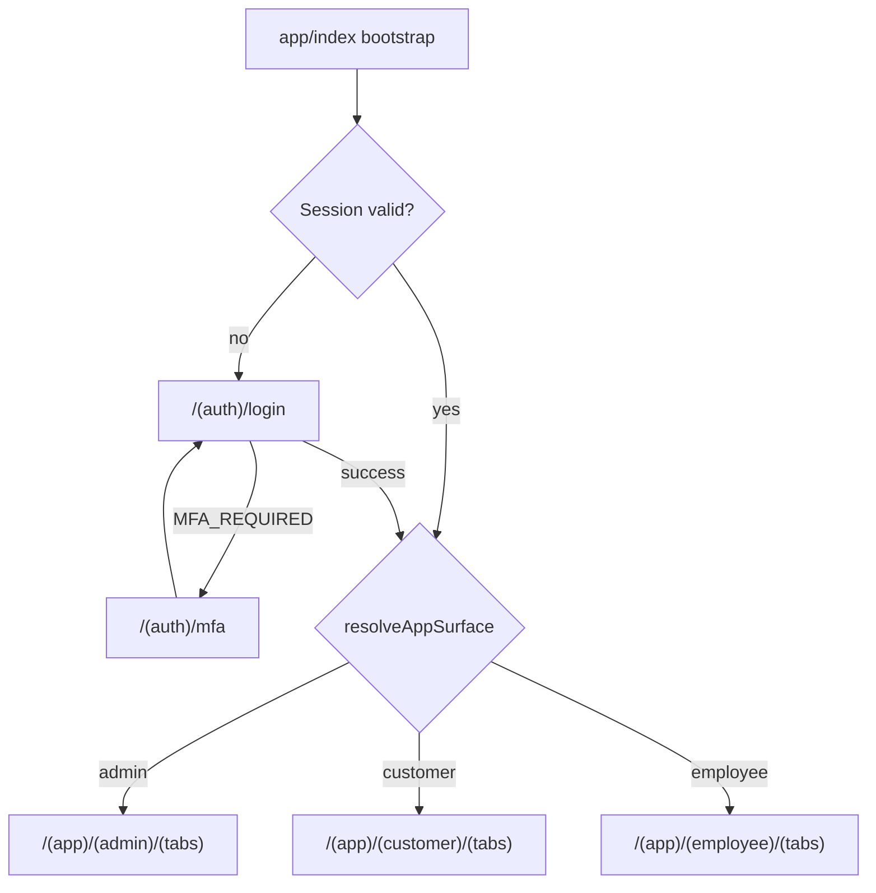
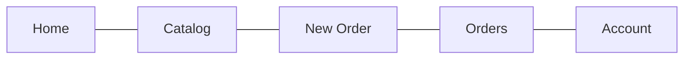
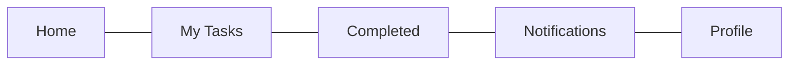
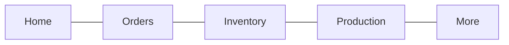

# Mobile navigation map

**Date:** 2026-08-05  
**Companion:** [mobile-architecture.md](./mobile-architecture.md), [mobile-screen-map.md](./mobile-screen-map.md)

---

## 1. Top-level flow



Home hrefs (from `@maher/permissions`):

| Surface | `resolveMobileHomeHref` |
|---------|-------------------------|
| customer | `/(app)/(customer)/(tabs)` |
| employee | `/(app)/(employee)/(tabs)` |
| admin | `/(app)/(admin)/(tabs)` |

---

## 2. Route group responsibilities

| Group | Responsibility |
|-------|----------------|
| `(auth)` | Unauthenticated only; redirect away if session exists |
| `(app)` | Requires `AuthUser`; wraps Query + notification poll |
| `(app)/(admin)` | `resolveAppSurface === 'admin'`; else redirect home |
| `(app)/(customer)` | `=== 'customer'` |
| `(app)/(employee)` | `=== 'employee'` |
| `(app)/notifications` | Shared inbox; reachable from every More tab |
| `(app)/modals` | Transparent modal presentation |

---

## 3. Tab bars (max 5)

Visibility is computed in `apps/mobile/src/navigation/tabConfig.ts` via `can` / `canAny`. Mid tabs are **omitted** when the user lacks permission (never exceed five). Home and the trailing account/more/profile tab are always present.

Custom chrome: `SurfaceTabBar` (haptics, RTL `flexDirection`, safe-area padding, `TabIndicator`).

### Customer (dealer)



| Tab | Visible when |
|-----|----------------|
| Home | Always |
| Catalog | `catalog.read` |
| New Order | `request.create` |
| Orders | `sales-order.read` |
| Account | Always |

### Employee (worker)



| Tab | Visible when |
|-----|----------------|
| Home | Always |
| My Tasks | `production-task.read` |
| Completed | `production-task.read` |
| Notifications | `notification.read` |
| Profile | Always |

### Admin



| Tab | Visible when |
|-----|----------------|
| Home | Always |
| Orders | any: `sales-order.read`, `quotation.read`, `request.read` |
| Inventory | any: `inventory.read` / receive / count, `purchase-order.read` |
| Production | any: `production-order.read`, `production-task.read` |
| More | Always |

---

## 4. Guard rules

| Condition | Behavior |
|-----------|----------|
| No tokens / refresh failed | `router.replace('/(auth)/login')` |
| Bootstrapping / authenticating | Splash/`null` — no tab chrome |
| Authenticated on `(auth)/*` | `replace` to `resolveMobileHomeHref(user)` (via `/(app)` redirect) |
| Wrong surface group | `SurfaceGate` → `Redirect` to `resolveMobileHomeHref` |
| Deep link to denied tab / missing perm | `PermissionGate` → `ForbiddenView` (`/(app)/_forbidden`); never flash protected UI |
| Missing tab permission | Omit tab from bar (`href: null` + filtered `SurfaceTabBar`) |
| API 403 | Toast + stay; do not crash |

Implementation: `(app)/_layout` session gate; `(admin|customer|employee)/_layout` → `SurfaceGate`; tab screens wrap `PermissionGate` where needed.

---

## 5. Stack nesting

Within each surface, tabs are the root; detail routes are **siblings** of `(tabs)` (Expo Router pattern) so headers can show back:

```text
(admin)/
  (tabs)/...
  quotations/[id].tsx
  purchase-orders/[id].tsx
  ...
```

Shared notifications sit above surfaces so one inbox serves all:

```text
(app)/notifications/index.tsx
```

From a surface More tab: `router.push('/(app)/notifications')`.

---

## 6. Deep links and notification routing

App scheme: `maher://` ([`apps/mobile/app.json`](../apps/mobile/app.json)).

Examples:

| Link | Behavior |
|------|----------|
| `maher:///(app)/(admin)/(tabs)/orders` | Opens admin Orders if surface+perms allow |
| Wrong surface (e.g. dealer opens admin tabs) | Redirect to `resolveMobileHomeHref` |
| Missing perm / forced URL to omitted tab | Forbidden / tab omitted — no wrong-surface flash |

| Notification / web `linkUrl` pattern | Mobile href |
|--------------------------------------|-------------|
| `/tasks/:id` or employee task | `/(app)/(employee)/tasks/:id` (stack sibling; detail TBD) |
| `/deliveries/:id` | Employee or admin equivalent by surface |
| `/quotations/:id` | Customer or admin quotation detail by surface |
| `/requests/:id` | Customer or admin request detail |
| `/sales-orders/:id` / orders | Customer `orders/[id]` or admin |
| `/ai-intake/:id` or jobs | `/(app)/(admin)/ai-intake/:id` |
| `/notifications` | `/(app)/notifications` |
| Unknown | Open inbox or Home |

Resolver (planned): `src/permissions/deep-links.ts` — input `(linkUrl, user)` → href or `null`.

Cold start: if session valid, bootstrap then navigate to deep link; else stash link and apply after login.

---

## 7. Cross-surface rules

- A user has **one** surface per session; switching accounts requires logout.
- Warehouse-only users with inventory perms but also back-office flags land on **admin** (per `resolveAppSurface`); Inventory tab shows when inventory/PO read perms exist.
- Customer users never mount admin/employee trees.

---

## 8. Accessibility / UX navigation notes

- Employee: large tab icons; task actions pinned to bottom of detail.
- Customer: order timeline as vertical steps (read-only).
- Admin: Home quick actions max 4–6; avoid sidebar metaphors.
- RTL: tab order mirrors automatically with `I18nManager`; test ar/he.
