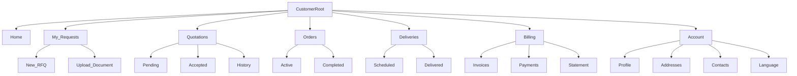
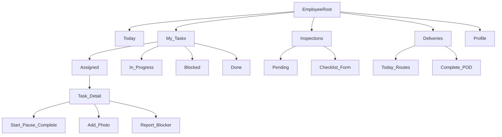

# Navigation Maps

Information architecture for the three client applications. Coral-red (`#E03C31`) primary accent on white enterprise chrome. Sidebar collapses on tablet; bottom nav on employee mobile.

Permission gates hide items — empty sections never render.

---

## Admin Web

Primary users: management, sales, purchasing, warehouse, production supervisors, QC, accounting, system admins. **Desktop-first.**

```mermaid
flowchart TB
  ROOT[AdminRoot]

  ROOT --> DASH[Dashboard]
  ROOT --> CRM[CRM]
  ROOT --> COMM[Commercial]
  ROOT --> MFG[Manufacturing]
  ROOT --> INV[Inventory]
  ROOT --> PUR[Purchasing]
  ROOT --> FIN[Finance]
  ROOT --> DOC[Documents]
  ROOT --> AI[AI_Intake]
  ROOT --> RPT[Reports]
  ROOT --> SYS[System]

  CRM --> CRM1[Customers]
  CRM --> CRM2[Contacts]
  CRM --> CRM3[Activities]

  COMM --> COMM1[RFQs]
  COMM --> COMM2[Quotations]
  COMM --> COMM3[Sales_Orders]
  COMM --> COMM4[Contracts]

  MFG --> MFG1[Production_Board]
  MFG --> MFG2[Production_Orders]
  MFG --> MFG3[Tasks]
  MFG --> MFG4[Quality]
  MFG --> MFG5[Deliveries]

  INV --> INV1[Items]
  INV --> INV2[Balances]
  INV --> INV3[Transactions]
  INV --> INV4[Transfers]
  INV --> INV5[Cycle_Counts]
  INV --> INV6[Warehouses]

  PUR --> PUR1[Suppliers]
  PUR --> PUR2[Purchase_Requests]
  PUR --> PUR3[Purchase_Orders]
  PUR --> PUR4[Goods_Receipts]

  FIN --> FIN1[Invoices]
  FIN --> FIN2[Payments]
  FIN --> FIN3[Credit_Notes]
  FIN --> FIN4[Statements]

  DOC --> DOC1[Library]
  DOC --> DOC2[Upload]

  AI --> AI1[Review_Queue]
  AI --> AI2[Job_History]

  RPT --> RPT1[Sales]
  RPT --> RPT2[Production]
  RPT --> RPT3[Inventory]
  RPT --> RPT4[Purchasing]
  RPT --> RPT5[Financial]
  RPT --> RPT6[Employees]

  SYS --> SYS1[Users]
  SYS --> SYS2[Roles]
  SYS --> SYS3[Settings]
  SYS --> SYS4[Audit_Log]
  SYS --> SYS5[Notifications]
```

### Top bar (global)

| Element | Behavior |
|---------|----------|
| Logo + company name | Home → Dashboard |
| Global search | `/search` — permission-filtered |
| Language switcher | AR / EN / HE |
| Notifications bell | In-app inbox |
| User menu | Profile, logout |

### Dashboard widgets (role-aware)

- Sales pipeline (Sales Manager+)
- Production WIP + blockers (Supervisor+)
- Low stock alerts (Warehouse+)
- AR aging (Accountant+)
- Pending AI reviews (Sales+)

---

## Customer Portal

B2B and retail customers. **Mobile-friendly.** No internal costs, worker names, or supplier data.

### Customer order tracking (detail view)

Timeline (read-only): Quotation accepted → In production → Quality check → Out for delivery → Delivered → Invoiced.

Status labels localized; dates in customer locale.

---

## Employee Portal

Floor workers, inspectors, delivery staff. **Tablet/phone-first.** Large touch targets; minimal chrome.

### Supervisor mode (extra nav when `production-task.assign`)

- Team tasks board (read-only list + assign)
- Production order summary (no financial fields)

Employees without supervisor permission see **My Tasks** and role-specific sections only (QC sees Inspections; delivery sees Deliveries).

---

## Cross-app deep links

| From | To | Example |
|------|-----|---------|
| Admin quotation | Customer portal quote | Magic link email with token |
| Admin production order | Employee task | `/tasks/:id` |
| AI intake approve | Admin draft RFQ | `/rfqs/:id` |
| Notification | Entity detail | Contextual URL per app |

---

## Breadcrumbs (Admin)

Entity hierarchy reflected in breadcrumbs:

`Sales Orders / SO-2026-00102 / Production / PO-2026-00058`

Customer and employee apps use back navigation instead of deep breadcrumbs.

---

## Empty states

- Permission-denied → 403 page with contact admin message (localized)
- No data → illustrated empty state with primary action (e.g. "Create first quotation")
- Archived entities → badge + restore action (admin only)
