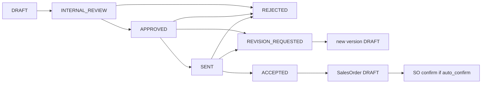

# Quotation → dealer approval audit

**Date:** 2026-08-22  
**Scope:** Read-only investigation of quotation create → internal approve → send → dealer accept/reject → sales order → production → invoice.  
**Not in this document:** any code, schema, seed, or i18n change. Recommendations only.

**Question answered:** the Admin button labeled **Approve (SYSTEM_ADMINISTRATOR)** — seen as “Approve / SYSTEM-APPROVE” — is **internal factory/admin approval**. It is **not** dealer/customer acceptance.

---

## Scoreboard

| Item | Result |
|---|---|
| SYSTEM-APPROVE REALLY MEANS | **INTERNAL APPROVAL** |
| ADMIN APPROVAL EXISTS | **YES** |
| DEALER ACCEPTANCE EXISTS | **YES** |
| DEALER REJECTION EXISTS | **YES** |
| DEALER REQUEST-CHANGES EXISTS | **YES** |
| QUOTE SENT/PUBLISHED STATE EXISTS | **YES** (`SENT`) |
| SALES ORDER CONFIRMS ON | **accept** (setting `auto_confirm_so_on_accept`, default **true**) |
| PRODUCTION STARTS ON | **SO confirm** creates POs `PLANNED` + schedule generate; floor `IN_PROGRESS` is later |
| INVOICE CREATED ON | **delivery / PO complete / manual** — not quote approve or accept |
| ADMIN CAN CURRENTLY IMPLY CUSTOMER ACCEPTANCE | **YES** (separate **Accept** button, not Approve) |
| QUOTE CAN BE EDITED AFTER ACCEPTANCE | **NO** |
| MULTIPLE REVISIONS SUPPORTED | **PARTIAL** |
| DEMO DATA HONEST | **NO** |
| SECURITY GAPS | ownership skipped on mutate; PDF unscoped; Admin/Sales hold `quotation.accept`; no quotation isolation tests |
| MAIN PROBLEM | raw `SYSTEM_ADMINISTRATOR` label + Admin/Sales can accept without a dealer principal |
| RECOMMENDED STATE FLOW | keep Prisma enum; `SENT` is the dealer gate; `ACCEPTED` only from dealer or explicit on-behalf |
| IMPLEMENTATION RISK | **MEDIUM** |

---

## 1. Current quote lifecycle

Canonical models live in [`packages/database/prisma/schema.prisma`](../packages/database/prisma/schema.prisma):

```
RequestForQuotation
  └── Quotation (versioned, optional requestId)
        ├── QuotationLine
        ├── QuotationApproval   (decision is a String, not an enum)
        └── SalesOrder (optional quotationId)
              ├── ProductionOrder
              └── Invoice
```

There is no `Quote` model, no `QuoteStatus`, and no `SYSTEM_APPROVE` / `SYSTEM-APPROVE` string in the repository.

Runtime flow in [`apps/api/src/modules/quotations/quotations.service.ts`](../apps/api/src/modules/quotations/quotations.service.ts):

1. Admin creates a quotation → `DRAFT`. If an RFQ is linked and still in `SUBMITTED | UNDER_REVIEW | READY_FOR_QUOTATION | NEEDS_INFORMATION`, RFQ becomes `QUOTED` at create (before send).
2. Admin submits → `INTERNAL_REVIEW` (`POST .../submit-for-approval`).
3. Admin approves → `APPROVED` (`POST .../approve`). Chain is one step: `SYSTEM_ADMINISTRATOR`.
4. Admin sends → `SENT`, `sentAt` set, dealer notified (`POST .../send`). RFQ forced to `QUOTED` again.
5. Dealer (or any principal with `quotation.accept`) accepts → `ACCEPTED`, `acceptedAt` set, sales order `DRAFT` created. RFQ → `CLOSED`. Default auto-confirm then confirms the SO.
6. Alternatives from `SENT` (and some earlier states): `REJECTED` or `REVISION_REQUESTED`.
7. Staff `revise` cancels the old row (`CANCELLED`) and creates version N+1 as `DRAFT`.

Internal approval **is required today**. Send is allowed only from `APPROVED`. Setting `quotation_approval.financeThreshold` is seeded in [`packages/database/prisma/seed/foundation.ts`](../packages/database/prisma/seed/foundation.ts) but `getApprovalChain()` ignores the total and always returns `['SYSTEM_ADMINISTRATOR']`.

`packages/types` `QuotationStatus` is stale (`PENDING_APPROVAL`, `CONVERTED`; missing `INTERNAL_REVIEW`, `VIEWED`, `REVISION_REQUESTED`, `CANCELLED`). Prisma is the source of truth.

---

## 2. Current state machine

Prisma `QuotationStatus` (schema lines 55–66):

| State | Who can set it | Meaning | In | Out | Internal vs customer-facing |
|---|---|---|---|---|---|
| `DRAFT` | Admin `quotation.create` | Editable quote | create; `revise` new version | `submit-for-approval` → `INTERNAL_REVIEW`; `updateDraft` stays `DRAFT` | Internal, but dealer list/get is not filtered by status (leak) |
| `INTERNAL_REVIEW` | `quotation.update` via submit | Waiting for internal approve | from `DRAFT` | `approve` → `APPROVED`; `reject` → `REJECTED` | Internal |
| `APPROVED` | `quotation.approve` | Internally cleared to send | from `INTERNAL_REVIEW` | `send` → `SENT`; `reject`; `request-revision`; `revise` | Internal. Portal UI wrongly offers Accept here |
| `SENT` | `quotation.send` | Published to dealer | from `APPROVED` | `accept` / `reject` / `request-revision` / `revise` | Customer-facing |
| `VIEWED` | **never written by API** (`viewedAt` unused) | Enum only | — | listed on request-revision / revise | Intended customer-facing |
| `ACCEPTED` | `quotation.accept` | Commercial acceptance | from `SENT` only | none in quotation module (`revise` does **not** allow `ACCEPTED`) | Customer-facing |
| `REJECTED` | `quotation.reject` | Rejected | from `INTERNAL_REVIEW` \| `SENT` \| `APPROVED` | `revise` → new `DRAFT` | Customer-facing |
| `REVISION_REQUESTED` | `quotation.accept` permission on `request-revision` | Dealer asked for changes | from `SENT` \| `VIEWED` \| `APPROVED` | `revise` → new `DRAFT` | Customer-facing |
| `EXPIRED` | **never written by API** | Enum only | — | — | Intended customer-facing |
| `CANCELLED` | `revise` on the old version | Superseded | from revise source statuses | none | Internal |



Do not invent missing states. `INTERNALLY_APPROVED` does not exist; that meaning is `APPROVED`.

---

## 3. Exact SYSTEM-APPROVE path

There is no action named `SYSTEM-APPROVE`. The UI prints the pending chain role next to **Approve**.

### UI

- Mobile: [`apps/mobile/src/features/quotations/AdminQuotationDetailScreen.tsx`](../apps/mobile/src/features/quotations/AdminQuotationDetailScreen.tsx) — `showApprove` when `can(user, 'quotation.approve')` and `status === 'INTERNAL_REVIEW'`. Label `t('mobile.adminQuotation.approveAs', { role: detail.pendingApproverRole })` → **Approve (SYSTEM_ADMINISTRATOR)**.
- Admin web: [`apps/admin-web/src/app/[locale]/quotations/[id]/page.tsx`](../apps/admin-web/src/app/[locale]/quotations/[id]/page.tsx) — `{t('approve')} (${data.pendingApproverRole})`.

Pending role comes from GET detail:

```216:221:apps/api/src/modules/quotations/quotations.service.ts
    const pendingApproverRole =
      quotation.status === 'INTERNAL_REVIEW'
        ? (approvalChain.find((role) => !completedSteps.includes(role)) ?? null)
        : null;
```

Chain:

```37:39:apps/api/src/modules/quotations/quotations.service.ts
  private async getApprovalChain(_total: number): Promise<string[]> {
    return ['SYSTEM_ADMINISTRATOR'];
  }
```

### API

| Item | Value |
|---|---|
| Endpoint | `POST /api/v1/quotations/:id/approve` |
| Controller | `QuotationsController.approve` |
| Permission | `quotation.approve` |
| Body | `RejectQuotationDto` `{ comment?: string }` — mobile/web send `{}` |
| Service | `QuotationsService.approve(id, user, dto.comment)` |

### DB

- Insert `quotation_approvals`: `approverId = JWT user.id`, `decision = 'APPROVED'`, `comment = '[step:SYSTEM_ADMINISTRATOR]'` (optional comment appended), `decidedAt = now`.
- Update `quotations.status` → `APPROVED` (chain length 1, so it always completes).
- **No** `acceptedAt`, **no** `acceptanceSignature`, **no** `AuditEvent`.

Approver stored: the **logged-in Admin user**, not a system account and not the dealer. Role is only encoded in the approval comment via `[step:SYSTEM_ADMINISTRATOR]`. Elevated bypass: `SUPER_ADMIN` or `SYSTEM_ADMINISTRATOR` can approve the pending step (`SUPER_ADMIN` is not a live Prisma role).

### Downstream of Approve

| Effect | On approve? |
|---|---|
| Quotation status → `APPROVED` | Yes |
| Approval history row | Yes |
| Sales order / order status | **No** |
| Production / schedule | **No** |
| Invoice | **No** |
| Dealer notification | **No** |
| Quote immutable | Yes for in-place edit (`updateDraft` is `DRAFT` only). Revise still allowed later from `APPROVED` |
| Dealer can still reject afterward | Yes, until send+accept. After send, dealer can reject `SENT`. After accept, reject is not allowed |

**Proof it is not dealer acceptance:** accept is a different endpoint (`POST .../accept`), gated to `SENT`, and is what writes `acceptedAt` and creates the sales order.

---

## 4. Admin permissions

| Action | Permission | CUSTOMER | SALES staff preset | Admin `SYSTEM_ADMINISTRATOR` | Worker |
|---|---|---|---|---|---|
| Create / edit draft | `quotation.create` / `quotation.update` | no | yes | yes | no |
| Submit for review | controller uses **`quotation.update`**, not unused `quotation.submit` | no | yes | yes | no |
| Internal approve | `quotation.approve` | no | **no** | yes | no |
| Send | `quotation.send` | no | yes | yes | no |
| Accept | `quotation.accept` | yes | **yes** | **yes** | no |
| Reject | `quotation.reject` | yes | no | yes | no |
| Revise (new version) | `quotation.update` on `POST .../revise` (`quotation.revise` exists in catalog but is unused on the route) | no | yes (via update) | yes | no |
| Confirm SO | `sales-order.update` | no | yes | yes | no |

Permission meta ([`packages/permissions/src/permission-meta.ts`](../packages/permissions/src/permission-meta.ts)): approve = “Approve quotations for sending”; accept = “Accept a quotation as a dealer.” The meta is correct; the grants are not — Admin and Sales both hold `quotation.accept`.

Frontend: Admin web and Admin mobile both render **Accept** when `status === 'SENT'`. That is on-behalf-of-customer, not the Approve button.

---

## 5. Dealer capabilities

| Capability | Result |
|---|---|
| See a quotation | **PARTIAL** — customer portal `/quotations` and `/quotations/[id]`. **Not in** [`portal-shell.tsx`](../apps/customer-portal/src/components/portal-shell.tsx) nav (reachable by URL / `QUOTE_SENT` deep link). Mobile dealer: **no quotation screens**. |
| Quote items | YES (portal table) |
| Unit prices | YES |
| Discount | PARTIAL — API/lines have `discountValue`; portal table does not show it |
| VAT | PARTIAL — API has `taxTotal` / line `taxRate`; portal shows line total + header total only |
| Total | YES |
| Measurements / specs | PARTIAL — API lines have width/height/depth/fabric/color; portal line table is description/qty/price/lineTotal only |
| Requested / suggested delivery | PARTIAL — `deliveryTerms` / RFQ `requiredDeliveryDate` on API; portal detail does not render terms |
| PDF | YES (thin — see §10) |
| Accept | YES portal (optional signature canvas). NO mobile dealer UI. API: `SENT` only |
| Reject | YES portal + API |
| Request changes | YES portal `request-revision`. NO mobile |
| Comment | YES on request-revision (`comment`); optional on reject |
| Acceptance history | PARTIAL — `acceptedAt` + optional `acceptanceSignature`. **No `acceptedById`**. `QuotationApproval` is the internal chain, not dealer accept |

**DEALER CAN VIEW QUOTE:** PARTIAL  
**DEALER CAN ACCEPT:** YES (portal/API; not mobile)  
**DEALER CAN REJECT:** YES  
**DEALER CAN REQUEST CHANGES:** YES (portal/API)

Portal bug vs API: `canDecide = SENT || APPROVED` in [`apps/customer-portal/src/app/[locale]/quotations/[id]/page.tsx`](../apps/customer-portal/src/app/[locale]/quotations/[id]/page.tsx). Accept from `APPROVED` will 400 because the service only allows `SENT`.

---

## 6. Sales-order trigger

**Quotation approval does not create or confirm a sales order.**

Sales order is created in `QuotationsService.accept`:

- Status `SENT` → `ACCEPTED`
- `acceptedAt = now`
- `acceptanceSignature` if the body sent `signatureData` (optional; Admin Accept sends `{}`)
- `salesOrder.create` with copied `subtotal` / `taxTotal` / `total` / lines, status **`DRAFT`**
- Linked RFQ → `CLOSED`
- `syncCalculatedCosts` updates **manufacturing** cost, not commercial totals
- If `auto_confirm_so_on_accept` is true (seed default, and null setting also treated as true), `salesOrders.confirm(so.id, userId)` runs immediately

`userId` on accept is passed into SO confirm as `createdById` on production orders. It is **not** stored on the quotation as accepted-by.

Manual confirm remains available: `POST /api/v1/sales-orders/:id/confirm` (`sales-order.update`).

---

## 7. Production trigger

**Quotation approval does not create production or scheduling.**

On **SO confirm** ([`apps/api/src/modules/sales-orders/sales-orders.service.ts`](../apps/api/src/modules/sales-orders/sales-orders.service.ts) `confirm`):

1. For each `productionRequired` line (schema default **true**): create `ProductionOrder` status `PLANNED` + workflow snapshot.
2. Inventory reserve → SO `READY_FOR_PRODUCTION` or `WAITING_FOR_MATERIALS`; if not ready, POs → `WAITING_FOR_MATERIALS`.
3. Notify `ORDER_CONFIRMED`.
4. `scheduling.generateForProductionOrder` per PO.

Floor start (`IN_PROGRESS`) is a later production action, not quote accept.

If auto-confirm is on (current demo default), **dealer/staff accept is the commercial trigger that starts planning**. That is why Admin Accept is dangerous: it is not Approve, but it does start the factory.

---

## 8. Invoice trigger

Invoice is **not** created on quote approve, send, or accept.

Created by `InvoicesService.ensureFromSalesOrder` / `createFromSalesOrder`:

- Manual `POST` invoices from a sales order
- Delivery marked `DELIVERED` ([`deliveries.controller.ts`](../apps/api/src/modules/deliveries/deliveries.controller.ts))
- Production task completion path ([`tasks.service.ts`](../apps/api/src/modules/tasks/tasks.service.ts))

Amounts are copied from **current sales-order lines**, not a frozen quotation snapshot. Current flow does **not** create a financial invoice obligation at internal approval or at dealer acceptance. (SO exists after accept; invoice comes later.)

`docs/pdf-compliance.md` mentions auto-contract on accept; `accept()` does **not** create a `Contract`. That comment in the service is stale.

---

## 9. Notifications

| Event | Dealer | Admin |
|---|---|---|
| Create | none | none |
| Submit / approve | none | none |
| Send | in-app `QUOTE_SENT` to portal users on the customer; email if `customer.email`; WhatsApp if `customer.phone` | none |
| Accept | none (unless auto-confirm fires `ORDER_CONFIRMED`) | none |
| Reject / request-revision / revise | none | none |
| Auto SO confirm | `ORDER_CONFIRMED` | none |

Template `QUOTE_SENT` is seeded. Accept/reject notification infrastructure is **not wired**.

---

## 10. PDF / document flow

`GET /api/v1/quotations/:id/pdf` in [`apps/api/src/modules/documents/pdf.controller.ts`](../apps/api/src/modules/documents/pdf.controller.ts). Permission `quotation.read`. **No** `assertCustomerOwns` (invoice PDF does check).

Today the PDF contains:

- Title “quotation”
- Number · version
- Customer name
- **Raw status enum** (e.g. `APPROVED`, `SENT`)
- Currency
- Line table: description, qty, unit price, line total
- Footer total

Not in the PDF today:

- RFQ / order reference
- Custom measurements / fabric / color
- Discount
- Tax / VAT breakdown
- Subtotal as its own line
- Validity / expiration date
- Payment terms
- Delivery / requested date
- Notes / warranty / terms
- Localized status labels

---

## 11. Demo-data consistency

Source: [`packages/database/prisma/demo/orders.ts`](../packages/database/prisma/demo/orders.ts). **Not mutated during this audit.**

| Finding | Detail |
|---|---|
| No `QuotationApproval` rows | SYSTEM-APPROVE is **not** stored as customer acceptance in demo |
| Non-draft stories | Quote status `ACCEPTED`, `acceptedAt = createdAt`, `createdById` / `salesRepId` = sales user. No dealer user, no signature |
| `draft` stories | Quote `SENT` **and** a `DRAFT` sales order is still created, then production is skipped. SO exists before dealer accept |
| Internal chain skipped | Seed never writes `DRAFT` → `INTERNAL_REVIEW` → `APPROVED` → `SENT` |
| Revisions | Always `version: 1`. No parent/child chains |

**SYSTEM-APPROVE is not the liar in demo.** Seed `ACCEPTED` without a dealer actor is. Draft stories also imply a commercial SO while the quote is still `SENT`.

**DEMO DATA HONEST:** NO

---

## 12. Security / isolation

Implemented but untested at quotation layer:

- `list` / `getById` (when `user` is passed) / `requestRevision` / `updateDraft` use `customerScopeFilter` / `assertCustomerOwns`.
- Dealer cannot receive `quotation.approve`.
- Worker has no quotation permissions.

Gaps:

- `accept`, `reject`, `send`, `approve`, `revise` call `getById(id)` **without** `user` → ownership skipped. Any principal with the permission can act on any quote id.
- Quotation PDF has no customer ownership check.
- Admin and Sales can call dealer acceptance (`quotation.accept`) with no on-behalf flag and no `acceptedById`.
- Signature is optional; Admin Accept posts `{}`.
- Double-accept is blocked by status (`SENT` only) — good — but not covered by tests.
- Rejected quotes cannot be accepted (status gate) — good — but a **new** independent quotation on the same RFQ can still be accepted (no unique `requestId`).
- **No** `quotations*.spec.ts` (or equivalent) proving A cannot accept B, worker cannot approve, dealer cannot internally approve, Admin cannot call accept unless allowed, rejected cannot produce.

Dealer A cannot **list** Dealer B’s quotes. A stolen id plus any `quotation.accept` principal can still accept it.

---

## 13. Mobile / web consistency

| Surface | Approve | Send | Accept | Reject | Request revision |
|---|---|---|---|---|---|
| Admin web | YES (`INTERNAL_REVIEW`) | YES (`APPROVED`) | YES (`SENT`) | YES | no (staff **Revise** instead) |
| Admin mobile | YES | YES | YES | YES | no (staff **Revise**) |
| Customer portal | no | no | YES (`SENT` **or** `APPROVED` in UI) | YES | YES |
| Mobile dealer | no screens | no | no | no | no |

Status badges share `statuses.json` (`APPROVED` vs `ACCEPTED`). Totals come from the same API. Dates/terms: Admin shows payment/delivery terms; portal detail does not. One surface can say **Approved** (internal) while another offers **Accept** as if the dealer were deciding — portal `APPROVED` branch.

---

## 14. EN / AR terminology

Action verbs are distinct:

| Key | EN | AR | Role |
|---|---|---|---|
| `quotations.approve` | Approve | اعتماد | Internal |
| `quotations.accept` | Accept quote | قبول العرض | Dealer |
| `quotations.reject` | Reject | رفض | Shared |
| `quotations.requestRevision` | Request revision | طلب تعديل | Dealer |
| `quotations.send` | Send to customer | إرسال للتاجر | Internal |
| `mobile.adminQuotation.approveAs` | Approve ({role}) | اعتماد ({role}) | Internal |

Status labels:

| Status | EN | AR |
|---|---|---|
| `INTERNAL_REVIEW` | Internal review | مراجعة داخلية |
| `APPROVED` | Approved | تمت الموافقة |
| `SENT` | Sent | مُرسل |
| `ACCEPTED` | Accepted | مقبول |
| `REJECTED` | Rejected | مرفوضة |
| `REVISION_REQUESTED` | Revision requested | طُلب تعديل |

اعتماد vs قبول is the right split. `APPROVED` / تمت الموافقة is generic (“approval happened”), not “internally approved / ready to send”.

Problems:

- Raw `SYSTEM_ADMINISTRATOR` on screen (the “SYSTEM-APPROVE” look).
- No role humanization in i18n.
- AR `SUBMITTED` and `SENT` both “مُرسل” (different enums, still ambiguous if mixed).
- PDF prints raw English enum.

---

## 15. Root problem

Two layers, not one:

1. **Label.** Internal approve is real and correctly separated in the database, but the button dumps the chain role `SYSTEM_ADMINISTRATOR`, which reads as SYSTEM-APPROVE.
2. **Integrity.** A **different** Admin/Sales **Accept** action records `ACCEPTED`, creates the sales order, and (by default) confirms production **without a dealer user**. `acceptedById` does not exist. Mobile dealers cannot accept. Portal quotes are off the nav.

Pressing Approve does **not** write fake customer acceptance. Pressing Accept as Admin **does** create a commercial acceptance with no dealer attribution.

Compared to the desired business flow:

| Desired | Today |
|---|---|
| 1. Dealer submits RFQ | YES |
| 2. Admin prepares quotation | YES (`DRAFT`) |
| 3. Optional internal Admin approval | EXISTS and is **mandatory** before send (stub one-step chain). Not required by every business; setting unused |
| 4. Send/publish to dealer | YES (`SENT`) |
| 5. Dealer reviews price/specs/terms | PARTIAL (portal; no mobile; thin PDF) |
| 6. Accept / reject / request changes | YES on portal/API |
| 7. Only accepted quote proceeds | YES in the accept path; Admin can perform that accept |
| 8. SO confirms per system rules | YES, default auto-confirm |
| 9. Production/scheduling at existing trigger | YES on SO confirm |

---

## 16. Recommended corrected flow

Keep the existing Prisma enum. Do **not** add `INTERNALLY_APPROVED` or explode states.

```
DRAFT
  → INTERNAL_REVIEW → APPROVED     (keep if the business wants a send gate; otherwise allow send from DRAFT)
  → SENT                           (dealer-visible published quote)
  → ACCEPTED | REJECTED | REVISION_REQUESTED
```

Leave `VIEWED` / `EXPIRED` unwired until product wants them.

Later work (not this audit):

- Humanize or hide `SYSTEM_ADMINISTRATOR` on the Approve button. Never show raw enums.
- Treat Admin Accept as explicit on-behalf-of-dealer, or remove it from Admin UI. Sales `quotation.accept` should not silently impersonate the dealer.
- Persist `acceptedById`, accepted amount, quotation `number`+`version`. IP/device only if an existing audit channel already records requests.
- Pass `user` into accept/reject/send/approve and `assertCustomerOwns` unless an explicit on-behalf permission is used.
- Hide unsent quotes (`DRAFT`, `INTERNAL_REVIEW`, `APPROVED`) from dealer list/get.
- Mobile dealer quote review / accept / reject.
- Decide whether `auto_confirm_so_on_accept` should stay default true.
- Fix portal Accept shown on `APPROVED`.
- Seed: no SO until `ACCEPTED`; no `ACCEPTED` without a dealer user; do not present Admin approve as accept.

Quote versioning already cancels the old row. After `ACCEPTED`, terms change should `revise` (today revise is blocked on `ACCEPTED` — that is the right instinct; a later revision should require accept again).

---

## 17. Exact files that would need changing

No changes in this audit. If a fix is approved later:

| Area | Files |
|---|---|
| Approve vs accept domain | [`apps/api/src/modules/quotations/quotations.service.ts`](../apps/api/src/modules/quotations/quotations.service.ts), [`quotations.controller.ts`](../apps/api/src/modules/quotations/quotations.controller.ts), DTO |
| Schema (accepted-by) | [`packages/database/prisma/schema.prisma`](../packages/database/prisma/schema.prisma) if `acceptedById` is added |
| Permissions | [`packages/permissions/src/staff.ts`](../packages/permissions/src/staff.ts), [`catalog.ts`](../packages/permissions/src/catalog.ts), [`permission-meta.ts`](../packages/permissions/src/permission-meta.ts) |
| Admin UI | [`apps/admin-web/src/app/[locale]/quotations/[id]/page.tsx`](../apps/admin-web/src/app/[locale]/quotations/[id]/page.tsx), [`apps/mobile/src/features/quotations/AdminQuotationDetailScreen.tsx`](../apps/mobile/src/features/quotations/AdminQuotationDetailScreen.tsx) |
| Dealer UI | customer portal quotations pages + [`portal-shell.tsx`](../apps/customer-portal/src/components/portal-shell.tsx); new mobile dealer quotation screens |
| PDF | [`apps/api/src/modules/documents/pdf.controller.ts`](../apps/api/src/modules/documents/pdf.controller.ts) |
| i18n | [`packages/i18n/src/messages/*/quotations.json`](../packages/i18n/src/messages/en/quotations.json), `statuses.json`, `mobile.json` `approveAs` |
| Types drift | [`packages/types/src/index.ts`](../packages/types/src/index.ts), admin `status-options.ts` |
| Demo | [`packages/database/prisma/demo/orders.ts`](../packages/database/prisma/demo/orders.ts) |
| Tests | new `apps/api/src/modules/quotations/**/*.spec.ts` |

---

## 18. Risk level

**Later implementation risk: MEDIUM.**

Approve vs accept are already separate statuses and endpoints. The dangerous coupling is default auto-confirm on accept plus Admin/Sales holding `quotation.accept`. Changing that touches permissions, three UIs, demo honesty, and production start timing. Label-only fix (hide `SYSTEM_ADMINISTRATOR`) is LOW risk by itself and does not fix commercial spoofing.

---

## Quote versioning / price drift (audit notes)

**Edit after acceptance:** `updateDraft` requires `DRAFT`. `revise` allows `APPROVED | SENT | REJECTED | REVISION_REQUESTED | VIEWED`, **not** `ACCEPTED`. Quote lines are immutable after accept.

**Multiple quotations:** `@@unique([number, version])`. `revise` increments version and cancels the parent. One RFQ may have many quotations (`requestId` is not unique). Dealer cannot accept `CANCELLED`. Two independent `SENT` quotes on the same RFQ can both be accepted → two sales orders. No “active revision” flag.

**Price drift:** accept copies quote commercial totals onto the SO. `syncCalculatedCosts` only writes manufacturing cost / breakdown. SO `update` cannot change line prices (draft metadata/costs only) and after auto-confirm the SO is no longer `DRAFT`. Invoice later copies **SO** lines. Drift happens if a second quote/SO is created for the same RFQ, or if invoice is generated after some other SO-line mutation path is added. Today quote vs first SO totals should match at accept.

---

## Desired vs current — internal approval

Step 3 in the desired flow (internal Admin approval) **exists and is mandatory** in code even though the chain is a single stub role. If the business does not need it, send could be allowed from `DRAFT` (or create could land in `APPROVED`). That is a product choice, not a missing enum.
