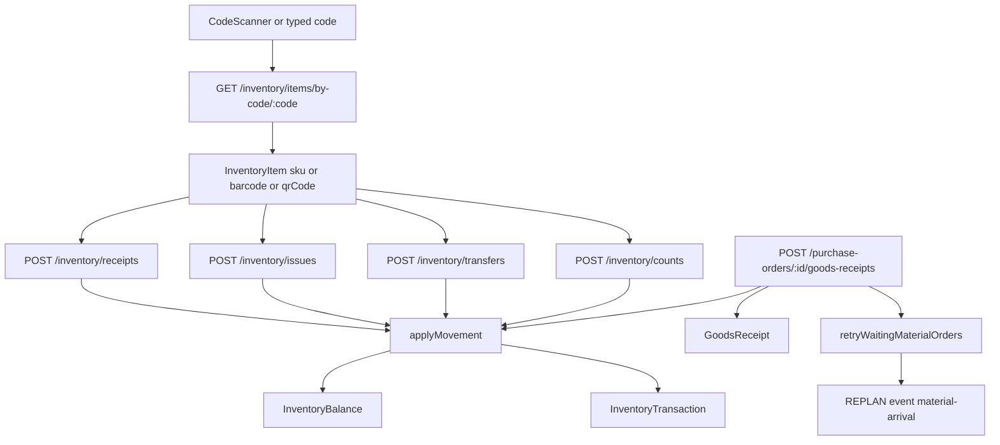

# Raw-material QR / warehouse scan — architecture audit

**Date:** 2026-08-24  
**Scope:** How inventory identity, photos, labels, scanners, and receive / issue / transfer / count already work, so a future warehouse QR action can open those flows instead of inventing a second stock system.

**Not in this document:** any code, schema, seed, permission, purchasing, scheduling, or i18n change. Recommendations only. Do not implement the QR feature from this file until that work is approved separately.

**Question answered:** warehouse scanning should identify the canonical `InventoryItem` SKU and then reuse existing movement services. Raw materials are **not** roll/lot tracked. Receive from a known item does **not** need a scan.

Related: [raw-material-images-audit.md](./raw-material-images-audit.md), [raw-material-images-closure-report.md](./raw-material-images-closure-report.md), [inventory-rearchitecture-audit.md](./inventory-rearchitecture-audit.md). Implemented: [inventory-qr-identity-closure-report.md](./inventory-qr-identity-closure-report.md).

---

## Scoreboard

| Item | Result |
|---|---|
| RAW MATERIAL CANONICAL ENTITY | `InventoryItem` / `inventory_items` |
| RAW / ACCESSORY SHARED MODEL | **YES** |
| INVENTORY TRACKING LEVEL | **SKU** (raw). Lots are WIP/FG only |
| RAW MATERIAL IMAGE SUPPORT | **YES** (`InventoryItem.imageUrl`) |
| ACCESSORY IMAGE REUSABLE | **YES** (same field, same upload) |
| QR EXISTS TODAY | **PARTIAL** (label encodes SKU; `qrCode` unused) |
| BARCODE EXISTS TODAY | **PARTIAL** (field + lookup; demo empty) |
| REUSABLE SCANNER EXISTS | **YES** (`CodeScannerProvider` + `CodeField`) |
| CURRENT RECEIVE SCAN IDENTIFIES | SKU / barcode / `qrCode` string |
| KNOWN ITEM RECEIVE NEEDS SCAN | **NO** |
| LABEL PDF EXISTS | **YES** |
| LABEL CONTAINS QR | **YES** (payload = `qrCode` or SKU) |
| CANONICAL RECEIVE | `applyMovement(PURCHASE_RECEIPT)` via GRN when PO-linked, else `InventoryService.receive` |
| PO-AWARE RECEIVE | **PARTIAL** (demand + explicit PO GRN; no SKU auto-select) |
| GRN CONNECTED | **YES** (PO path only) |
| MATERIAL ARRIVAL REPLAN | **YES** (GRN and ad-hoc receive) |
| CANONICAL ISSUE | `InventoryService.issue` |
| PRODUCTION ISSUE LINKAGE | **PARTIAL** (task consume only) |
| RESERVATIONS PROTECTED | **PARTIAL** (manual issue ignores `reservedQty`) |
| TRANSFER / COUNT | **YES** |
| MULTI-WAREHOUSE | **YES** |
| BIN / LOCATION | **PARTIAL** (schema only on manual ops) |
| STAGE-MATERIAL MRP | **YES** (read via `GET /material-demand`) |
| MATERIAL REQUIRED-BY | **YES** on demand DTO |
| SCAN PERMISSIONS | identify = `inventory.read`; actions stay receive / issue / transfer / count |
| RECOMMENDED QR IDENTITY | **SKU** (optionally persist `qrCode = sku`; no new column) |
| MIGRATION REQUIRED | **NO** |
| IMPLEMENTATION RISK | **LOW** for scan-to-identify + known-item receive; **MEDIUM** for PO-picker UX |

**Prerequisite gaps (not blockers for identify + gated actions):** no `GET /inventory/items/:id/open-pos`; warehouse role cannot read demand; no global Scan header; `qrCode` never written; demo `barcode` / `qrCode` empty.

---

## Verdict

Operational stock already has one identity: `InventoryItem`. Fabric, foam, wood, accessories, paint, and adhesive are rows on that table. Photos already live on `imageUrl`. Label PDF already draws a QR whose payload is `qrCode` or, when that is empty, the SKU. Mobile already has a camera scanner that returns a raw string. `GET /inventory/items/by-code/:code` already resolves SKU, barcode, or `qrCode`. Every legal quantity change already goes through `InventoryService.applyMovement`.

A warehouse Scan button should therefore be an **entry point**: decode → resolve item → show image + SKU + balances → open the existing receive / issue / transfer / count sheets. It must not add a roll/lot model, a second image column, a URL-shaped QR, or a parallel receive that skips GRN / `applyMovement` / material-arrival replan.

---

## What the app actually does today



Canonical stock engine: [`InventoryService.applyMovement`](../apps/api/src/modules/inventory/inventory.service.ts). Each call upserts `InventoryBalance` on `(inventoryItemId, warehouseId, locationId)`, writes a signed `InventoryTransaction`, optionally applies `reservedDelta`, and honors an optional unique `idempotencyKey`. Negative `availableQty` is blocked except count post (`allowNegative`).

---

## 1. Canonical inventory entity

**Model:** `InventoryItem`  
**Table:** `inventory_items`  
**PK:** UUID `id`  
**Schema:** [`packages/database/prisma/schema.prisma`](../packages/database/prisma/schema.prisma)

| Field | Role |
|---|---|
| `sku` | Unique human identity. Auto-generated on create if omitted (`nextInventorySku`). **Immutable** via PATCH — not on `UpdateInventoryItemDto` |
| `barcode` | Optional unique. Create/PATCH accept it. Demo does not set it |
| `qrCode` | Optional unique. Column exists. **Create/PATCH DTOs omit it. `createItem` never writes it** |
| `nameEn` / `nameAr` / `nameHe` | Display names |
| `category` | `InventoryCategory` (FABRIC, FOAM, WOOD, METAL_ACCESSORY, …) |
| `itemClass` | `RAW_MATERIAL` / `SEMI_FINISHED_GOOD` / `FINISHED_GOOD` |
| `materialGroup` | `WOOD` / `FABRIC` / `FOAM` / `ACCESSORIES` (nullable for paint/adhesive) |
| `unit` | Item unit only (`m`, `sheet`, `block`, `pcs`, `kit`, `L`, …). **No conversion** |
| `standardCost` | Catalog / PO unit cost. Hidden without `inventory.cost.read` |
| `minStock` / `maxStock` / `reorderQty` | Reorder hints |
| `imageUrl` | Canonical SKU photo |
| `preferredSupplierId` | Optional supplier |
| `materialId` | Optional 1:1 to catalog `Material` |
| `productId` | Used for WIP/FG product link |
| `isActive` / `archivedAt` | Soft archive. `findByCode` excludes archived |

Catalog `Material` (`materials`) is a thinner twin (sku, names, category, unit, min/max). It has **no** barcode, QR, image, balances, or warehouses. BOM pick may fall back to it. Operational stock is **always** `InventoryItem`.

`Fabric` / `ColorReference` are catalog helpers, not stock.

WIP/FG are also `InventoryItem` rows (`SEMI_FINISHED_GOOD` / `FINISHED_GOOD`) plus **`InventoryLot`** for produced pieces. Lots are **not** raw-material rolls.

---

## 2. RAW vs ACCESSORY

They share one model. Accessories are `itemClass = RAW_MATERIAL` with `materialGroup = ACCESSORIES` and categories `METAL_ACCESSORY` / `DECORATIVE_ACCESSORY` / `PACKAGING`. Paint and adhesive are the same table with other categories and a null `materialGroup`.

There is no `Accessory` table, no `rawMaterialImage`, and no accessory-only stock ledger.

A future QR must treat Italian velvet and a hardware kit as the same kind of identity: an `InventoryItem` SKU with an optional photo.

---

## 3. Physical tracking level

Balances are per `(inventoryItemId, warehouseId, locationId)` on `InventoryBalance`:

| Qty field | Runtime |
|---|---|
| `availableQty` | Written by `applyMovement` |
| `reservedQty` | Written only when caller passes `reservedDelta` |
| `damagedQty` | Schema only on this model |
| `onOrderQty` | Schema only — **not updated**. Open PO remainder comes from PO lines minus GRN lines |

Manual receive / issue / transfer / count always pass `locationId: null`.

`GoodsReceiptLine.batchNumber` exists and is unused by warehouse UI.

**PHYSICAL TRACKING LEVEL: SKU ONLY** for raw materials.

`InventoryLot` is created by production output, semi consume, delivery, and returns. It is the piece/WIP/FG instance model. It is **not** a fabric roll or timber board instance.

**QR recommendation: Option A — identify the canonical SKU (`InventoryItem`).**

| Option | Fit |
|---|---|
| A. SKU QR | Matches balances, receive, issue, transfer, count, labels, `findByCode` |
| B. Roll / lot QR | Invents a tracking level the domain does not have |
| C. SKU now, rolls later | Acceptable only as a later add-on after a real lot model for raw |

Printed payload must stay a **plain code** (SKU). [`printableScanCode`](../apps/api/src/common/helpers/pdf.util.ts) already strips `exp:` / `https?:` / `file:`, so URL or deep-link QRs are the wrong shape for this factory.

Do **not** encode stock, price, PO number, or ETA in the QR. Those change; the SKU does not.

---

## 4. Why Receive asks to scan (and why it is not required)

Known-item Receive (list row or detail → Receive) **already knows the item**. Both UIs pre-fill it:

- Mobile [`AddStockSheet`](../apps/mobile/src/features/inventory/components/AddStockSheet.tsx) sets `item` from `initialItem` on open
- Admin [`openMove`](../apps/admin-web/src/app/[locale]/inventory/inventory-client.tsx) sets `selectedItem` from the row

The scan field is **lookup UX** (admin parity: “scan barcode/SKU → item → warehouse → quantity”). Submit needs only `inventoryItemId` + `warehouseId` + `quantity`. A successful scan is not validated.

Scanner / typed lookup calls `GET /inventory/items/by-code/:code` → [`findByCode`](../apps/api/src/modules/inventory/inventory.service.ts):

```
archivedAt: null
OR: sku = code | barcode = code | qrCode = code
```

| Identifier | Supported? |
|---|---|
| SKU | Yes |
| barcode | Yes |
| qrCode | Yes (column rarely populated) |
| Item UUID | No |
| PO / GRN / lot / warehouse | No |

**What is scanned today:** a string identity for the **inventory SKU**, not a purchase order, goods receipt, lot, or bin.

**KNOWN ITEM RECEIVE NEEDS SCAN: NO**

Italian velvet from item detail (`MAT-ITAL-VEL`) opens `AddStockSheet` with that `initialItem`. The worker picks warehouse + qty and confirms. The scan field stays visible but is optional.

---

## 5. Mobile inventory surfaces (current)

Default composition is **signature** ([`inventoryComposition.ts`](../apps/mobile/src/features/inventory/inventoryComposition.ts)). Tab route gates any of `inventory.read`, `inventory.count`, `inventory.receive`, `purchase-order.read`.

| Surface | File | Role |
|---|---|---|
| Tab | `apps/mobile/app/(app)/(admin)/(tabs)/inventory.tsx` | Permission gate → groups screen |
| Home | [`InventorySignatureHome`](../apps/mobile/src/features/inventory/components/InventorySignatureHome.tsx) | Materials / WIP / FG + items / transfers / counts |
| Chrome | [`InventoryCompositionChrome`](../apps/mobile/src/features/inventory/components/InventoryCompositionChrome.tsx) | Title, tabs, search, **header pills** (not a FAB) |
| Detail | [`InventoryItemDetailScreen`](../apps/mobile/src/features/inventory/InventoryItemDetailScreen.tsx) | Qty, warehouses, history, sticky **Receive** |
| Material row | [`InventoryMaterialRow`](../apps/mobile/src/features/inventory/components/InventoryMaterialRow.tsx) | Photo, SKU, Receive / Issue / Edit / Label |

Header pills today: New Item / New Transfer / New Count (context), Add warehouse (`warehouse.manage`), Sync from materials (`inventory.adjust`). **No global Scan.**

### Action → API

| Action | UI | Sheet | Endpoint | Scanner required? |
|---|---|---|---|---|
| Receive | Row chip + detail sticky | `AddStockSheet` `mode=receive` | `POST /inventory/receipts` | **No** when `initialItem` set |
| Issue | Row chip **only** (not on detail) | `AddStockSheet` `mode=issue` | `POST /inventory/issues` | **No** when `initialItem` set |
| Edit | Row | `EditInventoryItemSheet` | `PATCH /inventory/items/:id` | No; optional barcode `CodeField` |
| Label PDF | Row | PDF helper | `GET /inventory/items/:id/label` | N/A |
| Transfer | Header + complete on row | `CreateTransferSheet` + picker | `POST /inventory/transfers` then `…/:id/complete` | No |
| Count | Header + post on row | `CreateStockCountSheet` + picker | `POST /inventory/counts` then `…/:id/post` | No. `POST /inventory/counts/scan` is unused |
| Photo | Create / edit / detail | `AccessoryPhotoField` / camera | upload `INVENTORY_IMAGE` + PATCH `imageUrl` | N/A (photo, not code) |

Receive / Issue payload: `{ inventoryItemId, warehouseId, quantity, notes?, idempotencyKey? }`. Mobile sends a **timestamp** key (`mobile-receive-…-Date.now()` / `mobile-{mode}-…-Date.now()`), not a stable client nonce. Double-tap can create two receipts.

---

## 6. Existing QR / barcode / scanner / label

### Scanner (identity)

Reusable, already mounted in `AppProviders`:

| Piece | Path |
|---|---|
| Host | [`CodeScannerProvider`](../apps/mobile/src/components/scan/CodeScannerProvider.tsx) — `openScanner(): Promise<string \| null>` |
| Camera | [`CodeScannerScreen`](../apps/mobile/src/components/scan/CodeScannerScreen.tsx) — `expo-camera` `CameraView` |
| Field | [`CodeField`](../apps/mobile/src/components/forms/CodeField.tsx) — text + QR icon |

Formats: `qr`, `ean13`, `ean8`, `upc_a`, `upc_e`, `code128`, `code39`, `code93`, `itf14`, `codabar`.

The scanner **only** returns a raw string. It does not identify an item or mutate stock. Identification is `findByCode` (network). Mutations are the movement endpoints (network).

`CodeField` is used on `AddStockSheet` (receive/issue) and create/edit item **barcode**. Transfer, count, and label flows do not scan on mobile.

### Photo camera (not a scanner)

[`AccessoryCameraProvider`](../apps/mobile/src/features/inventory/components/AccessoryCameraProvider.tsx) captures a local image URI. Do not reuse it for QR identity.

### Label PDF

- Endpoint: `GET /api/v1/inventory/items/:id/label` in [`pdf.controller.ts`](../apps/api/src/modules/documents/pdf.controller.ts)
- Permission: `inventory.read`
- Mobile: `openInventoryLabelPdf`
- Admin: `window.open(…/label)` (no auth header; depends on cookie/session)

Printed:

| Element | Content |
|---|---|
| Title / subtitle | Localized names |
| Meta | SKU, barcode **text**, unit |
| Table | SKU, barcode, min stock |
| Footer | `labelScanHint` |
| QR image | `printableScanCode(item.qrCode, '') \|\| item.sku` |
| Linear barcode image | **Not rendered** |

Because demo `qrCode` is null, today’s label QR **already encodes the SKU**. A future permanent QR can keep that payload.

### Create item today

| Field | Behavior |
|---|---|
| SKU | Auto `FAB-0001` / `FOAM-…` / `WOOD-…` / `ACC-…` if omitted |
| barcode | Optional; stored only if typed/scanned |
| qrCode | **Never set** |

---

## 7. Images (already done — do not reopen)

Canonical field: `InventoryItem.imageUrl`. Helper: [`canonicalInventoryImageUrl`](../apps/api/src/modules/inventory/inventory-image.ts).

Upload: `POST /uploads?category=INVENTORY_IMAGE` (permissions `document.manage` **or** `catalog.manage` **or** `inventory.adjust`). Attach via create/PATCH `imageUrl`.

Mobile list/detail show the photo when `showsRawMaterialPhoto` (`itemClass` missing or `RAW_MATERIAL`). WIP/FG rows use **product** photos.

After `demo:reset`, 42/42 curated RAW SKUs have Unsplash URLs from [`material-photo-pool.ts`](../packages/database/prisma/demo/material-photo-pool.ts), including `MAT-ITAL-VEL`.

**Do not add `rawMaterialImage`.** Reuse `imageUrl`.

---

## 8. Movement paths a QR action must reuse

### Receive

**PO-linked (preferred when an open PO exists):**

- `POST /purchase-orders/:id/goods-receipts`
- Permission: `inventory.receive`
- Logic is inline in [`purchasing.controller.ts`](../apps/api/src/modules/purchasing/purchasing.controller.ts) (not `PurchasingService`)
- PO status must be `APPROVED` / `SENT` / `PARTIALLY_RECEIVED`
- Warehouse **required** and must be `RAW_MATERIALS`
- Writes `GoodsReceipt` + `GoodsReceiptLine`, then `applyMovement({ type: PURCHASE_RECEIPT, referenceType: 'GoodsReceipt', idempotencyKey: grn:{grnId}:{inventoryItemId} })`
- Recomputes PO → `RECEIVED` or `PARTIALLY_RECEIVED`
- Audit: `goods-receipt.create`
- After commit: `retryWaitingMaterialOrders` → may reserve waiting SOs and enqueue `REPLAN` `{ event: 'material-arrival' }`
- Does **not** call `maybeAutoReorderAfterStockChange`

**Ad-hoc (what Inventory Receive uses today):**

- `POST /inventory/receipts` → `InventoryService.receive` → same ledger type
- **No GRN, no PO status, no lot**
- Still calls `retryWaitingMaterialOrders` and `maybeAutoReorderAfterStockChange`
- No audit event

**Production / other inbound (not warehouse-operator REST):** stage-complete `produceOutput` (WIP/FG + lot); `POST /production-orders/:id/materials/return`; delivery restore; customer return quarantine.

### Issue

**Warehouse floor (canonical REST):**

- `POST /inventory/issues` → `InventoryService.issue` → `applyMovement(PRODUCTION_ISSUE, outbound)`
- **Must** supply item, warehouse, qty
- Does **not** take production order, stage, or reason
- Does **not** decrement `reservedQty`
- Blocks negative stock
- Calls `maybeAutoReorderAfterStockChange`
- No scheduling side effect, no audit event

**Production BOM consume (not a standalone REST issue):** last task in a stage → `ProductionInventoryService.consumeRawMaterials`. Quantities come from **`product.bomDefaults`**, not from `ProductStageMaterialInput`. Picks the RAW warehouse with the highest `availableQty`. Applies `reservedDelta` down. Idempotency `raw-issue:{productionOrderId}:{stageInstanceId}:{itemId}`.

QR Issue must open the existing sheet. Do **not** invent “scan issue against a stage” unless the API is later extended.

### Transfer

Exists. Draft `POST /inventory/transfers` then `POST /inventory/transfers/:id/complete`. Warehouses must differ and share the **same type**. Stock moves only on complete (`transfer-out:` / `transfer-in:` keys). Locations always null. No reservation / replan / audit.

QR can open `CreateTransferSheet` with the item prefilled.

### Count

Exists. Create snapshots `systemQty` from the null-location balance. Post writes `INVENTORY_ADJUSTMENT` with `allowNegative`. `POST /inventory/counts/scan` resolves `findByCode` then create (+ optional immediate post). Mobile/admin count UI does **not** call it.

### Other outbound (not QR scope)

Delivery confirm, FG reverse, return damage/scrap.

---

## 9. PO-aware receiving

There is **no** `GET /inventory/items/:id/open-pos`.

Closest API: `GET /material-demand` (`purchase-order.read`) in [`PurchasingService.materialDemand`](../apps/api/src/modules/purchasing/purchasing.service.ts).

Per RAW SKU with open production demand:

- identity + `imageUrl`
- `onHandQty`, `reservedQty`, `freeQty`, `requiredQty`
- `incomingQty`, `nextEta`, `nextRequiredBy`, `status`
- `incoming[]` `{ qty, eta, purchaseOrderNumber }`
- `affected[]` production order / stage / qty / required-by

Open PO statuses: `DRAFT`, `APPROVED`, `SENT`, `PARTIALLY_RECEIVED`. Remainder = PO line qty − sum(GRN `receivedQty`).

**Multiple open POs for one SKU:** GRN always targets the PO in the URL. Demand lists **all** remainders and takes the earliest ETA. There is **no** FIFO auto-pick. A warehouse worker who only scans a SKU cannot legally GRN without choosing a PO (or falling back to ad-hoc receive).

`WAREHOUSE_MANAGEMENT` **lacks** `purchase-order.read`, so demand / incoming / required-by are admin/purchasing today. Scan-result UI must hide those fields unless the caller has the permission — do not grant it as a side effect of QR.

---

## 10. Warehouses, bins, reservations, units, offline, concurrency

**Warehouses.** Types: `RAW_MATERIALS`, `SEMI_FINISHED`, `FINISHED_GOODS`. `applyMovement` enforces `itemClassCompatibleWithWarehouse`. Worker still **chooses** warehouse after a SKU scan (the same velvet can exist on RAW and RAW-2). Defaults: `isDefault` RAW warehouse / [`preferWarehouseForReceive`](../apps/mobile/src/features/inventory/selectInventory.ts) (and issue equivalent).

**Bins.** `WarehouseLocation` exists (seed RAW-A1 / B2). Unused on manual movements. Lots / returns may use locations (e.g. QUARANTINE). QR should not pretend bins are live.

**Reservations.** Pool-level `InventoryBalance.reservedQty`, set on SO confirm (`tryReserveForSalesOrder`). Production consume credits reserved. Manual issue does **not**. QR must not invent “scan issue against reservation.”

**Units.** Item unit only. PO line copies `InventoryItem.unit`. No conversion.

**Offline.** [`queryPersist.ts`](../apps/mobile/src/api/queryPersist.ts) whitelist is catalog / tasks / sales-orders / statements. **No inventory keys.** Mutations call `assertOnline()`. Scanner lookup needs the network. Stale React Query may flash; receive / issue / transfer / count / create / label all require connectivity.

**Concurrency.** Engine: Prisma transaction + unique `idempotencyKey` (pre-check + P2002 replay returns the existing tx **without** re-mutating). GRN / transfer / production keys are stable. Mobile receive/issue keys include `Date.now()`.

---

## 11. Stage-material MRP vs floor consume

Planning / demand uses snapshotted **`ProductStageMaterialInput`** (and `productionOrderWorkflowSnapshotMaterialInput`): per-stage SKU, `qtyPerUnit`, `requiredBy` from the schedule.

Floor consume on stage complete still uses **whole-product `bomDefaults`**.

QR / scan-result “needed on upholstery” should read demand (`affected[]`), not assume a scan-issue will consume that stage line.

---

## 12. Material arrival → scheduling replan

| Path | `retryWaitingMaterialOrders` | `REPLAN` `material-arrival` |
|---|---|---|
| GRN receive | Yes | Yes |
| Manual `/inventory/receipts` | Yes | Yes |
| Manual issue | No | No |
| Transfer / count | No | No |
| PO ETA patch | No | Yes (`event: 'purchase-eta'`) |

`retryWaitingMaterialOrders` ranks `WAITING_FOR_MATERIALS` sales orders, tries `tryReserveForSalesOrder`, may set SO `READY_FOR_PRODUCTION` / PO `PLANNED`, then enqueues replan for waiting/constrained orders.

A future scan-first Receive must keep this chain. Ad-hoc receive still replans; it just does not close the fabric PO.

---

## 13. Permissions

[`WAREHOUSE_MANAGEMENT`](../packages/permissions/src/staff.ts):

| Has | Does not have |
|---|---|
| `inventory.read` | `inventory.adjust` (create / edit / photo) |
| `inventory.receive` | `purchase-order.read` (demand / incoming) |
| `inventory.issue` | `inventory.cost.read` |
| `inventory.transfer` | `warehouse.manage` |
| `inventory.count` | |
| `warehouse.read` | |
| `document.read` | |
| `notification.read` | |

Identify = `GET …/by-code` = `inventory.read`. Label PDF = `inventory.read`. Each action button must stay gated on its own permission. Scan must never grant rights. Dealers must stay 403 on these staff routes.

---

## 14. Cedar / Italian velvet (`MAT-ITAL-VEL`) — what a scan screen can show today

Seeded in [`demo/catalog.ts`](../packages/database/prisma/demo/catalog.ts), [`demo/stock.ts`](../packages/database/prisma/demo/stock.ts), [`demo/validate.ts`](../packages/database/prisma/demo/validate.ts):

| Fact | Value |
|---|---|
| SKU | `MAT-ITAL-VEL` |
| Name | Italian velvet reserved |
| Class / group | `RAW_MATERIAL` / `FABRIC` |
| Unit | `m` |
| Opening on-hand | **0** |
| Image | Unsplash `photo-1576566588028-4147f3842f27` via `material-photo-pool.ts` |
| barcode / qrCode | **Unset** (label QR still encodes SKU) |
| Product BOM | `SOF-RECL` **8 m** |
| Sales / production | `SO-2026-00056` / `PO-2026-00056` `WAITING_FOR_MATERIALS` |
| Inbound purchase | Fabric PO, **24 m**, `SENT`, note “Italian velvet inbound — Cedar sectional”, ETA ~ order date + 10 days (2026-08-18) |

`PO-2026-00056` is the **production** order number. The inbound velvet line lives on a **separate sequential fabric purchase order** created in `stock.ts`. UAT scripts that say “PO-2026-00056” for purchasing are talking about the production order unless they load the fabric PO by supplier/note.

From existing APIs a scan of `MAT-ITAL-VEL` (or a label QR that encodes that SKU) can show:

- Item + image + unit — `GET /inventory/items/by-code/MAT-ITAL-VEL`
- On-hand / reserved / free / warehouses — item balances
- Incoming 24 m + ETA + affected upholstery 8 m — `GET /material-demand` **if** `purchase-order.read`
- Receive today → **ad-hoc `/inventory/receipts`** unless the worker opens that fabric PO and GRNs

Do **not** change Cedar quantities, ETA, or scheduling in a future QR UAT except by posting the real GRN.

---

## 15. Best place for a future global Scan

No global Scan exists. Scanner is only reachable through inventory `CodeField`s.

| Candidate | Fit |
|---|---|
| **`InventoryCompositionChrome` search / header pills** | Best. Already hosts search + New Item / Transfer / Count |
| Root `CodeScannerProvider` | Already global; any screen can `openScanner()` |
| Admin home inventory card | Optional deep-link, not the primary warehouse path |
| Detail sticky Receive | Too narrow |

Not: worker/dealer tabs.

Recommended flow after approval: header **Scan** (materials) → existing `openScanner()` → result sheet (image, name, SKU, type, unit, on-hand / reserved / free / warehouses; incoming/ETA/required-by only with `purchase-order.read`) → gated actions that open **existing** sheets with the item prefilled.

---

## 16. Recommended QR identity and create-time behavior

1. Printed / stored identity = **SKU** (plain text, not a URL).
2. On create, if `qrCode` is blank, set `qrCode = sku`. No new column. No migration.
3. Demo seed: set `qrCode` and `barcode` to SKU inside [`demo/catalog.ts`](../packages/database/prisma/demo/catalog.ts) on `demo:reset` — not a one-off SQL update.
4. Label PDF already falls back to SKU; after backfill the payload stays the same.
5. Resolver: reuse `GET /inventory/items/by-code/:code`. A thin `POST /inventory/resolve-scan` is optional (clearer 404) and **not required**.
6. Do not encode stock, price, PO, or ETA in the code.

---

## 17. Proposed implementation (blocked until the feature is approved)

This section is the plan for a later pass. **Do not execute it as a side effect of this audit.**

1. **Identity:** printed QR = SKU. On create, `qrCode = sku` if blank.
2. **Resolver:** reuse `findByCode`.
3. **Global Scan:** Inventory chrome header button → `CodeScannerProvider` → scan-result sheet.
4. **Scan result:** image, name, SKU, type, unit, on-hand / reserved / free / warehouses. Incoming / ETA / required-by only if `purchase-order.read`. Actions gated: Receive, Issue, Transfer, Count, Details, Label PDF.
5. **Known-item Receive:** keep `initialItem`; demote scan to optional confirm. Same for the admin move modal.
6. **Scan-first Receive:** if demand shows exactly one open PO remainder, offer GRN on that PO; if several, picker; else ad-hoc `/inventory/receipts`. Never skip `applyMovement` / retry / replan.
7. **Issue / Transfer / Count:** open existing sheets with the item prefilled. Do not bind production issue.
8. **Label / standalone QR:** already SKU; standalone sheet can render the same code.
9. **Images:** already shipped. Do not reopen.
10. **Demo:** `qrCode` / `barcode` = SKU in seed. Cedar velvet remains the visual + GRN story.
11. **Tests + live UAT:** `findByCode` SKU / qr / unknown / archived; known-item receive without scan; scan → existing services; dealer 403; scan alone does not mutate stock.

**Out of scope:** lot/roll tracking, finished-goods sofa scan, offline sync, planner / MRP / BOM qty changes, new permission keys.

### Files likely to change *if* that feature is approved

- [`inventory.service.ts`](../apps/api/src/modules/inventory/inventory.service.ts) — `createItem` sets `qrCode`
- [`AddStockSheet.tsx`](../apps/mobile/src/features/inventory/components/AddStockSheet.tsx) + admin move modal — optional scan
- [`InventoryCompositionChrome.tsx`](../apps/mobile/src/features/inventory/components/InventoryCompositionChrome.tsx) — Scan action
- New scan-result sheet; thin prefills on transfer / count sheets
- [`demo/catalog.ts`](../packages/database/prisma/demo/catalog.ts) — qr/barcode = sku
- i18n EN / AR / HE
- Jest + `scripts/…-live-uat.mjs`

No Prisma migration if only the existing `qrCode` column is populated.

---

## 18. Risks if implementation ignores this audit

| Risk | Why it hurts |
|---|---|
| Second receive path that skips `applyMovement` | Split ledger; missed replan |
| Scan-first always hits `/inventory/receipts` | Fabric PO stays SENT; GRN history lies |
| Roll/lot QR without a lot model | Orphan identities; counts will not match |
| URL / deep-link QR | `printableScanCode` strips it; labels go blank |
| Encoding qty / price / ETA in QR | Stale labels; workers trust the sticker over the system |
| New image column | Breaks the accessories/raw photo work just closed |
| Granting `purchase-order.read` to every warehouse scan | Leaks demand/cost-adjacent purchasing data |
| Offline receive queue | No inventory outbox; duplicates vs timestamp idempotency keys |
| Binding Issue to a production stage | Manual issue does not consume reservations or BOM lines |

---

## 19. Path index (reuse these; do not duplicate)

```
IDENTIFY
  GET  /inventory/items/by-code/:code          inventory.read
  GET  /inventory/items/:id                    inventory.read
  GET  /inventory/items/:id/label              inventory.read   (pdf.controller)
  GET  /material-demand                        purchase-order.read

RECEIVE
  POST /purchase-orders/:id/goods-receipts     inventory.receive   → GRN + PURCHASE_RECEIPT
  POST /inventory/receipts                     inventory.receive   → InventoryService.receive

ISSUE
  POST /inventory/issues                       inventory.issue     → InventoryService.issue
  (internal) consumeRawMaterials               task complete       → PRODUCTION_ISSUE + reservedDelta

TRANSFER
  POST /inventory/transfers                    inventory.transfer
  POST /inventory/transfers/:id/complete       inventory.transfer

COUNT
  POST /inventory/counts                       inventory.count
  POST /inventory/counts/:id/post              inventory.count
  POST /inventory/counts/scan                  inventory.count     (unused by mobile/admin UI)
```
