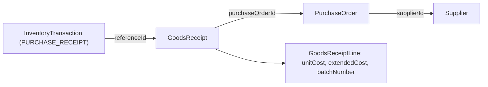

# Raw Materials Management Report — Pre-implementation Audit

Status: **audit only, nothing implemented.**
Scope: monthly management PDF for RAW materials, launched from Admin mobile → Inventory → Raw Materials.

Verdict up front: **most of this report is buildable from canonical server truth today.** Quantity
movement and reconciliation are exact. The blocking honesty problem is **money**: the system has no
historical cost, so opening/closing stock *value* cannot be reconstructed for a past period. Details
in §5 and §26.

---

## 1. Exact inventory ledger model used

`InventoryTransaction` — [packages/database/prisma/schema.prisma](packages/database/prisma/schema.prisma) L1227–1250.

| Field | Type | Notes |
|---|---|---|
| `id` | uuid | |
| `number` | String @unique | `INVTX` sequence |
| `type` | `InventoryTxType` | see §2 |
| `inventoryItemId` | String | FK → `InventoryItem` (only real FK besides warehouse) |
| `warehouseId` | String | FK → `Warehouse` |
| `locationId` | String? | **no** Prisma relation |
| `quantity` | Decimal(18,3) | **signed** (negative = outbound) |
| `unitCost` | Decimal(18,3)? | nullable, frequently null — see §4 |
| `referenceType` / `referenceId` | String? / String? | polymorphic, **no FK**, no index |
| `notes` | String? | free text |
| `idempotencyKey` | String? @unique | replay guard |
| `createdAt` | DateTime | **the only movement timestamp** |
| `createdById` | String? | **no** Prisma relation to `User` |

Authoritative movement time is `createdAt`. There is no `occurredAt`/`postedAt`, and
`GoodsReceipt.receiptDate` / `InventoryCount.countedAt` are **not** copied onto the ledger row.
Backdating a movement is therefore impossible — period boundaries must use `createdAt`.

There is **no** `balanceBefore` / `balanceAfter` column.

Balances: `InventoryBalance` L1208–1225, unique on `(inventoryItemId, warehouseId, locationId)`,
holding `availableQty`, `reservedQty`, `damagedQty`, `onOrderQty`, `updatedAt`.
`damagedQty` and `onOrderQty` are **never written** by the API — treat as dead fields.

Single canonical writer: `InventoryService.applyMovement`
([apps/api/src/modules/inventory/inventory.service.ts](apps/api/src/modules/inventory/inventory.service.ts) L564–701).
It computes the sign, guards negatives, writes the ledger row, then updates the balance in one
transaction. Every RAW movement in the app goes through it.

One bypass exists: `resolveReturnFate` RETURN_TO_STOCK creates a row directly (L2266). That is a
finished-goods customer-return path, so it does not affect RAW reporting.

## 2. Exact transaction types available

`InventoryTxType` — schema L215–230:

`PURCHASE_RECEIPT`, `PRODUCTION_ISSUE`, `PRODUCTION_RETURN`, `WAREHOUSE_TRANSFER`,
`INVENTORY_ADJUSTMENT`, `CUSTOMER_RETURN`, `FINISHED_GOODS_RECEIPT`, `DELIVERY_ISSUE`,
`DELIVERY_RESTORE`, `DAMAGE`, `SCRAP`, `SEMI_FINISHED_RECEIPT`, `SEMI_FINISHED_ISSUE`,
`OPENING_BALANCE`.

Mapping to the requested buckets:

- Purchase receipt — `PURCHASE_RECEIPT` ✓
- Production issue — `PRODUCTION_ISSUE` ✓
- Production return — `PRODUCTION_RETURN` ✓
- Transfer in / out — **not separate types.** One `WAREHOUSE_TRANSFER` type; direction is the sign.
- Adjustment — `INVENTORY_ADJUSTMENT` ✓
- Damage / scrap — `DAMAGE`, `SCRAP` exist ✓ but see §9
- Opening balance — `OPENING_BALANCE` exists in the enum with **zero writers** in the API. No
  historical opening rows exist. Only referenced by `mapInventoryTxType`.
- Stock count correction — **not a type.** Counts post `INVENTORY_ADJUSTMENT` with
  `referenceType: 'InventoryCount'`, so it is still separable by reference.

## 3. Can historical opening / closing quantity be reconstructed?

**Yes, exactly — for quantities.**

Because every RAW balance mutation writes a signed ledger row through `applyMovement`, quantity is
replayable backwards from live state:

```
closingQty(item, wh) = availableQty_now − Σ quantity WHERE createdAt >= periodEnd
openingQty(item, wh) = closingQty − Σ quantity WHERE createdAt IN [periodStart, periodEnd)
```

That makes the conservation identity a real check, not a decoration:

```
opening + receipts + returns + transfersIn + adjustments − issues − transfersOut − scrap = closing
```

Two caveats to state in the PDF:

- **Reserved has no history.** `reserveQty` / `releaseReservation` mutate
  `InventoryBalance.reservedQty` and write **no ledger row**. Reserved and free are
  **current-only** figures. A past-period "reserved at close" is not reconstructible.
- Items archived or deleted mid-period lose their balance row; the back-computation must start from
  balances *and* include items that only appear in the ledger.

## 4. Exact cost / valuation model currently used

Documented and implemented as `standardCost + latestPurchaseReceipt`:

- [apps/api/src/modules/production/manufacturing-cost-basis.ts](apps/api/src/modules/production/manufacturing-cost-basis.ts) — `id: 'standardCost+latestPurchaseReceipt'`, `neverInventZero: true`
- `buildMaterialCostMap` in [apps/api/src/common/helpers/order-costing.util.ts](apps/api/src/common/helpers/order-costing.util.ts) L100–122

Policy: seed from `InventoryItem.standardCost` where `> 0`, then overlay the latest costed
transaction per SKU, preferring `PURCHASE_RECEIPT`. Zero and missing stay **absent from the map** —
the codebase already refuses to invent 0.

There is **no** FIFO, no moving/weighted average, no per-lot cost (`InventoryLot` has no cost field).

Where `unitCost` is actually populated on the ledger:

- `PURCHASE_RECEIPT` via GRN — from PO line `unitPrice` or an explicit override
  ([apps/api/src/modules/purchasing/purchasing.controller.ts](apps/api/src/modules/purchasing/purchasing.controller.ts) L1107–1160) ✓
- `PRODUCTION_ISSUE` / `PRODUCTION_RETURN` via `finalizeForTask` — frozen from the cost map
  ([apps/api/src/modules/production/material-usage.service.ts](apps/api/src/modules/production/material-usage.service.ts) L680–696) ✓
- `WAREHOUSE_TRANSFER`, `INVENTORY_ADJUSTMENT`, count corrections, and the automatic
  `consumeRawMaterials` stage issue — **no unitCost written at all** ✗

## 5. Can historical valuation be reconstructed correctly?

**No. This is the one place the requested report cannot be delivered as specified.**

Three independent reasons:

1. The cost map is a **current** map ("latest purchase receipt"), not cost-as-of-date. Re-running it
   for August produces August-priced answers only by accident.
2. Opening/closing stock value needs a unit cost per SKU at two past instants. Nothing stores that.
3. Several movement types carry no `unitCost` at all, so the money column of the movement ledger has
   real holes (transfers, adjustments, count corrections, auto stage consumption).

What **is** honest:

- **Purchases received value** — real, from GRN `unitCost` / `extendedCost`.
- **Production consumption and return value** — real, frozen at finalize on the transaction and on
  `ProductionTaskMaterialUsage.extendedCost`.
- **Closing stock value at today's cost basis** — computable, but it is a *restatement at current
  cost*, not the value on 31 Aug. It must be labeled that way.
- **Opening stock value** — only as `openingQty × current cost basis`, which is a weaker statement
  still. Arguably should be shown as quantity only.

Consequence for §26 of the request: the closing-value identity
(`opening + purchases − consumption + returns − scrap ± adjustments = closing`) **must not be
printed as a balancing equation**. Mixing audited movement money with a current-cost restatement
produces a number that looks reconciled and is not. The quantity identity in §3 *is* printable and
does reconcile.

## 6. How purchases link to InventoryTransactions

`referenceType = 'GoodsReceipt'`, `referenceId = GoodsReceipt.id`. Chain to supplier:



There is **no** supplier or PO foreign key on the transaction, and `referenceId` is not indexed, so
this is a manual two-step join in application code.

Note a second, weaker path: `POST /inventory/receipts` (`InventoryService.receive` L703) writes
`PURCHASE_RECEIPT` with **no GRN and no PO reference**. Such rows have no supplier attribution and
must render supplier as `—`, not be dropped.

## 7. How production issues link to PO / task / worker

Two different writers with different linkage:

- `finalizeForTask` (hybrid worker usage, the normal floor path) — `referenceType: 'ProductionTask'`.
  Production order reached via task → order. Sales order via order → sales order.
- `consumeRawMaterials` (automatic stage consume fallback) — `referenceType: 'ProductionOrder'`
  directly, **no task**.

Sales order is never on the transaction.

## 8. Does PRODUCTION_RETURN work today?

Yes, two live paths, both writing real ledger rows:

- Task level — `finalizeForTask` writes `PRODUCTION_RETURN` when `returnedQty > 0`.
- Order level — `ProductionInventoryService.returnUnusedMaterial`, exposed as
  `POST production/:id/materials/return`, validated against issued − returned.

Not stubbed. Safe to report.

## 9. How scrap / damage is represented

This does not match the request's mental model and needs care.

**Production floor scrap is not a separate transaction.** It lives on
`ProductionTaskMaterialUsage.scrapQty` with `scrapReason` (`MaterialScrapReason` enum:
`CUTTING_WASTE`, `DAMAGED`, `DEFECTIVE_MATERIAL`, `MACHINE_DAMAGE`, `MEASUREMENT_ERROR`, `REWORK`,
`OTHER`) plus free-text `reasonNotes`. The issued quantity is `actual + returned + scrap`, so scrap
is **already inside** the `PRODUCTION_ISSUE` row, and the notes field gets
`Includes scrap N (REASON)`.

Therefore scrap must be reported as a **breakdown within consumption**, sourced from usage rows, and
explicitly labeled as included in production issues. Subtracting it from consumption or adding it as
a separate outflow would double count and break the §3 identity.

The `DAMAGE` / `SCRAP` transaction types are only written by the customer-return fate path
(`resolveReturnFate`), which is finished goods. For RAW they will normally be empty.

## 10. How adjustments are represented

Only `INVENTORY_ADJUSTMENT`, distinguished by `referenceType`:

- `'InventoryCount'` → count correction (from `postCount`)
- `'ReturnRequest'` → quarantine release (finished goods)
- no reference → manual

There is **no manual adjustment endpoint** in the API today, and no reason-code enum on the ledger —
only free-text `notes`. So the report can honestly separate *count correction* from *other
adjustment*, but cannot offer the richer taxonomy in §16 of the request.

## 11. How stock counts create corrections

- `InventoryCount` header (`status` is a plain String, `"DRAFT"` / `"POSTED"`, not an enum) plus
  `InventoryCountLine` with `systemQty`, `countedQty`, `varianceQty`.
- `systemQty` is snapshotted from the balance at count creation; variance is computed at create and
  again at post.
- `postCount` writes **one `INVENTORY_ADJUSTMENT` per line with non-zero variance**, referencing the
  count.

Count variance reporting is well supported. Value-of-variance is only available at current cost.

## 12. How reservations are represented

Aggregate `InventoryBalance.reservedQty` only. **There is no reservation table.**
`scheduling.service.ts` says so outright: "No per-order reservation ledger."

`tryReserveForSalesOrder` / `releaseForSalesOrder` know the sales order at call time but persist
nothing that links a reserved quantity to it. `InventoryLot` can carry `salesOrderId` /
`productionOrderId`, but lots are used for semi-finished and finished goods, not raw materials.

So §19 of the request (reserved material attributed to SO/PO with required vs reserved qty) is
**not deliverable from reservations**. The honest substitute already exists and is already used by
the per-item PDF: `PurchasingService.materialDemand()` gives required qty, free qty, incoming qty,
next-required-by, and the affected production orders per material. That answers "why is the
warehouse full but free stock low" from real data, and should replace the reservation-attribution
section.

## 13. How the low-stock threshold is stored

`InventoryItem.minStock` (Decimal, default 0), **per item, not per warehouse**. Also `maxStock`,
`reorderQty`.

Every server consumer compares **on-hand**, not free:

- `InventoryService.lowStock` L1091 — `itemClass: 'RAW_MATERIAL'`, `onHandQty <= minStock`
- `listItems?lowStock=true`, `listGroups`, `reports.inventory()`, `managementSummary` — same rule

Low stock is already RAW-only in `lowStock()`, which matches the request.

## 14. How transfers are represented

`WarehouseTransfer` + `WarehouseTransferLine` (status is a plain String: `DRAFT`, `IN_TRANSIT`,
`COMPLETED`). `createTransfer` writes no ledger rows; `completeTransfer` writes **two
`WAREHOUSE_TRANSFER` rows per line** — negative at source, positive at destination, both
referencing the transfer.

This gives the requested behaviour for free: RAW→RAW transfers **net to zero** at factory level and
show correctly per warehouse. And because `itemClassCompatibleWithWarehouse` blocks RAW-material
items from non-RAW warehouses, every raw-material transaction is in a `RAW_MATERIALS` warehouse by
construction. Filtering the report to RAW warehouses cannot leak semi/finished movements.

## 15. Which supplier data is available

Via the GRN chain in §6: supplier id, code, localized name, PO number, GRN number, receipt date,
line `unitCost` / `extendedCost` / `batchNumber`. `InventoryItem.preferredSupplier` also exists.
Sufficient for "top suppliers by received value" and per-receipt attribution.

## 16. Which production-order / material data is available

- `ProductionTaskMaterialUsage` — `expectedQty`, `actualQty`, `returnedQty`, `scrapQty`,
  `varianceQty`, `unitCost`, `extendedCost`, `scrapReason`, `reasonNotes`, `finalizedAt`,
  `recordedById`, plus `productionOrderId` and `taskId`.
- `MaterialUsageService.listOrderMaterialUsage` already rolls this up per order with worker stamps.
- `ProductionInventoryService.listMaterialActivity` rolls up issue/return per production order.

This makes §23 (material usage by production order) and §24 (planned vs actual) genuinely
supportable — `expectedQty` is the plan and `actualQty` is the truth, same row, same unit. That is
the safest possible variance comparison and needs no unit conversion.

## 17. Which worker attribution is provable

**Not from the ledger.** `InventoryTransaction.createdById` is whoever *finalized* the movement, not
who consumed the material.

Provable attribution comes from `ProductionTaskMaterialUsage.recordedById` and, secondarily, the
linked task's `assignedEmployee`. `listOrderMaterialUsage` already encodes exactly this caution in
comments ("Proven only when usage row has recordedBy" / "…when linked task has an assignee").

So: worker is shown when the consumption came from a usage row, and `—` when it came from
`consumeRawMaterials`. Never inferred from the current assignment.

## 18. Existing report / PDF infrastructure

Server-side only, `pdfkit` + `fontkit`, in
[apps/api/src/common/helpers/pdf.util.ts](apps/api/src/common/helpers/pdf.util.ts). No puppeteer, no
HTML templating, no device-side generation.

The **closest precedent is already an inventory report**:
`buildInventoryItemReportPdf` (L1346+) with `InventoryItemReportService`
([apps/api/src/modules/inventory/inventory-item-report.service.ts](apps/api/src/modules/inventory/inventory-item-report.service.ts))
and route `GET documents/inventory/items/:id/label`.

Reusable primitives inside that builder:

- `drawHeading(text, size)` — accent heading + rule
- `drawPairs([[label, value]])` — label/value money-row layout, RTL aware
- `drawTable(columns, rows)` — auto page break **with header repaint**, money columns right-aligned
- `ensureSpace(n)`, `drawPageChrome` on `pageAdded` (brand lockup, watermark, footer contact)
- Page numbers — `bufferedPages` loop at L1675–1688 (`Page X of Y`)

Constraints to respect:

- **A4 portrait is hardcoded** (`size: 'A4'`, `margin: 0`). `layout: 'landscape'` is never passed.
- `columnWidths` / `columnKinds` (L657–676) only have tuned weights for 2, 4 and 6 columns.
  Anything above 6 falls back to **equal widths, all `nowrap`**. The 10–15 column tables in the
  request would be unreadable on portrait A4. Tables must be capped at ~6 columns, or landscape
  added.
- Existing reports module: `/reports/*` JSON + CSV endpoints, `report.inventory.read` on
  `GET /reports/inventory` — but that endpoint has **no date range and no cost**, so it is not a
  base for this work.

## 19. Existing download / share flow

1. Server streams bytes: `sendPdf(res, filename, buffer)` — `Content-Type: application/pdf`,
   `Content-Disposition: inline`. Nothing is stored.
2. Mobile fetches with auth and shares: `openAuthedPdf`
   ([apps/mobile/src/api/openPdf.ts](apps/mobile/src/api/openPdf.ts) L19–68) — writes to cache via
   `expo-file-system`, then `Share.share({ url })`, falling back to `Linking.openURL`.
3. Language/theme chosen first via `usePdfDownload()` → `pickPdfOptions()` →
   `PdfDownloadSheet`, appended as `?lang=&theme=` by `withPdfOptions`.

Existing inventory precedent: `openInventoryLabelPdf`
([apps/mobile/src/api/modules/inventory.ts](apps/mobile/src/api/modules/inventory.ts) L403–412).

This is a single share action, not separate Open and Download buttons. The request's
`[Open PDF] [Download / Share]` pair does not exist as a pattern anywhere in the app.

## 20. Permission needed

`packages/permissions/src/catalog.ts` — permissions are `domain.action` strings; enforced by the
global `PermissionsGuard` with `@RequirePermissions(...)`.

Relevant existing keys:

- `inventory.read`, `inventory.receive`, `inventory.issue`, `inventory.transfer`, `inventory.adjust`,
  `inventory.count`
- `inventory.cost.read` — "See unit costs and inventory valuation"
- `report.inventory.read` — "See inventory reports", `requires: ['inventory.read']`
- `report.financial.read`

There is **no** raw-materials report permission. Best fit is `report.inventory.read` for the report
plus `inventory.cost.read` for the money.

Dealer / worker exclusion is already correct: dealers are role `CUSTOMER` and workers are
`PRODUCTION_WORKER`, and `ROLE_PERMISSIONS` grants **neither** any `inventory.*` or `report.*`
permission. Note that `WAREHOUSE_MANAGEMENT` staff have `inventory.read` but **not**
`report.inventory.read` or `inventory.cost.read`, so warehouse staff would not see this report
unless granted.

## 21. EN / AR / HE PDF capability — honest assessment

**Implemented, unit-tested for generation, not visually proven.**

- Fonts present: `NotoNaskhArabic-Regular/Bold`, `NotoSansHebrew-Regular/Bold`, `NotoSans-*` in
  `apps/api/assets/fonts`.
- Arabic and Hebrew are **not embedded as PDF fonts**. `fontkit` lays out the runs with Arabic
  OpenType features and the glyphs are painted as **vector outlines** (`drawOutlined`), specifically
  to survive viewers like iOS PDFKit. Tests assert the raw PDF contains `/BaseFont /Helvetica` and
  *not* `NotoNaskh`.
- RTL handling reverses **run order**, not characters within a run (`visualRuns`). There is no full
  Unicode bidi implementation. `arabic-persian-reshaper` and `bidi-js` are installed dependencies
  and **never imported**.
- `shapePdfText` is a **no-op** that returns its input.
- Tests exist generating Arabic titles and asserting Hebrew is not character-reversed, but there are
  **no snapshot or visual regression tests**.
- Footer contact block and page numbers are always drawn with `drawLatin` — English only.

Honest position: Arabic/Hebrew output should be treated as **plausible but unverified** for a dense
management document. Mixed Arabic+Latin cells (a material name next to `FAB-0042`) rely on
heuristics that have never been checked on a table this heavy. This should be a UAT gate with a real
device viewer, and the audit should not claim an Arabic PASS in advance.

Technical identifiers (`FAB-0042`, `PO-1042`, `GRN-1008`) stay Latin and are safe.

## 22. Date / timezone semantics

Factory timezone exists and is canonical: `FactoryCalendar.timezone`, default `Asia/Amman`
(`DEFAULT_FACTORY_TIMEZONE`). Several services already resolve it via
`findFirst({ where: { isDefault: true }, select: { timezone: true } })`.

The correct existing helper for period boundaries is already written:

```
WorkingCalendar.localRangeBounds(fromYmd, toYmd)
  → { start: localInstant(fromYmd, 0, 0), endExclusive: localInstant(toYmd + 1, 0, 0) }
```

That is factory-local midnight to next-day midnight expressed as UTC instants — exactly what the
request demands.

Two existing behaviours to be aware of, both of which this report should **not** copy:

- `reports.service.ts` `dateRange()` builds `new Date(\`${from}T00:00:00.000Z\`)` — **raw UTC**
  midnight. Wrong for factory-local reporting.
- `management-summary.ts` `startOfLocalDay` uses `setHours`, i.e. the **Node process** timezone.

Week convention: **Sunday-start**, proven by
[apps/mobile/src/features/reports/selectReports.ts](apps/mobile/src/features/reports/selectReports.ts)
L23 (`dt.setDate(dt.getDate() - dt.getDay())`, comment "Sunday week-start, same factory calendar as
scheduling") and `startOfWeekSunday` in the scheduling selectors. `FactoryCalendar.workingWeekdays`
defaults to `[0,1,2,3,4,6]` (Friday closed), consistent with a Sunday-first week.
There is an unused `rangeForPreset()` in `features/reports/period.ts` that uses **Monday** — it is
not wired to anything and must not be used.

## 23. Mobile entry point and existing UI parts

Hub: `InventorySignatureHome`
([apps/mobile/src/features/inventory/components/InventorySignatureHome.tsx](apps/mobile/src/features/inventory/components/InventorySignatureHome.tsx)).
The category rail renders only when `section === 'items' && lifecycle === 'materials'` (L912–918),
passed as `children` into `InventoryCompositionChrome`. That conditional is the correct insertion
point for a RAW-only action row.

Categories: client `InventoryCategoryGroup = 'fabric' | 'foam' | 'wood' | 'accessories'`, mapped
server-side by `INVENTORY_CATEGORY_GROUPS`
([apps/api/src/common/helpers/inventory-category.util.ts](apps/api/src/common/helpers/inventory-category.util.ts)) —
note `accessories` covers `METAL_ACCESSORY`, `DECORATIVE_ACCESSORY` **and** `PACKAGING`.

Reusable pieces:

- Action row precedent — `InventoryPickerRow` (`AnimatedPressable variant="button"`,
  `haptics.selection()`, 44 min height, `radius.xl`, `orderBoardShadow`) and `FloorActionButton`
- Sheet composition — `BottomSheet` + `InventorySheetBody` + `InventorySheetFooter`
  (canonical example: `CreateInventoryItemSheet` L133–219)
- Date range — no dedicated component, but `MonthCalendar` supports `rangeStart` / `rangeEnd` and
  `nextDateRange()`; `StatementRangeSheet` is a working all-vs-custom range sheet to copy
- Period presets — `ReportsPeriodChrome` has today/week/month and **no Custom cell**

Gaps: no report row, no Custom period cell, no raw-materials report API client, no
`report.raw-materials.*` permission.

## 24. Performance and indexing

Existing indexes on `inventory_transactions` are single-column only:
`inventoryItemId`, `warehouseId`, `createdAt`, `type`. There is **no** composite
`(inventoryItemId, createdAt)` or `(type, createdAt)`, and **no** index on
`(referenceType, referenceId)` — which matters because the GRN, task and count joins all go through
that pair.

There is no `packages/database/prisma/migrations` directory, so schema changes appear to be applied
via push rather than migration files. Any index addition should be confirmed with the user first.

Current inventory aggregations are mostly **in-memory over `findMany`** (`listGroups`, `lowStock`,
`reports.inventory()` with `take: 200`, `buildMaterialCostMap` with `take: 800`). One
`management-summary.ts` comment even admits it is "LIMITED vs true SQL aggregate". A month of
report data must not follow that pattern — it needs `groupBy`.

Background jobs: BullMQ queues literally named `'pdf'` and `'reports'` exist in
`apps/worker/src/main.ts` but the handlers are **no-op stubs** returning `{ ok: true }`, and they
only run when `REDIS_URL` is set. `@nestjs/schedule` is absent. All existing PDFs are synchronous
request/response.

## 25. Data that cannot honestly be included yet

1. **Historical inventory valuation** (opening/closing value as of a past date) — §5.
2. **A balancing money reconciliation** — §5 / request §26.
3. **Historical reserved / free** — reserved has no ledger (§3, §12).
4. **Reservation attributed to SO/PO** with required vs reserved per material — no reservation
   table (§12). Substitute: `materialDemand()`.
5. **Production scrap as its own outflow bucket** — it is inside `PRODUCTION_ISSUE` (§9).
6. **Worker on every consumption row** — only where a usage row exists (§17).
7. **Rich adjustment taxonomy** (manual vs opening vs damage as distinct ledger types) — only count
   vs other (§10).
8. **Opening-balance transactions** — the type exists, nothing writes it (§2). Pre-ledger stock has
   no origin row.
9. **Supplier on manual `/inventory/receipts` rows** — no GRN reference (§6).
10. **Cost on transfers, adjustments and auto stage consumption** — `unitCost` is null (§4).
11. **Verified Arabic/Hebrew rendering** of dense tables — unproven, not disproven (§21).

## 26. Reconciliation position (recommended)

Print **two clearly separated** blocks and never merge them:

- **Quantity reconciliation** — per item and per category, a true identity that must balance, with
  the residual shown as a check line. Fully supported.
- **Valued movements** — purchases received, production consumption, production returns, each summed
  only from rows that actually carry `unitCost`, with an explicit
  `Valuation incomplete — N SKUs / M movements without cost basis` line and the affected SKUs listed.

Stock value, if shown at all, is labeled
`Closing stock value (at current cost basis: standard cost + latest purchase receipt)` and is
visually separated from the audited movement money so it cannot be read as a period-end valuation.

## 27. Open decisions for the owner

1. **Valuation** — restate at current cost with clear labels, quantities-only, or invest in cost
   snapshotting for true historical valuation later.
2. **Permission** — require `report.inventory.read` + `inventory.cost.read` together, or allow a
   quantities-only report for `report.inventory.read` alone.
3. **Landscape** — accept ~6-column portrait tables, or add `layout: 'landscape'` for the wide
   ledger and appendix sections.
4. **Ledger cap** — the full movement ledger for a busy month could be thousands of rows; agree a
   cap with an honest `showing N of M` line.
