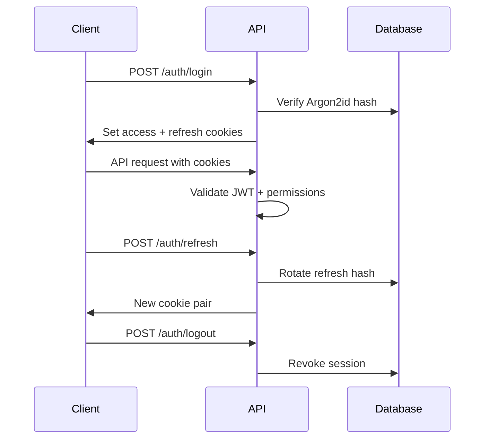

# Security

Security model for **Maher Al-Aghbar & Sons Furniture ERP** — coral-red enterprise platform for a Jordan furniture factory handling commercial, production, and financial data.

---

## Authentication

### Credentials

| Mechanism | Detail |
|-----------|--------|
| Password hashing | **Argon2id** (memory-hard); per-user salt |
| Login identifiers | Email or E.164 phone |
| MFA | Optional TOTP for staff (`otpauth`); off for customers by default |
| Lockout | 5 failed attempts → 15-minute lockout per account + IP throttle |

### JWT + cookies

| Token | Storage | TTL | Notes |
|-------|---------|-----|-------|
| Access | HTTP-only `Secure` `SameSite=Lax` cookie `access_token` | 15 min | Short-lived; contains `sub`, `permissions[]` |
| Refresh | HTTP-only `Secure` cookie `refresh_token` | 30 days | Rotated on each `/auth/refresh`; reuse detection revokes family |

Additional controls:

- Refresh tokens stored hashed in **Session** table; revocable per device.
- CSRF: `SameSite=Lax` + double-submit token on state-changing requests from browsers.
- Bearer tokens supported for automation/service accounts only; not issued to customer browsers.

### Session lifecycle

---

## Authorization (RBAC)

- **Roles** are bundles; **permissions** are the enforcement unit (`quotation.approve`, `inventory.adjust`, etc.).
- Every mutation checks permission server-side; UI hides actions but never relies on UI alone.
- Users may hold multiple roles; effective permissions are union of grants.
- **Customers** scoped to own `customerId` — row-level filter in repository layer.
- **Production workers** scoped to assigned tasks unless supervisor permission.

See `permissions.md` and `packages/permissions/src/catalog.ts` for full matrix.

---

## Threat model summary

| Threat | Mitigation |
|--------|------------|
| Credential stuffing | Lockout, rate limits, optional MFA |
| Session hijacking | HTTP-only cookies, short access TTL, refresh rotation, Secure flag |
| CSRF | SameSite + CSRF token on mutations |
| IDOR | Row-level scoping; UUID IDs; permission checks on every read |
| Privilege escalation | Permission grants only via `role.manage`; audit logged |
| SQL injection | Prisma parameterized queries; no raw string concat |
| XSS | React escaping; CSP headers; sanitize rich text (if any) |
| File upload abuse | MIME allowlist, size limits, virus scan hook, private bucket |
| SSRF (AI/webhooks) | Allowlist outbound URLs in worker |
| Data exfiltration by staff | Audit log; financial reports permission-gated; no bulk export without `report.*` |
| Insider tampering | Immutable **AuditEvent**; inventory/finance transitions require dual permission for voids |

**Trust boundaries:** Browser apps (untrusted) → API (trusted) → DB/Redis/S3 (trusted). Workers same trust as API.

**Out of scope v1:** Formal penetration test (recommended before production go-live).

---

## File URL policy

Documents stored in private S3/MinIO bucket — **never** public ACL.

| Rule | Value |
|------|-------|
| Access pattern | API `GET /documents/:id/url` returns **presigned URL** |
| Default TTL | 15 minutes |
| Upload | Presigned PUT via `/documents/upload`; client completes via `/complete` |
| Visibility | `visibilityScope`: `INTERNAL`, `CUSTOMER`, `EMPLOYEE_TASK` — enforced before URL minted |
| Direct linking | Blocked; nginx/API rejects unsigned bucket paths |

Customer portal users receive URLs only for documents linked to their entities.

---

## Secrets management

| Secret | Storage |
|--------|---------|
| `DATABASE_URL` | Env / secret manager |
| `JWT_ACCESS_SECRET`, `JWT_REFRESH_SECRET` | Env; rotate with session invalidation plan |
| S3 credentials | Env / IAM role (prod) |
| AI/OCR API keys | Worker env only — never in frontend bundle |
| Email/SMS/WhatsApp keys | Worker env |
| Encryption at rest | PostgreSQL volume encryption (hosting); S3 SSE |

**Never commit:** `.env`, credentials, private keys, production URLs with tokens.

Local development uses `.env.example` with placeholder values and **MockProvider** for external services.

---

## Transport & headers

Production:

- TLS 1.2+ terminated at nginx/reverse proxy
- HSTS enabled
- Headers: `X-Content-Type-Options: nosniff`, `X-Frame-Options: DENY`, `Referrer-Policy: strict-origin-when-cross-origin`
- CSP tailored per Next.js app

---

## Audit & compliance

- All authentication events, permission changes, financial voids, inventory adjustments, and AI approvals → **AuditEvent**.
- Audit rows append-only; no UPDATE/DELETE.
- Retention: 7 years for financial audit events (Jordan business records assumption); configurable archive to cold storage.

---

## Security checklist (Definition of Done)

- [ ] Permission guard on every controller mutation
- [ ] Integration tests for IDOR on customer portal
- [ ] Refresh token reuse test
- [ ] Signed URL expiry test
- [ ] No secrets in client bundles (CI grep)
- [ ] Dependency audit in CI (`pnpm audit`)
