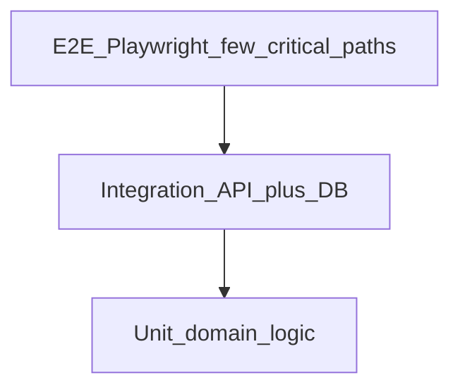

# Testing Strategy

Quality approach for **Maher Al-Aghbar & Sons Furniture ERP** across monorepo packages and three Next.js applications.

---

## Test pyramid



| Layer | Tool | Scope | Target |
|-------|------|-------|--------|
| **Unit** | Vitest | Pure functions, validators, permission checks, money math | Fast, >80% on `packages/*` |
| **Integration** | Vitest + Testcontainers | API modules, Prisma repos, inventory transactions | Every domain module |
| **E2E** | Playwright | Cross-app user journeys | Critical business paths |
| **Contract** | OpenAPI diff | API schema stability | CI on PR |

Shared utilities: `packages/testing` (factories, test DB helpers, auth cookie helper).

---

## Unit tests

Focus areas:

- `packages/validation` — Zod schemas for RFQ, quotation, invoice line items
- `packages/permissions` — role → permission resolution
- Money: Decimal add/mul/tax; never floating point
- State machines: quotation transitions, inventory invariants
- i18n key parity (script, not full translation QA)

Run: `pnpm test:unit`

---

## Integration tests

- Spin PostgreSQL + Redis via Testcontainers (or docker compose in CI).
- NestJS testing module with real Prisma client against migrated test DB.
- Each test wraps in transaction rollback or truncates seeded tables.

Required scenarios per module:

| Module | Tests |
|--------|-------|
| Auth | Login, refresh rotation, lockout |
| Quotation | Submit → approve → send → accept |
| Inventory | Receipt, issue, insufficient stock 409, transfer pair |
| Production | Task assign → complete updates stage |
| AI intake | Approve creates draft only |
| Customer portal | IDOR — cannot read other customer SO |

Run: `pnpm test:integration`

---

## E2E tests (Playwright)

Apps: `admin-web`, `customer-portal`, `employee-portal` against running API + worker.

Configuration:

- Headless in CI; trace on failure
- Seeded database fixture (`pnpm db:seed:test`)
- Locale runs: default `ar` RTL; smoke in `en`

Run: `pnpm test:e2e`

---

## 16-step end-to-end scenario

Primary **Definition of Done** journey exercising the full factory lifecycle. Automate in Playwright where stable; manual UAT checklist until Phase 11.

| Step | Actor | Action | Verification |
|------|-------|--------|--------------|
| **1** | Sales (Admin) | Create customer (company) with contact and Amman address | Customer appears in CRM list |
| **2** | Sales | Create RFQ with 2 line items (sofa + chair), dimensions and fabric notes | RFQ number assigned, status Open |
| **3** | Sales | Create quotation from RFQ, set prices and 30-day validity | Quotation v1 Draft |
| **4** | Sales Manager | Submit and approve quotation | Status Approved |
| **5** | Sales Manager | Send quotation to customer | Status Sent; PDF generated; customer notified |
| **6** | Customer (Portal) | Log in, view quotation, accept | Status Accepted; acceptance audited |
| **7** | System / Sales | Confirm sales order spawned from quote | SO Confirmed; lines match quote snapshot |
| **8** | Production Supervisor | Create production order, assign carpentry task to worker | PO Planned; task Pending |
| **9** | Warehouse | Issue materials (ISSUE txn) for production order | Inventory decreased; txn linked to PO |
| **10** | Production Worker (Employee) | Start and complete carpentry task with photo | Task Completed; stage progress updated |
| **11** | QC Inspector | Run quality inspection — pass | Inspection Pass; PO can proceed |
| **12** | Warehouse / Supervisor | Complete remaining stages; mark PO completed | PO Completed |
| **13** | Delivery Employee | Schedule and complete delivery with POD signature | Delivery Delivered; SO ReadyForDelivery/Delivered |
| **14** | Accountant | Issue invoice from sales order | Invoice Issued; total matches SO |
| **15** | Accountant | Record partial then final payment | Invoice Paid; SO Closed |
| **16** | GM / Admin | Open audit log — filter by SO number | Events for quote accept, inventory issue, task complete, invoice, payment |

### E2E assertion highlights

- Money totals consistent at every step (Decimal string compare).
- Customer portal never shows internal cost or worker names.
- Inventory cannot go negative on step 9 without permission.
- Step 6 cannot occur before step 5 (409).
- AI shortcut: optional parallel test uploads handwritten note → draft RFQ (steps 2–3 alternate path).

---

## CI pipeline

```yaml
# Simplified
lint → typecheck → unit → integration (parallel) → build → e2e (main/staging only)
```

- PR: unit + integration required
- Main: full e2e + OpenAPI diff
- Coverage upload optional; fail on permission module < 90%

---

## Test data

- Seed script creates: admin, sales manager, worker, customer user, warehouses, stage templates, sample SKUs
- Factories use `@faker-js/faker` with fixed seed in CI for determinism
- No production data in tests

---

## Accessibility testing

- axe-core in Playwright on login, quotation create, employee task screen
- Keyboard navigation smoke on admin nav
- Reduced motion: verify animations respect `prefers-reduced-motion`

---

## Performance smoke

- k6 or artillery script: 50 concurrent list quotations (staging)
- p95 < 300 ms for list endpoints with seed data 10k rows (Phase 10 target)

---

## Manual QA checklist (release)

- [ ] RTL layout on admin dashboard (Arabic)
- [ ] Customer portal mobile viewport
- [ ] Employee task flow on tablet touch targets
- [ ] Signed document URL expires after TTL
- [ ] Email notification received (staging mailhog)
