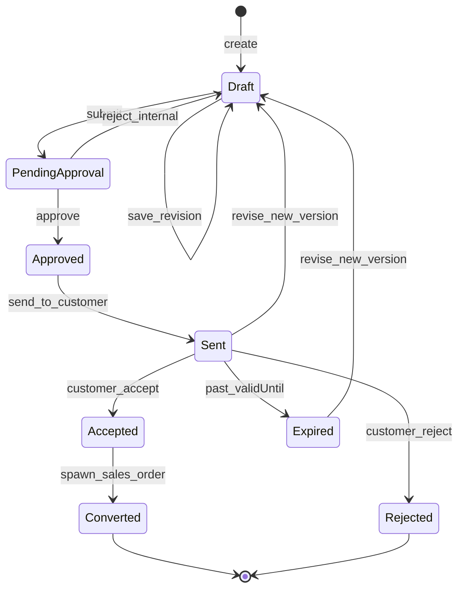
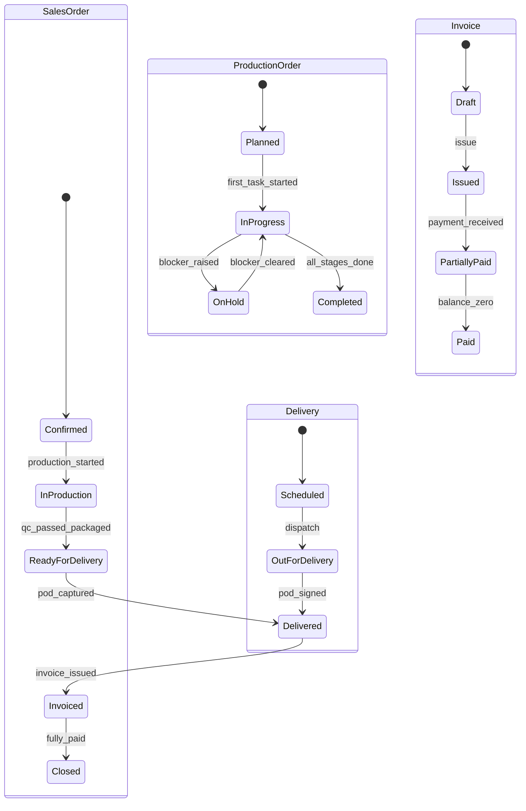
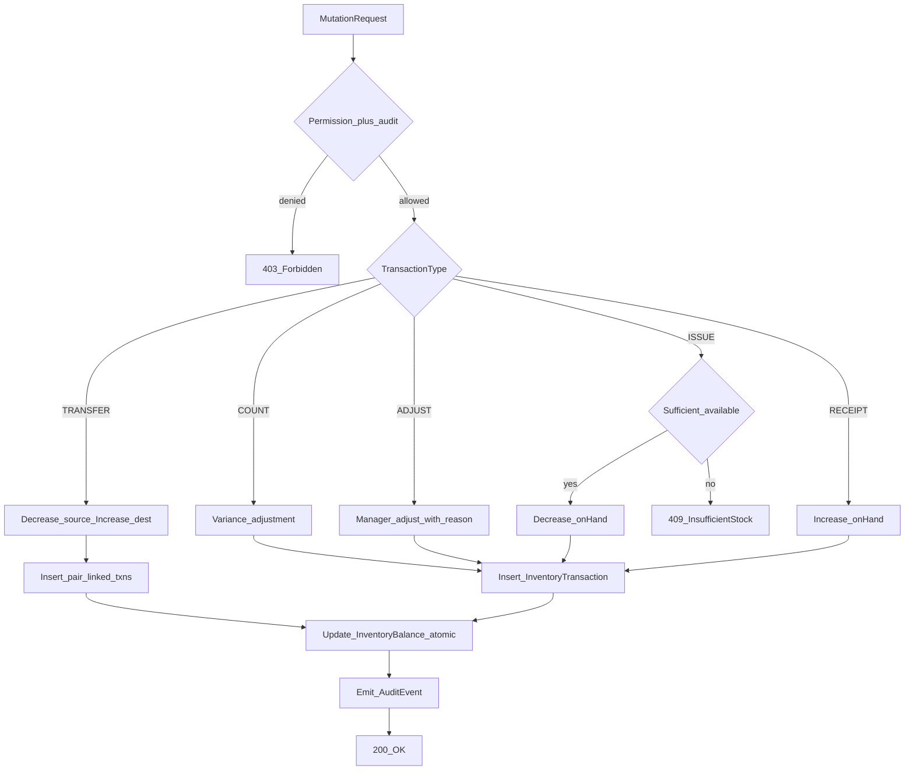
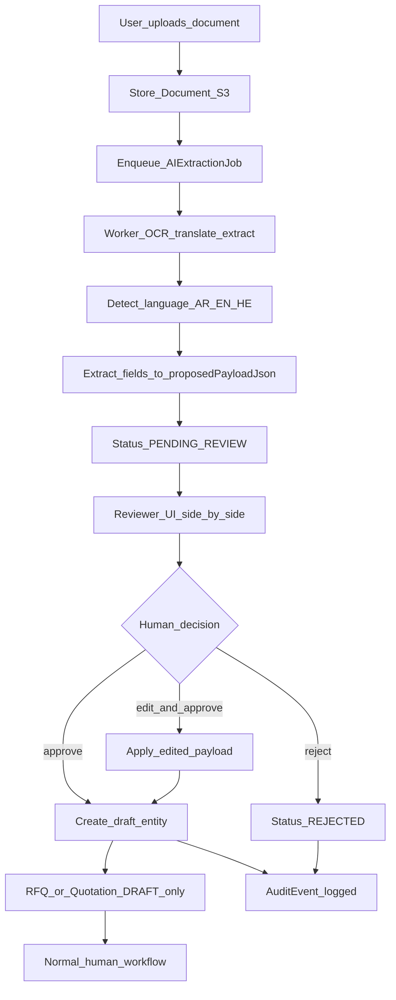

# Workflow Diagrams

State machines and process flows for **Maher Al-Aghbar & Sons Furniture ERP**. All transitions are enforced server-side; clients display allowed actions based on permissions and current state.

---

## (a) Quotation lifecycle

| Status | Meaning |
|--------|---------|
| `Draft` | Editable by sales; not visible to customer |
| `PendingApproval` | Awaiting sales manager approval |
| `Approved` | Internally approved; ready to send |
| `Sent` | Delivered to customer (PDF/portal); clock on `validUntil` |
| `Accepted` | Customer acceptance recorded with evidence |
| `Converted` | Linked **SalesOrder** created |
| `Rejected` / `Expired` | Terminal unless revised (new version increments) |

Rules:

- Only one **Sent** version per quotation number chain should be active at a time.
- Accepting creates an immutable snapshot; line prices copied to **SalesOrder**.
- Internal approval and customer acceptance both write **AuditEvent** rows.

---

## (b) Sales order → production → delivery → invoice

```mermaid
flowchart LR
  subgraph commercial [Commercial]
    SO[SalesOrder_CONFIRMED]
    PO[ProductionOrder_PLANNED]
  end

  subgraph mfg [Manufacturing]
    MAT[MaterialIssue_INVENTORY]
    STG[StageInstances_IN_PROGRESS]
    QC[QualityInspection_PASS]
    PKG[Packaging_COMPLETE]
  end

  subgraph fulfillment [Fulfillment]
    DEL[Delivery_SCHEDULED]
    POD[Delivery_DELIVERED_POD]
  end

  subgraph finance [Finance]
    INV[Invoice_ISSUED]
    PAY[Payment_RECORDED]
  end

  SO --> PO
  PO --> MAT
  MAT --> STG
  STG --> QC
  QC -->|fail| STG
  QC --> PKG
  PKG --> DEL
  DEL --> POD
  POD --> INV
  INV --> PAY
```

Detailed status progression:

Rules:

- **ProductionOrder** created automatically (or manually by supervisor) when **SalesOrder** is confirmed.
- Material **ISSUE** transactions reference production order; negative stock blocked unless adjusted with permission.
- **Invoice** may be draft before delivery; issuance typically after POD for retail, per terms for B2B.
- Deposit on **SalesOrder** reduces invoice balance; tracked separately from line totals.

---

## (c) Inventory transaction rule

Balances change **only** through **InventoryTransaction** rows. Never update `quantityOnHand` directly from application code outside the inventory service.

| Type | Effect on `quantityOnHand` | Typical reference |
|------|---------------------------|-------------------|
| `RECEIPT` | +qty | GoodsReceipt, PO |
| `ISSUE` | −qty | ProductionOrder, SalesOrder |
| `TRANSFER` | −source, +destination | Inter-warehouse move |
| `ADJUST` | ±qty | Cycle count correction (permission-gated) |
| `COUNT` | Set via variance txn | Physical inventory count |

Invariants (enforced in DB transaction):

1. `available = quantityOnHand - quantityReserved` must be ≥ 0 after ISSUE (unless override permission + audit).
2. Each transaction has `performedById`, `occurredAt`, and polymorphic `referenceType`/`referenceId`.
3. TRANSFER creates two linked transactions sharing a `transferGroupId`.
4. Nightly reconciliation job alerts on balance drift.

---

## (d) AI intake human review

AI proposes structured data; **never** auto-confirms orders, quotations, or inventory movements.

| Job status | Description |
|------------|-------------|
| `QUEUED` | Waiting for worker |
| `PROCESSING` | OCR/translation/extraction in progress |
| `PENDING_REVIEW` | Draft payload ready for human |
| `APPROVED` | Reviewer confirmed; draft entity created |
| `REJECTED` | Discarded with reason |
| `FAILED` | Provider error; retryable |

Rules:

- `proposedPayloadJson` is immutable after extraction; reviewer edits stored in `reviewedPayloadJson`.
- Approved jobs create **Draft** RFQ or quotation only — still requires normal approval/send/accept flows.
- Customer portal uploads follow same pipeline; customers cannot bypass review.
- All provider calls run in worker; API keys never exposed to browsers.
